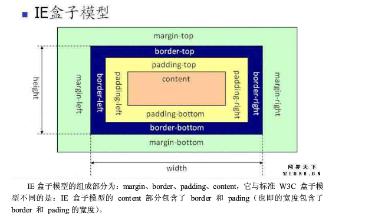

# NOWCODE错题、好题研究整理

# 一、
### 1.
输出对象中值大于2的key的数组

	var data = {a: 1, b: 2, c: 3, d: 4};
	
	Object.keys(data).filter(function(x) { return___ ;})

期待输出：[“c”,”d”]

**答案：** data[x]>2 或 arguments[1]>2

**解析：** 

	var data={a:1,b:2,c:3,d:4};
	var newdata=Object.keys(data).filter(
	    function (x) {
	        return data[x]>2;
	    }
	);
	console.log(newdata);

Object.keys(oneObject)：返回对象oneObject的可枚举属性和方法的名称。

(Array.)filer(callback)：对数组的每个元素调用定义的回调函数，并返回回调函数返回为true的值的项组成的素组。

另一种方法：

	var data={a:1,b:2,c:3,d:4};
	var newdata=Object.keys(data).filter(
	    function (x) {
	        return arguments[1]>=2;
	    }
	);
	console.log(newdata);
关于array.filter（）详细介绍：https://msdn.microsoft.com/zh-cn/library/ff679973(v=vs.94).aspx


### 2.
关于IE、FF下脚本的区别：***待求证***

- innerText: IE支持，FIRFOX不支持
- document.createElement：IE支持，FIRFOX不支持
- setAttribute('class'，'styleClass')：FIREFOX支持，IE不支持


### 3.
请用CSS实现如下图的样式，相关尺寸如图示，其中dom结构为：

	<div id=”demo”></div>
<http://www.nowcoder.com/questionTerminal/011952f7acf04e028949f25fcd557e86>

**答案：**
方法一：

	<!DOCTYPE HTML>
	<html>
	    <head>
	        <title>My answer</title>
	        <style type="text/css">
	          #demo{
	            position: absolute;
	            width: 100px;
	            height: 100px;
	            border: 2px solid #000;
	            background-color: #fff;
	          }
	          #demo:before,#demo:after{
	            position: absolute;
	            content: "";
	            border: 10px;
	            left: 100px;
	            width: 0px;
	            height: 0px;
	          }
	          #demo:before{
	            top: 18px;
	            border-left: 12px solid #000;
	            border-top: 12px solid transparent;
	            border-bottom: 12px solid transparent;
	          }
	          #demo:after{
	            top: 20px;
	            border-left: 10px solid #fff;
	            border-top: 10px solid transparent;
	            border-bottom: 10px solid transparent;
	          }
	        </style>
	    </head>
	    <body>
	        <div id="demo">
	        </div>
	    </body>
	</html>

方法二：

           <!DOCTYPE html>            
                  <html>         
                  <head>         
                      <title>myanswer</title>         
                      <styletype="text/css">                                   
                      .bigRec{         
                          position: absolute;         
                          top: 10px;         
                          left: 10px;         
                          margin: 0px;         
                          padding: 0px;         
                          width: 100px;         
                          height: 100px;         
                          border: 2px solid #000;         
                          background-color: #fff;         
                      }         

                      .smallRec{         
                          position: absolute;         
                          top: 33px;         
                          left: 105px;         
                          width: 14px;         
                          height: 14px;         
                          border: none;         
                          border-top: 2px solid #000;         
                          border-right:2px solid #000;         
                          transform: rotate(45deg);         
                          background-color: #fff;             
                      }            
                      </style>         
                  </head>         

                  <body>         

                      <divid="demo">                              
                        <divclass="bigRec"></div>                             
                        <divclass="smallRec"></div>          
                      </div>         
                  </body>         
                  </html>         

**补充知识：**

1. left/top: 定义了定位元素**外边距边界**与其包含块边界之间的偏移。

2. ：before/:after:为某元素添加:before/:after

 	(1)#id:before之间不能有空格<br>
	(2)插完：before/:after之后元素DOM结构形如

		```
		<div id="id">
			::before
			::after
		</div>
 		```
	(3)#id:before的css要有content属性，没有内容要content:""

3. 绘制三角形的方法

	方法一：

	可用css中的border实现：

		width:0;<br>
		height:0;<br>
		border-right:10px solid red;
		border-top:10px solid transparent;//设置透明
		border-bottom:10px solid transparent;

	三角形 顶点在哪边 就 不设置哪边的border值 ，三角形向左或向右，则设置border的顶部和底部为相同像素的透明色。三角形的高则为像素的点素，即px值。
	
	方法二：
	
	用一个正方形设置transform:rotate(45deg)来实现

### 3. 
简述document.write和innerHTML的区别。

**答案：**
document.write只能重绘整个页面,
innerHTML可以重绘页面的一部分。

### 4.
你知道的，javascript语言的执行环境是"单线程模式"，这种模式的好处是实现起来比较简单，执行环境相对单纯；坏处是只要有一个任务耗时很长，后面的任务都必须排队等着，会拖延整个程序的执行，因此很多时候需要进行“异步模式”，请列举js异步编程的方法。

**答案：**
	
	（1）回调函数，这是异步编程最基本的方法。
	（2）事件监听，另一种思路是采用事件驱动模式。任务的执行不取决于代码的顺序，而取决于某个事件是否发生。
	（3）发布/订阅，上一节的"事件"，完全可以理解成"信号"。
	 (4)Promises对象，Promises 对象是CommonJS 工作组提出的一种规范，目的是为异步编程提供统一接口。

***CommonJS待了解***

### 5.
用户从手机的浏览器访问www.baidu.com，看到的可能跟桌面PC电脑，是不太一样的网页效果，会更适合移动设备使用。请简要分析一下，实现这种网页区分显示的原因及技术原理。

**答案：**

参考答案：

	手机的网速问题、屏幕大小、内存、CPU等。
	通过不同设备的特征，实现不同的网页展现或输出效果。
	根据useragent、屏幕大小信息、IP、网速、css media Query等原理，实现前端或后端的特征识别和行为改变

我的答案：
	
	这种网页区分显示的原因是其应用了客户端检测技术。
	其技术原理为，检测用户代理字符串。
	如要检测是移动设备，则须检测navigator.userAgent.indexOf("iphone")>-1或navigator.userAgent.indexOf("Android")>-1或navigator.userAgent.indexOf("NokiaN")>-1是否为true。然后针对不同的检测结果向网页应用不同的板式效果。

### 6. 
angularjs中指令的link参数是什么时候运行的？**angularjs**

**答案：** 在compile后

	Angularjs诞生于2009年，由Misko Hevery 等人创建，后为Google
	所收购。是一款优秀的前端JS框架，已经被用于Google的多款产品当
	中。AngularJS有着诸多特性，最为核心的是：MVVM、模块化、自动化
	双向数据绑定、语义化标签、依赖注入等等。
   [angularjs教程](http://www.runoob.com/angularjs/angularjs-tutorial.html)

### 7.
哪些可以给文字加上背景？**bootstrap**

	bg-primary(主要蓝)
	bg-success(成功绿）
	bg-info(信息蓝)
	bg-warning(危险红)

**答案：** 以上都可以
[详见bootstrap中文文档-CSS-辅助类](http://v3.bootcss.com/css/#helper-classes)


### 8.
关于一些html标签  **html**

	<mark> 高亮显示文本
	<del> 用于显示删除的文本
	<ins> 文字会带下划线
	<strong> 用于强调文本

### 9.
为了在input两侧添加额外元素，以下说法正确的是 **bootstrap**
	
	A.使用input-group来封装控件
	B.使用input-group-addon来添加前置元素
	C.使用input-group-tailon来添加后置元素
	D.必须为input添加form-control类

**答案：** ABD
[参见bootstrap中文文档-css-forms](http://v3.bootcss.com/css/#forms)
添加前置后置元素都用input-group-addon

	  <form class="form-inline">
	        <div class="form-group">
	          <label class="sr-only" for="exampleInputAmount">Amount (in dollars)</label>
	          <div class="input-group">
	            <div class="input-group-addon">$</div>
	            <input type="text" class="form-control" id="exampleInputAmount" placeholder="Amount">
	            <div class="input-group-addon">.00</div>
	          </div>
	        </div>
	        <button type="submit" class="btn btn-primary">Transfer cash</button>
	      </form>

没有 input-group-tailon吧？前后置元素都用input-group-addon来添加

### 10.
iframe的使用场景有？**html**

	A.与第三方域名下的页面共享cookie
	B.上传图片，避免当前页刷新
	C.左边固定右边自适应的布局
	D.资源加载

**答案：** ABCD

### 11.
能在1024的windows机器上显示8列而在肾6手机上显示12列的是？

**答案**：col-md-8 col-xs-12

- .col-xs- 超小屏幕 手机 <768px
- .col-sm- 小屏幕 平板  >=768px
- .col-md- 中等屏幕  >=992px
- .col-lg- 大屏幕  >1200px


## 二、来自阿里巴巴2016前端开发工程师笔试（二）
### 12.下列哪个操作是W3C标准定义的阻止事件向父容器传递：

	A. e.preventDefault()
	B. e.cancelBubble=true
	C. e.stopPropagation()
	D. e.stopImmediatePropagation()

**答案：** C

参见《JavaScript高级程序设计》P355

DOM中的事件对象的方法/属性：event.+

	preventDefault() |Function |取消事件的默认行为。在cancelable是true的时候可以用这个方法。
	stopImmediatePropagation() |Function | 取消事件冒泡同时阻止当前节点上的事件处理程序被调用。
	stopPropagation() |Function |取消事件的进一步捕获或冒泡，对当前节点无影响。在bubbles是true的时候可以用这个方法。

IE中的事件对象

	cancelBubble |Boolean | 默认为false,设置为true可以取消事件冒泡（与DOM的stopPropagation()方法作业相同）
	returnValue |Boolean |默认为true,设置为false可以取消事件的默认行为（与DOM的preventDefault()方法作用相同）

### 13. 以下有关盒子模型的描述正确的是：

	A.标准盒子模型中：盒子的总宽度 ＝ 左右margin + 左右border + 左右padding + width
	B.IE盒子模型中：盒子总宽度 ＝ 左右margin + 左右border + width
	C.标准盒子模型中：盒子的总宽度 ＝ 左右margin + 左右border + width
	D.IE盒子模型中：盒子总宽度 ＝ width

**答案：** A
IE盒子模型和标准盒子模型都是由四个部分组成的：margin,border,padding,content这四个部分！！！

不同的是在标准盒子模型中content是一个独立的部分不包含其他部分！！但是 **在IE盒子模型中content包含了border,padding。**




### 14.使用CSS的flexbox布局，不能实现以下哪一个效果： **Flexbox**

	A. 三列布局，随容器宽度等宽弹性伸缩
	B. 多列布局，每列的高度按内容最高的一列等高
	C. 三列布局，左列宽度像素数确定，中、右列随容器宽度等宽弹性伸缩
	D. 多个宽高不等的元素，实现无缝瀑布流布局

**答案：** D
关于Flexbox，参见教程：<br>
[Flex布局教程：语法篇](http://www.ruanyifeng.com/blog/2015/07/flex-grammar.html)<br>
[Flex布局教程：实例篇](http://www.ruanyifeng.com/blog/2015/07/flex-examples.html)
参见 前端好贴整理 10.Flex布局

### 15.关于HTTP协议，下面哪个说法是正确的？

	A.HTTP协议是有状态协议。
	B.以下是一个Http链接的response 的响应头： GET /xxx/xxx/js/lib/test.js HTTP/1.1 Host: 127.0.0.1 Connection: keep-alive Pragma: no-cache Cache-Control: no-cache Accept: */*
	C.RESTful 接口中，利用HTTP协议的method字段来描述要对资源操作的方式，比如GET表示获取资源，POST表示新增一个资源，PUT表示更新资源,DELETE 表示删除资源等等。
	D.一个HTTP请求返回的HTTP状态码中，304表示临时重定向。

**答案：** C

参考：<http://www.runoob.com/http/http-intro.html><br>
[http请求头响应头大全](http://tools.jb51.net/table/http_header)

HTTP协议是无状态协议。无状态是指协议对于事务处理没有记忆能力。缺少状态意味着如果后续处理需要前面的信息，则它必须重传，这样可能导致每次连接传送的数据量增大。另一方面，在服务器不需要先前信息时它的应答就较快。A错


	301	|永久移动。请求的资源已被永久的移动到新URI，返回信息会包括新的URI，浏览器会自动定向到新URI。今后任何新的请求都应使用新的URI代替
	302	|临时移动。与301类似。但资源只是临时被移动。客户端应继续使用原有URI
	303	|查看其它地址。与301类似。使用GET和POST请求查看
	304	|未修改。所请求的资源未修改，服务器返回此状态码时，不会返回任何资源。客户端通常会缓存访问过的资源，通过提供一个头信息指出客户端希望只返回在指定日期之后修改的资源
D错。


### 16.使用 for in 循环数组中的元素会枚举原型链上的所有属性，过滤这些属性的方式是使用__函数。***原型链***
**答案：** hasownproperty

	function Person() {
	}
	
	Person.prototype.name="Nicholas";
	Person.prototype.age=29;
	Person.prototype.sayName=function(){
	    alert(this.name);
	}
	
	var person1=new Person();
	person1.name="Greg";
	
	var person2=new Person();
	
	console.log(person1.hasOwnProperty("name"));//true
	console.log(person2.hasOwnProperty("name"));//false
	
	console.log("name" in person1);//true
	console.log("name" in person2);//true
	
	for (var prop in person1) {
	    console.log(prop);//name   age   sayName
	}
	
	function hasPrototypeProperty(object,pro) {//如此可判断存在于原型中的属性
	    return (!object.hasOwnProperty(pro))&&(pro in object);
	}
	console.log(hasPrototypeProperty(person1,"name"));//false
	console.log(hasPrototypeProperty(person2,"name"));//true


### 17.在空白处填入适当的代码使输出结果成立。***面向对象***

	function showMoney( ) {
	   ___
	};
	
	var personA = new Object;
	var personB = new Object;
	
	personA.money= "100";
	personB.money= "150";
	
	personA.showMoney= showMoney;
	personB.showMoney= showMoney;
	
	console.log(personA.showMoney());//100
	console.log(personB.showMoney());//150


**答案：** 

	return this.money;

### 18.删除给定数组中的第二项和第三项，并且在得到的新的数组中第二项后面添加一个新的值。 ***数组方法***
	
	var arr1 = ['a','b','c','d','e'];
	var arr2 = arr1. __ ( __ , __,'newvalue')	


**答案：**

	var arr1=['a','b','c','d','e'];
	var arr2=arr1.splice(1,2,'newvalue');
	console.log(arr1);//['a','newvalue','d','e']
	console.log(arr2);//['b','c']

注意：splice操作是在原数组上，操作后返回的是删除项。

### 19.写一个求和函数，达到下面的效果 ***数据类型转换***

	// Should equal 15
	sum(1, 2, 3, 4, 5);

	// Should equal 0
	sum(5, null, -5);

	// Should equal 10
	sum('1.0', false, 1, true, 1, 'A', 1, 'B', 1, 'C', 1, 'D', 1,  'E', 1, 'F', 1, 'G', 1);

	// Should equal 0.3, not 0.30000000000000004
	sum(0.1, 0.2);

**答案：**

方法1：

		function sum() {
		    var rel=0,len=arguments.length;
		    for (var i=0;i<len;i++) {
		        if ((isNaN(arguments[i])==false)&&(typeof arguments[i]=="number")) {
		            rel+=arguments[i]*10;
		        }
		        else if ((typeof (Number(arguments[i]))=="number")&&(isNaN(Number(arguments[i]))==false)&&(typeof arguments[i]!="boolean")) {
		            rel+=Number(arguments[i])*10
		        }
		        
		    }
		    return rel/10;
		    
		}

方法2：

	

**知识点复习：**

- Number()函数转换规则

	类型|转换规则
	-- |-------
	Booleen|true→1，false→0
	数值型|不变
	null|0
	undefined|NaN
	字符串|(1)如果其仅包含数字,如“123”，则转换为十进制数字，首位0去掉；<br>(2)如果包含有效的浮点格式，如“1.1”，则将其转为对应的浮点数值；<br>(3)如果包含有效的十六进制格式，例如"0xf"，则将其转换为相同大小的十进制数值(console.log(Number("0xf"));//15);<br>(4)如果是空字符串，“”，则将其转换为0；<br>(4)如果还有其他字符，则将其转换为NaN。


- 关于NaN
	1. 任何涉及NaN的操作都会返回NaN
	2. NaN与任何值都不相等，包括NaN本身
	3. typeof NaN结果为 number
	4. isNaN(x)函数可以确定x是否“不是数值”
	
			console.log(typeof(NaN));//number
			console.log(NaN==NaN);//false
			console.log(isNaN(NaN));//true
			console.log(isNaN(10));//false
			console.log(isNaN("10"));//false,"10"转换为10
			console.log(isNaN("abc"));//true,"abc"转换为NaN
			console.log(isNaN(true));//false,true转换为1


