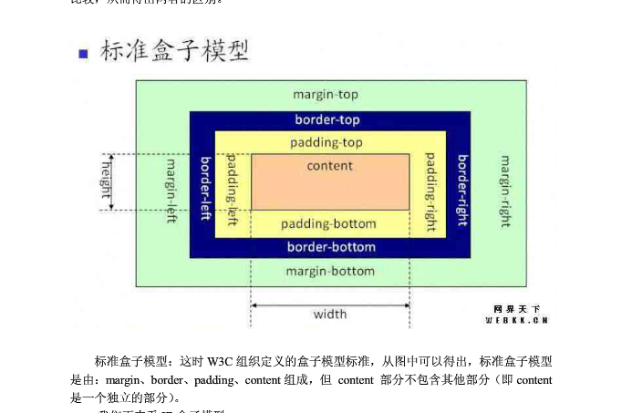
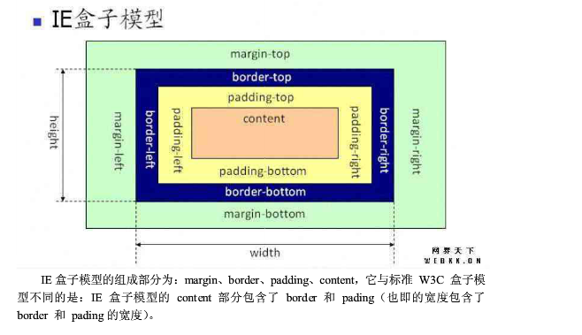

# NOWCODE错题、好题研究整理

## 重要参考手册

### bootstrap中文文档
<http://v3.bootcss.com/>

### jQuery中文手册
<http://jquery.cuishifeng.cn/>

# 一
### 1.（***数组/字符串方法***）
输出对象中值大于2的key的数组

	var data = {a: 1, b: 2, c: 3, d: 4};
	
	Object.keys(data).filter(function(x) { return___ ;})

期待输出：[“c”,”d”]

**答案：** data[x]>2 或 arguments[1]>2

**解析：** 
###### 方法一：

	var data={a:1,b:2,c:3,d:4};
	var newdata=Object.keys(data).filter(
	    function (x) {
	        return data[x]>2;
	    }
	);
	console.log(newdata);

Object.keys(oneObject)：返回对象oneObject的可枚举属性和方法的名称。
	
	console.log(Object.keys(data));//["a", "b", "c", "d"]
**注意：** 其获取的属性和方法的名称是带""的故，利用它们访问属性值使不能使用.法，只能使用[]法。

(Array.)filer(callback)：对数组的每个元素调用定义的回调函数，并返回回调函数返回为true的值的项组成的素组。

数组迭代方法：

- every():对数组中的每一项运行给定函数，若函数对每一项都返回true,则返回true。
- some()：对数组的每一项运行给定函数，若函数对任一项返回true,则返回true。
- filter():对数组的每一项运行给定函数，返回该函数返回true的项组成的数组。
- map():对数组的每一项运行给定函数，返回每次函数调用的结果组成的数组。
- forEach():对数组的每一项运行给定函数。该方法无返回值。

方法二：

	var data={a:1,b:2,c:3,d:4};
	var newdata=Object.keys(data).filter(
	    function (x) {
	        return arguments[1]>=2;
	    }
	);
	console.log(newdata);
关于array.filter（）详细介绍：https://msdn.microsoft.com/zh-cn/library/ff679973(v=vs.94).aspx


### 2.（***CSS构图***）
请用CSS实现如下图的样式，相关尺寸如图示，其中dom结构为：

	<div id=”demo”></div>
<http://www.nowcoder.com/questionTerminal/011952f7acf04e028949f25fcd557e86>

**答案：**
方法一：

	<!DOCTYPE HTML>
	<html>
	    <head>
	        <title>My answer</title>
	        <style type="text/css">
	          #demo{
	            position: absolute;
	            width: 100px;
	            height: 100px;
	            border: 2px solid #000;
	            background-color: #fff;
	          }
	          #demo:before,#demo:after{
	            position: absolute;
	            content: "";
	            border: 10px;
	            left: 100px;
	            width: 0px;
	            height: 0px;
	          }
	          #demo:before{
	            top: 18px;
	            border-left: 12px solid #000;
	            border-top: 12px solid transparent;
	            border-bottom: 12px solid transparent;
	          }
	          #demo:after{
	            top: 20px;
	            border-left: 10px solid #fff;
	            border-top: 10px solid transparent;
	            border-bottom: 10px solid transparent;
	          }
	        </style>
	    </head>
	    <body>
	        <div id="demo">
	        </div>
	    </body>
	</html>

方法二：

           <!DOCTYPE html>            
                  <html>         
                  <head>         
                      <title>myanswer</title>         
                      <styletype="text/css">                                   
                      .bigRec{         
                          position: absolute;         
                          top: 10px;         
                          left: 10px;         
                          margin: 0px;         
                          padding: 0px;         
                          width: 100px;         
                          height: 100px;         
                          border: 2px solid #000;         
                          background-color: #fff;         
                      }         

                      .smallRec{         
                          position: absolute;         
                          top: 33px;         
                          left: 105px;         
                          width: 14px;         
                          height: 14px;         
                          border: none;         
                          border-top: 2px solid #000;         
                          border-right:2px solid #000;         
                          transform: rotate(45deg);         
                          background-color: #fff;             
                      }            
                      </style>         
                  </head>         

                  <body>         

                      <divid="demo">                              
                        <divclass="bigRec"></div>                             
                        <divclass="smallRec"></div>          
                      </div>         
                  </body>         
                  </html>         

**补充知识：**

1. left/top: 定义了定位元素**外边距边界**与其包含块边界之间的偏移。

2. ：before/:after:为某元素添加:before/:after

 	(1)#id:before之间不能有空格<br>
	(2)插完：before/:after之后元素DOM结构形如

		```
		<div id="id">
			::before
			::after
		</div>
 		```
	(3)#id:before的css要有content属性，没有内容要content:""

3. 绘制三角形的方法

	方法一：

	可用css中的border实现：

		width:0;<br>
		height:0;<br>
		border-right:10px solid red;
		border-top:10px solid transparent;//设置透明
		border-bottom:10px solid transparent;

	三角形 顶点在哪边 就 不设置哪边的border值 ，三角形向左或向右，则设置border的顶部和底部为相同像素的透明色。三角形的高则为像素的点素，即px值。
	
	方法二：
	
	用一个正方形设置transform:rotate(45deg)来实现


### 3. （***JavaScript理论***）
简述document.write和innerHTML的区别。

**答案：**
document.write只能重绘整个页面,
innerHTML可以重绘页面的一部分。

### 4.（***JavaScript理论***）
你知道的，javascript语言的执行环境是"单线程模式"，这种模式的好处是实现起来比较简单，执行环境相对单纯；坏处是只要有一个任务耗时很长，后面的任务都必须排队等着，会拖延整个程序的执行，因此很多时候需要进行“异步模式”，请列举js异步编程的方法。

**答案：**
	
1. 回调函数，这是异步编程最基本的方法。
2. 事件监听，另一种思路是采用事件驱动模式。任务的执行不取决于代码的顺序，而取决于某个事件是否发生。
3. 发布/订阅，上一节的"事件"，完全可以理解成"信号"。***待查资料***
<http://www.codesec.net/view/190798.html>
4. Promises对象，Promises 对象是CommonJS 工作组提出的一种规范，目的是为异步编程提供统一接口。

### 5.（***其他***）
用户从手机的浏览器访问www.baidu.com，看到的可能跟桌面PC电脑，是不太一样的网页效果，会更适合移动设备使用。请简要分析一下，实现这种网页区分显示的原因及技术原理。

**答案：**

#### 1)总述：

	手机的网速问题、屏幕大小、内存、CPU等。
	通过不同设备的特征，实现不同的网页展现或输出效果。
	根据useragent、屏幕大小信息、IP、网速、css media Query等原理，实现前端或后端的特征识别和行为改变

#### 2)关于userAgent和客户端检测技术：
	

	这种网页区分显示的原因是其应用了客户端检测技术。
	其技术原理为，检测用户代理字符串。
	如要检测是移动设备，则须检测navigator.userAgent.indexOf("iphone")>-1或navigator.userAgent.indexOf("Android")>-1或navigator.userAgent.indexOf("NokiaN")>-1是否为true。然后针对不同的检测结果向网页应用不同的板式效果。

#### 2)关于响应式布局

     技术原理还包括响应式布局。

##### (1)什么是响应式布局
一个网站能够兼容多个终端——而不是为每个终端做一个特定的版本。
##### （2）响应式布局的优点和缺点
###### 优点
- 面对不同分辨率设备灵活性强
- 能够便捷地解决多设备显示适应问题

###### 缺点
- 为了兼容各种设备，工作量很大
- 代码累赘，会出现隐藏无用的元素，加载时间加长 
- 一定程度上改变了网站原有的布局结构
##### （3）如何实现
##### 示例
###### a.在style 标签中使用media属性

	<style media="screen AND (max-width:500px)" type="text/css">
		a{

		}
		#id{
		}

	</style>
	<style media="screen AND (min-width:500px)" type="text/css">
	</style>

##### b.在样式表中内嵌@media

	<style type="text/css">
        body{
            width: 100%;
            
        }
        @media(min-device-width:1024px) and (min-width:900px){
            div{
                position: absolute;
                width: 60%;
                left: 20%;
                height: 20px;
                background-color: yellow;
            }
        }
        @media screen and (max-width:800px){
            div{
                position: absolute;
                width: 98%;
                left: 1%;
                height: 20px;
                background-color: yellow;
            }
        }
     
    </style>

##### c.在link标签中使用media属性

	　　<link rel=“stylesheet” type=“text/css” media=“only screen and （max-width： 480px），only screen and （max-device-width： 480px）” href=“link.css”/>

#### 语法
字符间以空格相连，选取条件包含在小括号内，only（限定某种设备，可省略），and（逻辑与），not（排除某种设备）为逻辑关键字，多种设备用逗号分隔，这一点继承了css基本语法。

### 6.（***html***）
关于一些html标签  

	<mark> 高亮显示文本
	<del> 用于显示删除的文本
	<ins> 文字会带下划线（表新插入的文本）
	<strong> 用于强调文本


### 10.（***html*** / ***跨域***）
iframe的使用场景有？

	A.与第三方域名下的页面共享cookie
	B.上传图片，避免当前页刷新
	C.左边固定右边自适应的布局
	D.资源加载

**答案：** ABCD

关于A说明：cookie在性质上是绑定在特定的域名下的。当设定了一个cookie后，再给创建它的域名发送请求时，都会包含这个cookie。这个限制确保了cookie中的信息无法被其他域访问。使用iframe可以解决这个问题。

关于cookie参见《JavaScript高级程序设计》P629

## 二、来自阿里巴巴2016前端开发工程师笔试（二）
### 1.（***JavaScript***)
下列哪个操作是W3C标准定义的阻止事件向父容器传递：

	A. e.preventDefault()
	B. e.cancelBubble=true
	C. e.stopPropagation()
	D. e.stopImmediatePropagation()

**答案：** C

参见《JavaScript高级程序设计》P355

DOM中的事件对象的方法/属性：**event.+**
    
方法/属性名称|类别|作用
---|---|---
preventDefault() |Function |取消事件的默认行为。在cancelable是true的时候可以用这个方法。
stopImmediatePropagation() |Function | 取消事件冒泡同时阻止当前节点上的事件处理程序被调用。
stopPropagation() |Function |取消事件的进一步捕获或冒泡，对当前节点无影响。在bubbles是true的时候可以用这个方法。
target|Element|事件真正的具体的目标

IE中的事件对象

方法/属性名称|类别|作用
---|---|---
cancelBubble |Boolean | 默认为false,设置为true可以取消事件冒泡（与DOM的stopPropagation()方法作业相同）
returnValue |Boolean |默认为true,设置为false可以取消事件的默认行为（与DOM的preventDefault()方法作用相同）
srcElement|Element|事件的真正的具体的目标（与DOM的target属性作用相同）

### 2. (***CSS***)
以下有关盒子模型的描述正确的是：

	A.标准盒子模型中：盒子的总宽度 ＝ 左右margin + 左右border + 左右padding + width
	B.IE盒子模型中：盒子总宽度 ＝ 左右margin + 左右border + width
	C.标准盒子模型中：盒子的总宽度 ＝ 左右margin + 左右border + width
	D.IE盒子模型中：盒子总宽度 ＝ width

**答案：** A

- IE盒子模型和标准盒子模型都是由四个部分组成的：margin,border,padding,content这四个部分！！！

- 不同的是在标准盒子模型中content是一个独立的部分不包含其他部分(即height和width属性指的是中间部分！！但是 **在IE盒子模型中content包含了border,padding**（即height和width属性不仅包括的中间部分，还包括padding和border部分）。





- 背景应用于由内容和内边距、边框组成的区域。

 
### 3.（***CSS***)                   【***较生***】
使用CSS的flexbox布局，不能实现以下哪一个效果： 

	A. 三列布局，随容器宽度等宽弹性伸缩
	B. 多列布局，每列的高度按内容最高的一列等高
	C. 三列布局，左列宽度像素数确定，中、右列随容器宽度等宽弹性伸缩
	D. 多个宽高不等的元素，实现无缝瀑布流布局

**答案：** D
关于Flexbox，参见教程：<br>
[Flex布局教程：语法篇](http://www.ruanyifeng.com/blog/2015/07/flex-grammar.html)<br>
[Flex布局教程：实例篇](http://www.ruanyifeng.com/blog/2015/07/flex-examples.html)
参见 前端好贴整理 10.Flex布局

### 4.（***网络协议***）
关于HTTP协议，下面哪个说法是正确的？

	A.HTTP协议是有状态协议。
	B.以下是一个Http链接的response 的响应头： GET /xxx/xxx/js/lib/test.js HTTP/1.1 Host: 127.0.0.1 Connection: keep-alive Pragma: no-cache Cache-Control: no-cache Accept: */*
	C.RESTful 接口中，利用HTTP协议的method字段来描述要对资源操作的方式，比如GET表示获取资源，POST表示新增一个资源，PUT表示更新资源,DELETE 表示删除资源等等。
	D.一个HTTP请求返回的HTTP状态码中，304表示临时重定向。

**答案：** C

参考：<http://www.runoob.com/http/http-intro.html><br>
[http请求头响应头大全](http://tools.jb51.net/table/http_header)

##### 关于A:
HTTP协议自身不对请求和响应之间的通信状态进行保存，即不保存之前的一切请求或响应报文的信息。

目的：为了更快地大量处理事务，所以要这么简单。

为了解决保持状态的技术：cookie技术。

##### 关于B：
Http报文格式：
###### 请求报文
包括：a.报文首部 (空行) b.报文主体<br>
a.报文首部包括：<br>
a.1请求行。<br>
包含用于请求的方法。请求行构成：方法+ URI+ 协议版本。<br>
a.2首部字段（请求首部字段，通用首部字段，实体首部字段）<br>
a.3其他，比如cookie。

###### 响应报文
包括：a.报文首部 b.空行 c.报文主体<br>
a.报文首部包括：<br>
a.1状态行。<br>
包含表明请求结果的状态码。状态行构成：协议版本+ 状态码+ 状态码的原因短语。<br>
a.2首部字段（响应首部字段，通用首部字段，实体首部字段）<br>
a.3其他，比如cookie。

##### 关于D:
http状态码：
###### 3XX （重定向状态码）需要进行附加操作以完成请求
- 301 Moved Permanently//永久重定向。表请求的资源已被分配了新的URI,如指定资源路径最后没有加/
- 302 Found//临时重定向。
- 303 See Other//同302，但明确表示客户端应当采用GET方法获取资源。
- 304 Not Modified//未修改。所请求的资源未修改，服务器返回此状态码时，不会返回任何资源。和重定向无关。可以从缓存加载

D错。


### 5.（***JavaScript ECMAScritpt***）
使用 for in 循环数组中的元素会枚举原型链上的所有属性，过滤这些属性的方式是使用__函数。***原型链***
**答案：** hasownproperty

	function Person() {
	}
	
	Person.prototype.name="Nicholas";
	Person.prototype.age=29;
	Person.prototype.sayName=function(){
	    alert(this.name);
	}
	
	var person1=new Person();
	person1.name="Greg";
	
	var person2=new Person();
	
	console.log(person1.hasOwnProperty("name"));//true
	console.log(person2.hasOwnProperty("name"));//false
	
	console.log("name" in person1);//true
	console.log("name" in person2);//true
	
	for (var prop in person1) {
	    console.log(prop);//name   age   sayName
	}
	
	function hasPrototypeProperty(object,pro) {//如此可判断存在于原型中的属性
	    return (!object.hasOwnProperty(pro))&&(pro in object);
	}
	console.log(hasPrototypeProperty(person1,"name"));//false
	console.log(hasPrototypeProperty(person2,"name"));//true

- for in 会枚举对象所有属性，包括原型链上的和自身属性；
- hasOwnProperty()可判断该属性是否是自身属性，如果是则返回true,否则返回false;
- in会判断对象是否有该属性，不管该属性是原型链属性还是自身属性，都返回true。

***看到这里了***
__________________________
### 6.（***JavaScript——ECMAScritpt***）
在空白处填入适当的代码使输出结果成立。

	function showMoney( ) {
	   ___
	};
	
	var personA = new Object;
	var personB = new Object;
	
	personA.money= "100";
	personB.money= "150";
	
	personA.showMoney= showMoney;
	personB.showMoney= showMoney;
	
	console.log(personA.showMoney());//100
	console.log(personB.showMoney());//150


**答案：** 

	return this.money;

### 18.(***JavaScript——ECMAScript——数组方法***）
删除给定数组中的第二项和第三项，并且在得到的新的数组中第二项后面添加一个新的值。
	
	var arr1 = ['a','b','c','d','e'];
	var arr2 = arr1. __ ( __ , __,'newvalue')	


**答案：**

	var arr1=['a','b','c','d','e'];
	var arr2=arr1.splice(1,2,'newvalue');
	console.log(arr1);//['a','newvalue','d','e']
	console.log(arr2);//['b','c']

注意：splice操作是在原数组上，操作后返回的是删除项。

### 19.(***JavaScript——ECMAScript——数据类型***）
写一个求和函数，达到下面的效果

	// Should equal 15
	sum(1, 2, 3, 4, 5);

	// Should equal 0
	sum(5, null, -5);

	// Should equal 10
	sum('1.0', false, 1, true, 1, 'A', 1, 'B', 1, 'C', 1, 'D', 1,  'E', 1, 'F', 1, 'G', 1);

	// Should equal 0.3, not 0.30000000000000004
	sum(0.1, 0.2);

**答案：**

方法1：

		function sum() {
		    var rel=0,len=arguments.length;
		    for (var i=0;i<len;i++) {
		        if ((isNaN(arguments[i])==false)&&(typeof arguments[i]=="number")) {
		            rel+=arguments[i]*10;
		        }
		        else if ((typeof (Number(arguments[i]))=="number")&&(isNaN(Number(arguments[i]))==false)&&(typeof arguments[i]!="boolean")) {
		            rel+=Number(arguments[i])*10
		        }
		        
		    }
		    return rel/10;
		    
		}

方法2：待整理

	

**知识点复习：**

- Number()函数转换规则

	类型|转换规则
	-- |-------
	Booleen|true→1，false→0
	数值型|不变
	null|0
	undefined|NaN
	字符串|(1)如果其仅包含数字,如“123”，则转换为十进制数字，首位0去掉；<br>(2)如果包含有效的浮点格式，如“1.1”，则将其转为对应的浮点数值；<br>(3)如果包含有效的十六进制格式，例如"0xf"，则将其转换为相同大小的十进制数值(console.log(Number("0xf"));//15);<br>(4)如果是空字符串，“”，则将其转换为0；<br>(4)如果还有其他字符，则将其转换为NaN。


- 关于NaN
	1. 任何涉及NaN的操作都会返回NaN
	2. NaN与任何值都不相等，包括NaN本身
	3. typeof NaN结果为 number
	4. isNaN(x)函数可以确定x是否“不是数值”
	
			console.log(typeof(NaN));//number
			console.log(NaN==NaN);//false
			console.log(isNaN(NaN));//true
			console.log(isNaN(10));//false
			console.log(isNaN("10"));//false,"10"转换为10
			console.log(isNaN("abc"));//true,"abc"转换为NaN
			console.log(isNaN(true));//false,true转换为1

### 20.待整理
### 21.待整理

## 三、来自腾讯2015春招web前端开发练习卷

### 1.（***前端其他技术***）
jQuery Ajax都支持哪些返回类型？

**答案：** xml,html,jsonp,json

### 2.（***JavaScript——ECMAScript***)
下面哪些语句可以在JS里判断一个对象oStringObject是否为String？

		A.oStringObject instanceof String
		B.typeof oStringObject == 'string'
		C.oStringObject is String
		D.以上答案都不正确

**答案：** A

**解析：**

	var str1="abc";
	console.log(typeof str1);//string
	console.log(str1 instanceof String);//false
	
	var str2=new String("abc");
	console.log(typeof str2);//object
	console.log(str2 instanceof String);//true
	console.log(str2 instanceof Object);//true

string如果是基本类型的，用typeof即可判断；如果是引用类型的，要用instanceof判断。

题目说了是一个对象，故用typeof判断出来的是'object'，只能用instanceof 判断。

### 3. （***前端其他技术***）
常见的浏览器端的存储技术有哪些？

	A.cookie
	B.localStorage
	C.session
	D.userData

**答案：** ABD

**解析：**
详见《JavaScript高级程序设计》Chapter23
##### (1)cookie:
cookie会随着每次HTTP请求头信息一起发送，无形中增加了网络流量，另外，cookie能存储的数据容量有限，根据浏览器类型不同而不同，IE6大约只能存储2K。

##### (2)webStorage（包括sessionStorage,globalStorage和localStorage)
数据被严格控制在客户端，无须将数据发回服务器，存储量大。

###### sessionStorage
sessionStorage对象存储特定于某个会话的数据，该数据只保持到浏览器关闭，且只能由最初给对象存储数据的页面访问到。
###### globalStorage
可跨对话存储数据。但要指定哪些域可以访问。
###### localStorage
在HTML5规范中作为持久保存客户端数据的方案取代了globalStorage。与globalStorage不同的是，不能给localStorage指定任何访问规则，规则实现就设定好了：同源（同协议，同域名，同端口）

##### (3)userData
ie用户数据。仅在ie下有效。一旦某元素使用了userData行为，就可以使用setAttribute()方法在上面保存数据。

##### (4)session
称为“会话控制”。Session 对象存储特定用户会话所需的信息。这样，当用户在应用程序的 Web 页之间跳转时，存储在 Session 对象中的变量将不会丢失，而是在整个用户会话中一直存在下去。当用户请求来自应用程序的 Web 页时，如果该用户还没有会话，则 Web 服务器将自动创建一个 Session 对象。当会话过期或被放弃后，服务器将终止该会话。
**session为服务器端存储技术**

### 4.(***JavaScript——ECMAScript***)
如何规避javascript多人开发函数重名问题。

	A. 根据不同的开发人员实现的功能，在函数名加前缀
	B. 每个开发人员都把自己的函数封装到类中，然后调用的时候即使函数名相同，但是因为是要类.函数名来调用，所以也减少了重复的可能性
	C. 以上都不对

**答案：** AB

### 5.(***JavaScript——ECMAScript——数据类型***）
javascript基本数据类型有？

	A.字符串
	B.数字
	C.null
	D.undefined

**答案：** ABCD

ECMAScript有

- 5种简单数据类型：Undefined、Null、Number、Boolean、String

- 1种复杂数据类型:Object

- 引用类型：
	- 5种（正常的）引用类型：Object、Array、Date、RegExp、Function
	- 3种基本包装类型：Boolean、Number、String
	- 2个单体内置对象：Global、Math

### 6.(***HTML***)
有关html结构描述正确的是？

	A.<ul> <li> </li> </ul>
	B.<ol> <li> </li> </ol>
	C.<dl><dt><dd></dd></dt></dl>
	D.<table> <tr> <td></td> </tr> </table>
**答案：** ABD

关于dl、dt、dd:
	
	<dl>
	   <dt>计算机</dt>
	   <dd>用来计算的仪器 ... ...</dd>
	   <dt>显示器</dt>
	   <dd>以视觉方式显示信息的装置 ... ...</dd>
	</dl>

dl定义列表。dt定义列表中的项目。dd描述列表中的项目。

### 8.（***浏览器兼容性***）
关于IE、FF下脚本的区别,描述错误的是：***赶紧再复习Chapter10***

	A.innerText IE支持，FIREFOX不支持
	B.document.createElement FIREFOX支持，IE不支持
	C.setAttribute('class'，'styleClass') FIREFOX支持，IE不支持
	D.用setAttribute设置事件 FIREFOX不支持，IE支持
**答案：** BCD

##### （1）innerText: 
IE支持，FIRFOX不支持

- innerText、outerText原为IE专有属性，但没有被HTML5看中（对innerHTML、outerHTML也是IE专有属性，但被HTML5看中了）。
- 支持innerText的浏览器有IE4+、Safari8+、Opera8+和Chrome。
- **Firefox不支持innerText，但其支持类似的textContent属性**。故可用得到跨浏览器的代码：

	function getInnerText(element) {
	    return (typeof element.textContent=="String")? element.textContent: element.innerText;
	}
	
	function setInnerText(element,text) {
	    if (typeof element.textContent=="string") {
	        element.textContent=text;
	    }
	    else{
	        element.innerText=text;
	    }
	}

***参见《JavaScript高级程序设计》P301***

##### （2）document.createElement（）：
IE支持，FIRFOX也支持。

###### IE有3种方式都可以创建一个元素:
	1 document.createElement("<input type=text>")
	2 document.createElement("<input>")
	3 document.createElement("input")
###### Firefox只支持一种方式:
	document.createElement("input");document.setAttribute(name,value);

***参见《JavaScript高级程序设计》P268***

##### （3）setAttribute(属性名，属性值)
 Element.setAttribute(属性名，属性值），为所选元素添加指定的属性，并为其赋值。如果这个指定的属性已存在，则仅设置/更改值。

**所有主流浏览器均支持setAttribute,除ie7及之前版本。**

***参见《JavaScript高级程序设计》P265***


___________
复习到这里

### 9.下面有关javascript内部对象的描述正确的是？

	A.History 对象包含用户（在浏览器窗口中）访问过的 URL
	B.Location 对象包含有关当前 URL 的信息
	C.Window 对象表示浏览器中打开的窗口
	D.Navigator 对象包含有关浏览器的信息

**答案：**ABCD
##### History对象
History是window对象的属性，因此每个浏览器窗口、每个标签页、每个框架都有自己的history对象。<br>
history对象包含用户（在浏览器窗口中）访问过的URL。只不过出于安全方面的考虑，无法得知浏览过的URL，可以在不知道URL的情况下后退和前进。<br>
History对象的属性和方法：
属性/方法|描述
---------|----
length|返回历史记录数量，包括所有向前和向后的记录
back()|后退一页
forward()|前进一页
go(number/URL)|在历史记录中任意跳转，或包含该字符串的最近位置。

##### Location对象
包含有关当前URL的信息。window.location和document.location都可以访问它。
属性|描述
----|----
hash|   设置或返回从井号 (#) 开始的 URL（锚）。
host|	设置或返回主机名和当前 URL 的端口号。
hostname|	设置或返回当前 URL 的主机名。
href|	设置或返回完整的 URL。
pathname|	设置或返回当前 URL 的路径部分。
port|	设置或返回当前 URL 的端口号。
protocol|	设置或返回当前 URL 的协议。
search|	设置或返回从问号 (?) 开始的 URL（查询部分）。

##### Window 对象
window对象表示浏览器中打开的窗口。

如果文档包含框架（frame 或 iframe 标签），浏览器会为 HTML 文档创建一个 window 对象，并为每个框架创建一个额外的 window 对象。	

详见<http://www.w3school.com.cn/jsref/dom_obj_window.asp>

##### Navigator对象
Navigator对象包含有关浏览器的信息。现在已成为识别客户端浏览器的事实标准。

详见《JavaScript高级程序设计》P210

### 9.假设当前屏幕分别率为1024×768，定义一个居中的占屏幕一半大小的表格的语句是。
	A.<TABLE ALIGN=”CENTER” WIDTH=”50%”></TABLE>
	B.<TABLE ALIGN=”CENTER” WIDTH=”512″></TABLE>
	C.<DIV ALIGN=”CENTER”><TABLE WIDTH=”512″></TABLE></DIV>
	D.<CENTER><TABLE WIDTH=”50%”></TABLE></CENTER>

**答案：**ABCD

### 10.嵌入在HTML文档中的图像格式可以是？

 	A. *.gif
	B. *.tif
	C. *.bmp
	D. *.jpg

**答案：** ACD

### 11.下面属于CSS3新增属性的有？

	A.box-shadow
	B.text-shadow
	C.border-radius
	D.rgba

**答案：** ABCD

### 12.请给Array本地对象增加一个原型方法，它用于删除数组条目中重复的条目(可能有多个)，返回值是一个包含被删除的重复条目的新数组。

方法一：两层循环比较

	Array.prototype.distinct=function(){
	    var i=1;
	    var delArr=[];
	    while (this[i]) {
	        for (var j=0;j<i;j++) {
	            if (this[i]===this[j]) {
	                delArr=delArr.concat(this.splice(i,1));
	                break;
	            }
	        }
	        if (j==i) {
	            i++;
	        }
	    }
	    return delArr;
	}
	
	var myArray=[1,1,1,12,12,12,'a','b','ba','ba','bc','"a"','e','1','2','2','"3"'];
	var mydelArr=myArray.distinct();
	console.log(myArray);//[1, 12, "a", "b", "ba", "bc", ""a"", "e", "1", "2", ""3""]
	console.log(mydelArr);//[1, 1, 12, 12, "ba", "2"]

方法二：巧用素组的indexOf()方法

	Array.prototype.distinct=function(){
	    var i=1;
	    var delArr=[];
	    while (this[i]) {
	       if (this.indexOf(this[i])!=i) {
	            delArr=delArr.concat(this.splice(i,1));
	        }
	        else{
	            i++;
	        }
	    }
	    return delArr;
	}

***复习数组方法，复习Chapter5***