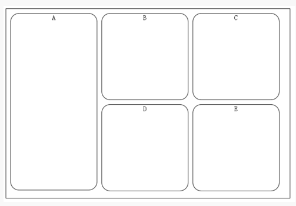
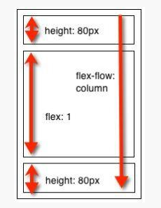
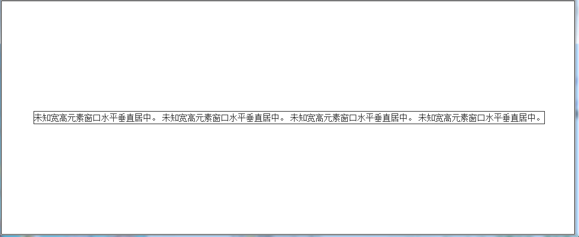

## div+css布局经典问题
## 资源一：
<http://www.mianwww.com/html/2013/10/19044.html>
### 一、超链接点击过后hover样式就不出现的问题？

答案：被点击过的超链接样式不再具有hover和active样式，解决办法是按l-v-h-a的顺序设置其CSS属性的排列顺序：

    	a:link{ /*未访问时*/
            color:blue;
        }
        a:visited{/*已被访问时*/
            color: blue;
        }
        a:hover{/*悬浮时，即鼠标指针位于其上*/
            color:red;
        }
      
        a:active{/*点击时*/
            color: yellow;
        }

### 二、IE6的margin双倍边距问题

#### 问题描述：

	<head>
	   
	</head>
	    
	<body>
	    
	   
hahaha

	
	</body>

浮动后本来左外边距应该为10px，但是IE6会解释为20px

#### 解决办法：

	给浮动元素加上 display:inline;

### 三、火狐浏览器下文本无法撑开容器的高度,怎么解决这个问题？

#### 问题描述：

标准浏览器中固定高度值的容器是不会象IE6里那样被撑开的,如果又想固定高度，又想能被撑开需要怎样设置呢？

#### 解决办法：

办法就是去掉height设置min-height:200px，即为：

	  div{
            min-height: 10px;
        }
	

 这里为了照顾不认识min-height的IE6 可以这样定义：

	div { 
		height:auto!important;
	    height:200px;
        min-height:200px; 
    }

### 四、为什么web标准中无法设置IE浏览器滚动条颜色了？
#### 问题描述

 	  
IE的颜色无法变化。。。

#### 解决办法
将body改成html。

***问题是经检测所有的浏览器都不支持滚动条颜色变化***
### 五、如何定义1px左右高度的容器？***先略***
### 六、怎么样才能让层显示在FLASH之上呢？***先略***

## 资源二：
<http://developer.51cto.com/art/201504/473284.htm>
### 1. 多元素水平居中
#### 实现布局：

#### 答案代码：
	<head>
	       
	</head>
	    
	<body>
	    

	       

	            A
	       

	       

	            B
	       

	       

	            C
	       

	       

	            D
	       

	    

	  
	
	</body>
	</html>
#### 补充说明
1. 在IE7及以下，display: inline-block只是触发了元素的layout。比如将display: inline-block设置到div上，只能保证这个div拥有块元素的特征（可以设置宽度，高度等），但还是会产生换行。 故接下来要设置 display: inline，使其不产生换行。将display:inline-block;* display:inline;写在同一个样式上，inline- block属性是不会触发元素的layout的，因此我们还要额外加上 * zoom:1来触发layout。

2. display:inline-block元素间会产生多余空白（本题没有涉及）。解决方法：父元素定义font-size:0 去掉行内块元素水平方向空白；子元素定义vertical-align 属性去掉行内块元素垂直方向空白。***待研究***

#### 规律总结：

##### 1.对于普通浏览器
容器设置text-align:center,内容项目设置display:inline-block、并通过margin值控制项目间距。

##### 2.对于IE7及以下
容器设置text-align:center,内容项目设置display:inline-block;display:inline;zoom:1;

### 3.栅栏式布局

#### 实现布局1

#### 答案代码1
	     
	</head>
	    
	<body>
	    

	       

	            A
	       

	       

	            B
	       

	       

	            C
	       

	       

	            D
	       

	        

	            D
	       

	    

	 
	</body>

#### 实现布局2：

#### 答案代码2：

	      
	</head>
	    
	<body>
	    

	       

	            A
	       

	       

	            B
	       

	       

	            C
	       

	      
	    

	  
	
	</body>

#### 规律总结

关于Flexbox，参见教程： 
[Flex布局教程：语法篇](http://www.ruanyifeng.com/blog/2015/07/flex-grammar.html) 
[Flex布局教程：实例篇](http://www.ruanyifeng.com/blog/2015/07/flex-examples.html)(内含骰子布局、网格布
局、圣杯布局） 

### 3. 未知高度多行文本垂直居中

#### 实现布局：

#### 答案代码：
		   
	</head>
	    
	<body>
	    

	       

	            未知宽高元素窗口水平垂直居中。
	            未知宽高元素窗口水平垂直居中。
	            未知宽高元素窗口水平垂直居中。
	            未知宽高元素窗口水平垂直居中。
	       

	      
	      
	    

	  
#### 规律总结：
1. box 容器的position设置为fixed，然后通过设置width和height都为100%从而占据整个窗口；

2. 容器再通过 after或者before 生成一个高度 100% 、宽度为0的「备胎」，其的高度和容器的高度是一致的，并为其设置display为inline-block,然后设置vertical-align为middle。这样，同级其他inline-block的元素都会相对于该「备胎」垂直居中，在视觉上表现出来也就是相对于容器垂直居中了。

3. 设置容器内元素的display为inline-block,这样它就相对于容器垂直居中了。

#### 延伸：未知宽高图片的居中
	       
	</head>
	    
	<body>
	    

	       
	    

	  
	
	</body>
### 4. 多栏自适应布局

	    
	</head>
	    
	<body>
	    

	       
	        
	        

	            多栏自适应布局
	            多栏自适应布局
	            多栏自适应布局
	       

	    

***该题目先放着，因为-box-flex是比flex较陈旧的东西***

### 5.强制不换行

#### 实现效果1：强制不换行

#### 答案代码1：

	
	</head>
	
	<body>
	

					             	aaaaaaaaaaaaaaaaaaaaaaaaaaaaaaaaaaaaaaaaaaa
					        	aaaaaaaaaaaaaaaaaaaaaaaaaaaaaaaaaaaaaaaaaaa
					        	aaaaaaaaaaaaaaaaaaaaaaaaaaaaaaaaaaaaaaaaaaa
					        	aaaaaaaaaaaaaaaaaaaaaaaaaaaaaaaaaaaaaaaaaaa
	 

	
	
	</body>

#### 规律总结1：white-space属性

white-space属性，设置如何处理元素内的空白。

white-space属性值|属性值描述
----------------|---------
normal|默认。空白会被浏览器忽略。
pre|空白会被浏览器保留。其行为方式类似 HTML 中的 <pre> 标签。
nowrap|文本不会换行，文本会在在同一行上继续，直到遇到br标签为止。
pre-wrap|保留空白符序列，但是正常地进行换行。
pre-line|合并空白符序列，但是保留换行符。
inherit|规定应该从父元素继承 white-space 属性的值。

#### 实现效果2：自动换行
#### 答案代码2：

	  
	</head>
	
	<body>
	    

	        aaaaaaaaaaaaaaaaa     aaaaaaaaaaaaaaaaaaaaaa
	        bbbbbbbbbbbbbbbbbbbbbbbbbbbbbbbbbbbbbbbbbbbb
	        cccccccccccccccccccccccccccccccccccccccccccc
	        aaaaaaaaaaaaaaaaaaaaaaaaaaaaaaaaaaaaaaaaaaa
	        hhhhhhhhhhhhhhhhhhhhhhhhhhhhhhhhhhhhhhhhhhhhhh
	        
	    

#### 规律总结2：word-wrap属性

word-wrap 属性允许长单词或 URL 地址换行到下一行。

值|描述
--|----
normal|只在允许的断字点换行（浏览器保持默认处理）。
break-word|在长单词或 URL 地址内部进行换行。

#### 实现效果3：强制英文单词断行

#### 答案代码3：
	  
	</head>
	
	<body>
	    

	        aaaaaaaaaaaaaaaaa     aaaaaaaaaaaaaaaaaaaaaa
	        bbbbbbbbbbbbbbbbbbbbbbbbbbbbbbbbbbbbbbbbbbbb
	        cccccccccccccccccccccccccccccccccccccccccccc
	        aaaaaaaaaaaaaaaaaaaaaaaaaaaaaaaaaaaaaaaaaaa
	        hhhhhhhhhhhhhhhhhhhhhhhhhhhhhhhhhhhhhhhhhhhhhh
	        
	    

	
	
	</body>

#### 规律总结3: word-break属性
word-break属性规定自动换行的处理方法，通过它可以让浏览器实现任意位置的换行。

值|描述
--|---
normal|使用浏览器默认的换行规则
break-all|允许在单词内换行
keep-all|只能在半角空格或连字符处换行

### 6. li超过一定长度，以省略号显示
#### 实现效果：li超过一定长度，以省略号显示

#### 答案代码：

	 
	</head>
	
	<body>
	   <ul class="nowrap">
	    <li>Today is a very good day.</li>
	    <li>My work is tiring but interesting.</li>
	    <li>lalalalalalalalalalalalalalalalala</li>
	    <li>hahahahahahahahahahahahahahahahahaha</li>
	   </ul>

#### 规律总结：

##### (1)overflow属性
overflow 属性规定当内容溢出元素框时发生的事情。

	
	值|描述
	--|----
	visible|不裁剪内容，可能会显示在内容框之外。
	hidden|裁剪内容 - 不提供滚动机制。
	scroll|裁剪内容 - 提供滚动机制。
	auto|如果溢出框，则应该提供滚动机制。
	no-display|如果内容不适合内容框，则删除整个框。
	no-content|如果内容不适合内容框，则隐藏整个内容。

##### （2）text-overflow属性
规定当文本溢出包含元素时发生的事情

值|描述
--|---	
clip|修剪文本。
ellipsis|显示省略符号来代表被修剪的文本。
string|使用给定的字符串来代表被修剪的文本。

### 7.左侧导航

	
	</head>
	
	<body>
	  

	        

	            

	                中间内容中间内容中间内容中间内容中间内容中间内容中间内
	                容中间内容中间内容中间内容中间内容中间内容
	            

	        

	  

	  

	    
左侧导航左侧导航左侧导航左侧导航左侧导航左侧导航左侧导航左侧导航左侧导航

	  

	</body>

### 8.css文字分栏
#### 答案代码：
	     
	</head>
	
	<body>
	   
  
	  　　当春风再一次吹拂她的脸庞时，那场让她刻骨铭心的失恋已在煦风轻扬的季节淡去了。她一点点地恢复，仿佛重生一般，花儿般的笑颜又重新浮上了她的脸庞。而他，看到她康复的样子，高兴极了，但他却不会讲什么，依旧如故，默默地陪在她身旁。他爱她，就包括爱她的一切缺点。这样做，他并不觉得有失尊严。他认为既然爱了，就应该无怨无悔。而她，觉得开始有点喜欢上了他，有些依赖他。但她认为，离爱还很遥远。   
	  　　转眼她和他都要毕业了，她甚至没有征求他的意见，就直接去了北方的一座城市，而他，却追随着她也到了这里。本来，在南方那座城市，他的家人早已给他联系好了一家不错的公司，但他连想都没想就拒绝了。她和他分别进了不同的公司。同在一个陌生的城市打工，难免心神俱疲，这个时候，她就很想找一个依靠，给她一点家的温暖。明明知道他一直愿意做她的依靠，可她却不愿意把自己的一生交付于他，因为她觉得自己一直不爱他，不爱，又如何依靠，再说，他也不能提供给她想像中的生活。  
	  
    
	  
  
	  
  
	  　　当春风再一次吹拂她的脸庞时，那场让她刻骨铭心的失恋已在煦风轻扬的季节淡去了。她一点点地恢复，仿佛重生一般，花儿般的笑颜又重新浮上了她的脸庞。而他，看到她康复的样子，高兴极了，但他却不会讲什么，依旧如故，默默地陪在她身旁。他爱她，就包括爱她的一切缺点。这样做，他并不觉得有失尊严。他认为既然爱了，就应该无怨无悔。而她，觉得开始有点喜欢上了他，有些依赖他。但她认为，离爱还很遥远。   
	  　　转眼她和他都要毕业了，她甚至没有征求他的意见，就直接去了北方的一座城市，而他，却追随着她也到了这里。本来，在南方那座城市，他的家人早已给他联系好了一家不错的公司，但他连想都没想就拒绝了。她和他分别进了不同的公司。同在一个陌生的城市打工，难免心神俱疲，这个时候，她就很想找一个依靠，给她一点家的温暖。明明知道他一直愿意做她的依靠，可她却不愿意把自己的一生交付于他，因为她觉得自己一直不爱他，不爱，又如何依靠，再说，他也不能提供给她想像中的生活。  
	  

	</body>

#### 规律总结

多列属性：
##### （1） column-count属性

规定元素应该被划分的列数，IE10和Opera支持column-count属性，FF支持替代的-moz-column-count属性，Safari和Chrome支持-webkit-column-count，IE9-不支持。

不管浏览器窗口缩放成何种比例，它永远都是规定的列数

##### （2）column-width 属性
规定列的宽度。IE10 和 Opera 支持 column-width 属性。
Firefox 支持替代的 -moz-column-width 属性。Safari 和 Chrome 支持替代的 -webkit-column-width 属性。IE9 以及更早版本的浏览器不支持 column-width 属性。

##### （3）column-gap属性
规定列之间的间隔。浏览器支持性同上。

##### （4）column-rule属性
它是一个简写属性。规定列之间分割的样式规则，包含宽度、样式、颜色，即column-rule-width column-rule-style column-rule-color;

### 9.修复侧边栏
#### 问题描述
在外容器添加导航栏和主内容板块，当（导航栏和主内容的宽度加上内外边距）的数值大于（外容器的宽度减去内边距的值），会导致导航和主内容中html代码排在后面的元素被挤下去。

***待研究：根本就没出现问题啊***
#### 解决办法

##### 方法1)Section元素上使用box-sizing:border-box;模拟IE6中，使得内元素的宽度为width的值，而非width加上padding和margin的值。

##### 方法2)  width:-moz-calc(75% -1rem * 2);width:-webkit-calc(75% - 1rem * 2); width: calc(75% - 1rem * 2); width属性中减去padding值

##### 方法3) 
在元素内部增加一个额外的容器，并将padding放在这个新增的内部容器中，这是一种修复方法，而且得到众多浏览器支持。

#### 规律总结
##### （1）IE盒子模型和标准盒子模型

两种盒子模型的范围都包括 margin、border、padding、content。不同的是：ie 盒子模型的 content 部分包含了 border 和 padding,即其width和height指包含了border和padding的宽度；w3c盒子模型的内容部分只是中间的内容部分，不包含border和padding。

## 资源三：
<http://web.jobbole.com/83384/>

## 资源四：
<http://www.cnblogs.com/yexiaochai/p/3158443.html>

## 资源五：
<http://blog.csdn.net/freshlover/article/details/11579669>