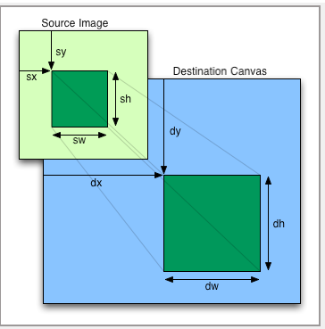

# Week3:HTML5 Graphics

## Lesson1 Video introduction

### words
- repetitive adj.重复的
- gradient n.梯度，坡度，渐变
- geometric transformation 几何变换
- geometric adj.几何学的
- loader 载入器，载入程序
- tricky adj.狡猾的，棘手的

## Lesson2 Basics of HTML5 canvas
### 2.1 关于JavaScript和HTML5
略

### 2.2 绘制图形并为其添加动画：canvas元素

#### 2.2.1 简介
canvas标签是HTML5的Flash杀手特征之一。本课程将关注于HTML5canvas的基础绘图能力。

W3C HTML5规范中关于canvas元素的说明：“canvas元素提供了分辨率相关的位图画布脚本，其可以用于渲染图形，游戏图像，或其他视觉影像。”

canvas是用于绘制像素式图像的，而SVG（Scalable Vector Graphics,可伸缩向量图形）是用于矢量式图像的。

canvas也用于制作动画（60帧每秒）

### 2.3 怎样使得HTML5的canvas具有残疾人可用性？

#### 2.3.1 简介

canvas元素的动态本质使其在需要具备残疾人可用性的应用程序中应用困难。想要具备残疾人可用性，必须遵守以下原则：

- 为canvas中绘制的内容提供可替换内容
- 将绘制于canvas中的形状、路径、图片的定位暴露给辅助技术
- 在视觉上指定canvas中的图像是否具有键盘焦点

#### 2.3.2 W3C的canvas专案组

其残疾人易用性已经添加到HTML5.1canvas规范。但只是初步工作目前还没有浏览器支持。

### 2.4 包含所有API方法和属性的canvas速查表

<https://simon.html5.org/dump/html5-canvas-cheat-sheet.html>

### 2.5 canvas坐标系
x轴是水平的，方向朝右

y轴是垂直的，方向朝下

坐标(0,0)在左上角。

### 2.6 canvas元素的典型应用

示例代码：

	<!DOCTYPE html>
	<html>
	<head>
	    <meta charset="utf-8">
	    <title>JS Bin</title>
	    
	    </style>
	</head>
	<body >
	   <canvas id="myCanvas" width=200 height=200>
	        Canvas is not supported by your browser...
	   </canvas>
	   
	</body>
	</html>

#### 2.6.1 对例子的详细解释

##### 步骤1：在HTML页面中添加canvas元素

	<canvas id="myCanvas" width="300" height="225">
	    Fallback content that will be displayed in case the web browser
	</canvas>

##### 步骤2：为了使用JavaScript,选择canvas元素
	
	var canvas = document.getElementById("myCanvas");

##### 步骤3：获取canvas相关的“2D context"对象，其对于绘制和设置绘图属性很有用

	var ctx=canvas.getContext('2d');
	ctx.fillStyle='red';
	ctx.fillRect(0,0,80,100);

#### 2.6.2 一些说明

##### （1）只有在DOM准备好后再获取元素

script中的window.onload=init()或在body元素中的< body onload="init();" >

这是个良好的做法。因为我们不能在页面完全加载且DOM准备好之前获取元素。

##### （2）获取canvas和其内容
在绘图前，我们必须获取绘图的"context",drawing context定义了我们可以用的绘图方法和属性。

良好的做法是我们在这个init函数中获取canvas,2D context对象，canvas的width和height,及其他全局属性。

##### （3）为填充图形设置颜色

在这里应用了context属性fillStyle。它可以设置颜色、渐变，或模式。

##### （4）绘图
调用了方法fillRect,其参数为fillRect(左上角的x坐标，左上角的y坐标，宽度，高度）

### 2.7 绘图准则

#### 2.7.1 更多关于Context对象
我们已经提过，我们为所有主要操作使用图形context对象。不管是一个形状，一段文本，或者是一个图像，context对象属性的当前值是被考虑进来的。你必须清楚只有context对象当前的属性值是被应用的。

#### 2.7.2 更多关于context对象的属性和方法
##### fillStyle是context的一个属性。和CSS属性有点像。

它的值可以是：
- 一种颜色
- 一个模式（文本）
- 一种渐变

其默认值是黑色。

fillStyle和其他context的属性可被看做是context对象的全局变量。

##### fillRect(x,y,width,height):这样调用绘制一个填充的矩形

eg:
	
	ctx.fillStyle='pink';
	ctx.fillRect(10,10,200,200);

##### strokeStyle是context的一个类似于fillStyle的属性，但其是指定怎样渲染一个图形的轮廓

它的值和fillStyle的一样：颜色，模式，渐变。当绘制线框的时候，这个属性将被采用。

##### strokeRect(x,y,width,height):和fillRect类似，但其实绘制线框而非填充的矩形。

eg:

	ctx.strokeStyle='blue';
	ctx.strokeRect(10,10,200,200);

只会绘制出线框，且使用strokeStyle属性的值。

##### clearRect(x,y,width,height):如此调用会抹去指定的矩形
事实上，它是使用了一种叫做"transparent black(!)"的颜色绘制。这样就和没有绘制的原始状态一致。

eg:

	ctx.fillStyle='red';
    ctx.fillRect(10,10,100,100);
    ctx.clearRect(50,50,20,20);

#### 2.7.3 来看看更多简单的例子
##### 绘制一个红色矩形框，线框宽3px

 		 ctx.lineWidth=3;
         ctx.strokeStyle='red';
         ctx.strokeRect(115,10,80,100);

这里引入了一个新的context属性，lineWidth,其仅在绘制stroke模式时起作用，用于指定边框宽度，单位为px。

##### 绘制红色的矩形，带有5px宽度的蓝色边框和一些文本

 	// set the global context values
    ctx.lineWidth=5;
    ctx.fillStyle='red';
    ctx.strokeStyle='blue'
    // font for all text drawing
    ctx.font = 'italic 20pt Calibri';
    // Draw the two filled red rectangles
    ctx.fillRect(10, 30, 70, 150);
    ctx.fillRect(110, 30, 70, 150);
    // Draw the two blue wireframe rectangles
    ctx.strokeRect(10, 30, 70, 150);
    ctx.strokeRect(110, 30, 70, 150);
    // Draw a message above the rectangles
    ctx.fillText("hello", 70, 22);

###### 补充知识点pt

PX像素（pixel）.相对长度单位. 
像素是相对于显示器屏幕分辨率而言的。譬如，WONDOWS的用户所使用的分辨率一般是96像素/英寸。而MAC的用户所使用的分辨率一般是72像素/英寸。

PT点（Point）。绝对长度单位。 
1in = 2.54cm = 25.4 mm = 72pt = 6pc 

他们两个一个是相对长度一个是绝对度。

### 2.8 2D转换：改变坐标系统

#### 2.8.1 简介
这一节我们将介绍2D转换的基础知识，这个强大的工具将使得这些事情变得简单:

- 在指定位置按照指定方向和尺寸绘制复杂图形
- 相对于一个图形绘制图形

#### 2.8.2 先画三个矩形：

 	ctx.fillStyle='lightgreen';
 
     ctx.fillRect(0,0,100,200);
     ctx.fillRect(150,0,100,200);
     ctx.fillRect(300,0,100,200);

#### 2.8.3 修改代码使得我们可以在任何x和y位置绘制三个矩形
如果我们要将这三个矩形作为一个整体移动到其他地方改怎么办呢？让我们给函数添加一些参数。

	

#### 2.8.4 现在来画一张小怪兽的脸

	 	function drawMonster(x, y) {
            // head
            ctx.fillStyle='lightgreen';
            ctx.fillRect(x,y,200,200);
            // eyes
            ctx.fillStyle='red';
            ctx.fillRect(x+35,y+30,20,20);
            ctx.fillRect(x+140,y+30,20,20);
            // interior of eye
            ctx.fillStyle='yellow';
            ctx.fillRect(x+43,y+37,10,10);
            ctx.fillRect(x+143,y+37,10,10);
            // Nose
            ctx.fillStyle='black';
            ctx.fillRect(x+90,y+70,20,80);
            // Mouth
            ctx.fillStyle='purple';
            ctx.fillRect(x+60,y+165,80,20);
         }

该代码使用系统的技术，可读性变得很差。每个函数调用中的x和y使得代码很难理解。

这里有一种新方法来简化它：2D几何学变换

#### 2.8.5 几何学转换：改变坐标系
2D转换背后的思想是：我们会让所有绘图代码保持它原来的样子，而非给每个绘图方法（如fillRect())传递参数。例如，如果上栗中的怪兽在坐标(0,0)处绘制，我们会仅仅转换原始坐标系。

来写一点和原始坐标系一致的代码：

  		function init() {
            canvas=document.getElementById("myCanvas");
            ctx=canvas.getContext('2d');
           
            drawMonster(0,0);
        }
        
 	function drawMonster(x, y) {
            // head
            ctx.fillStyle='lightgreen';
            ctx.fillRect(0,0,200,200);
            // eyes
            ctx.fillStyle='red';
            ctx.fillRect(35,30,20,20);
            ctx.fillRect(140,30,20,20);
            // interior of eye
            ctx.fillStyle='yellow';
            ctx.fillRect(43,37,10,10);
            ctx.fillRect(143,37,10,10);
            // Nose
            ctx.fillStyle='black';
            ctx.fillRect(90,70,20,80);
            // Mouth
            ctx.fillStyle='purple';
            ctx.fillRect(60,165,80,20);
     
        }
这和之前的例子一样，只是去掉了x,y参数。现在x和y参数还是没有用的。

##### 使用ctx.translate(offsetX,offsetY)来进行变换

现在，我们手先调用ctx.translate(100,100)而非简单地调用drawMonster(0,0)。

上述init()函数改写如下：

      function init() {
            canvas=document.getElementById("myCanvas");
            ctx=canvas.getContext('2d');
            ctx.translate(100,100);
            drawMonster(0,0);
        }

ctx.translate(,)改变了坐标系的位置，然后在新的转换后的坐标系中绘制了一个怪兽。所有后来的对绘图方法的调用都将被影响，都将被绘制在新坐标系中。

#### 2.8.6 其他的转换：旋转，放大

这里有其他的转换方法：

- ctx.rotate(angle),angle是弧度。注意变换的顺序是很重要的：通常是先translate,再rotate,再scale...如果你改变了这个顺序，你需要知道你在干什么...
- ctx.scale(sx,xy)。如果你给sx和xy使用的不是相同数值，你可以在水平或垂直方向扭曲它。

如下：

	   function init() {
            canvas=document.getElementById("myCanvas");
            ctx=canvas.getContext('2d');
            ctx.translate(100,100);
            ctx.rotate(Math.PI/4);
            ctx.scale(0.5,0.5);
            
            drawMonster(0,0);
	
        }

#### 2.8.7 注意：接下来绘制的所有图像都会以修改后的坐标系为基准

### 2.9 Saving and restoring the context

两个来保存和回复上下文属性的方法：

ctx.save()和ctx.restore()

会被保存的有：fillStyle,strokeStyle,lineWidth,之前的坐标系，等等，就是所有影响绘图的属性。

调用ctx.save()将会在你的显卡中的硬件寄存器中保存上下文属性。多行上下文会被连续地保存且将被恢复。

保存的上下文将会被堆叠起来，最后被保存的一个将会被其下一个restore()调用恢复。所以每个save后面都会加上一个restore是很重要的。

最佳用法：在每个函数的开头调用save，在结尾调用restore

eg:

	  

### words
- be comtposed of 由...组成
- a head start 有利的开端，先行一步的优势
- tweak vt.扭，调整
- sequentially adv.顺序地，连续地
- standalone adj.单独的，独立的
- dev tools 开发工具
- asynchronous adj.异步的
- hardware acceleration 硬件加速
- acceleration n.加速，促进，加速度
- gamepad n.手柄，游戏控制器
- collision n.碰撞
- resolution-dependent 分辨率相关
- bitmap n.位图
- canvas n.帆布，画布
- vector n.矢量
- alpha n.透明度
- dynamic adj.动态的
- assistive adj.辅助的
- assistive technologies 辅助技术
- task force 专案组，突击队，特遣队
- cheat sheet 小抄，速查表
- coordinate 坐标系
- axis n.轴
- horizontal adj.水平的
- vertical adj.垂直的
- IDE(Integrated Drive Electronics) 集成开发环境
- errata n.勘误表
- good practice 良好的做法
- in a way 在某种程度上，有点儿
- rectangle n.矩形
- wireframe n.线框
- erase vt.抹去，擦掉
- what if 假使...将会怎么样
- monster n.怪兽
- geometric adj.几何的，几何学的
- translate vt.转化
- utility adj.实用的，通用的
- subsequent adj.后来的，随后的
- radian n.弧度
- distort vt.扭曲，变形
- asymmetric adj.不对称的，非对称的
- hardware register 硬件寄存器
- graphics card 显卡
- consecutively adv.连续地

## lesson3 Immediate drawing mode:rectangles,text and images

### 3.1 绘制矩形：immediate drawing mode
#### 3.1.1 简介

之前的绘制都是"immediate mode(快速模式)"。另一种模式叫做"path mode(路径模式)"或"buffered mode(缓冲模式)"，其对于绘制直线、弧线，以及矩形都很有用。矩形是唯一一种可以通过"快速模式"绘制的形状，其也是可以用“路径/缓冲模式”绘制的形状。

### 3.2 绘制文本

#### 3.2.1 简介

canvas API提供了两种主要方法来绘制文本：

ctx.strokeText(message,x,y)和ctx.fillText(message,x,y)。

也提供了一系列的上下文属性来设置font和style,以展示文本。

#### 3.2.2 context.font属性

font属性是css兼容的，形式为：

  font style|font weight|font size|font face

可能值如下：

- font style: normal, italic, oblique, inherit
- font weight: normal, bold, bolder, lighter, auto, inherit, 100, 200, 300, 400, 500, 600, 700, 800, 900
- font size: a size in pixels or in points, such as 60pt, 20px, 36px, etc.
- font face: Arial, Calibri, Times, Courier, etc. Some font faces may not work in all browsers.

#### 3.2.3 fillText()或strokeText()方法

fillText(message,x,y)和strokeText(message,x,y)方法将会在基线位置。以文本为"Hello World"为例，它的基准点在"H"的左下脚。

这俩方法还有第四个可选参数:maxWidth,其会强制文本适应给出的宽度，必要时会使文本变形。

	context.strokeText("Hello World",x,y[,maxWidth]);
	context.fillText("Hello World",x,y[,maxWidth]);

eg:

 		canvas=document.getElementById("myCanvas");
        context=canvas.getContext('2d');
        
        context.font="60pt Calibri";
        context.lineWidth=3;
        context.strokeStyle="blue";
        context.fillStyle="red";
        
        context.fillText("Hello World!",10,100);
        context.strokeText("Hello World!",10,100);
        
        context.fillText("Hello World!",10,160,250);
        context.strokeText("Hello World!",10,160,250);
        
        context.fillText("Hello World!",10,220,150);
        context.strokeText("Hello World!",10,220,150);
	
#### 3.2.4 测量给定文本的宽度（边界框）
ctx.measureText()方法可用于以px单位获取给定文本的当前宽度，其是将多个属性如font,size,shadow,lineWidth等都是考虑在内的。

eg:

	        canvas=document.getElementById("myCanvas");
            context=canvas.getContext('2d');
            
            context.font="60pt Calibri";
            context.lineWidth=3;
            context.strokeStyle="blue";
            context.fillStyle="red";
        
            context.fillText("Hello World!",10,100);
            context.strokeText("Hello World!",10,100);
            
            var textMetrics=context.measureText("Hello World!");
            var width=textMetrics.width;
            
            context.font="20pt Arial";
            context.fillText("Width of previous Text: "+width+"px",10,150);
            
            context.moveTo(10,100);
            context.lineTo(width+10,100);
            context.stroke();

#### 3.2.5 ctx.textbaseline属性：改变文本的水平对齐方式

基线是很重要的，因为它说明了应该怎样解释fillText("some text",x,y)和strokeText("some text",x,y)中的y。

上下文对象的textBaseline属性用于指定给定文本的基线的位置的不同方法。其默认值是"alphabetic"。

可能值：

- top: 文本对齐方式基于文本中的最高字符。
- hanging: 文本对齐方式是基于一条线，文本看起来是从其上悬挂下来的。其基本上是和top完全一样的，并且在大多数情况下，你是看不出来区别的。
- middle:文本对齐方式是基于文本的中心线。
- alphabetic: 默认。基于垂直导向符号的地步,例如拉丁语。
- ideographic:基于横向符号的底部。
- bottom: 文本对齐方式是基于文本中字符的底部，其为文本的最底端。

eg:

	context.textBaseline = "top";
    context.fillText("top",0,75);
    context.textBaseline = "hanging";
    context.fillText("hanging",40,75);
    context.textBaseline = "middle";
    context.fillText("middle",120,75);

#### 3.2.6 文本水平对齐方式

textAlign属性说明了应该怎样解释fillText("some text",x,y)和strokeText("some text",x,y)中的x。

eg:

	        context.textAlign="center";
            context.fillText("center",250,20);
            context.textAlign="start";
            context.fillText("start",250,40);
            context.textAlign="end";
            context.fillText("end", 250, 60);
            context.textAlign = "left";
            context.fillText("left", 250, 80);
            context.textAlign = "right";
            context.fillText("right", 250, 100);

### 3.3 绘制图像

#### 3.3.1 简介
将图片加载到背景中。希望这些图片可以在绘制它们之前被完全加载到内存中。加载图片是一个异步过程。处理多图像对于初学者而已也是很困难的。课程后续我们将介绍多图加载器。

也可以从视频流中绘制图形、从其他的canvas上下文对象中绘制图形，或者从网页中的img元素中绘制图形。这些本章后续都会讲。

#### 3.3.2 例1：绘制一个图像
code:

	<body >
	   <canvas id="myCanvas" width="400" height="500">
	        Canvas is not supported by your browser...
	   </canvas>
	   
	</body>

有几点是需要解释的：

1. 我们必须要创建一个image对象：var imageObj=new Image()
2. 当我们为这个image对象设置src属性为图像文件的URL时，浏览器就发起了一个异步请求。加载一个大图像可能会花费一些时间，所以剩下的JavaScript代码会继续运行。这就是我们叫它“异步”的原因。
3. 当图像文件被加载后，浏览器调用image对象的onload回调函数
4. 我们只能在这个回调函数内部绘制图形，否则，我们不能保证图像被加载完毕并且可用。

这里有drawImage(...)方法的几个变体：

- drawImage(img,x,y):在坐标（x,y）处绘制图像，并保持图像的原始大小
- drawImage(img,x,y,sizeX,sizeY):同上，只不过这个图像是可以重新定义大小的。
- drawImage(img,sx,sy,sw,sh,dx,dy,dw,dh):用于绘制子图像（所加载图像的一部分），(sx,sy,sw,sh)定义源矩形，（dx,dy,dw,dh）定义目标矩形。如果这两个矩形尺寸不同，则源子图像大小改变。如下图：

#### 3.3.3 展示drawImage()的不同变体

code:

 	

#### 3.3.4 例3：绘制页面中image元素定义的图像
有时，需要绘制一个已经在HTML文档中声明过的图像，即img元素定义的。记住当你为文档添加img标签的时候，浏览器就开始加载相应图像了。

**这是错误的** 有时候会有这样的代码：

	<body >
	   <canvas id="myCanvas" width="512" height="512">
	        Canvas is not supported by your browser...
	   </canvas>
	   
	   
	</body> 

虽然你会发现很多网上的例子都是这么写的，但这么写多数只是在图片比较小的时候有用，或者在图片在浏览器缓存中时有用。记住，**你不能绘制一个还没有完全加载的图像**！

当你绘制一个没有加载或部分加载的图像时，会发生不可预料的结果！

好的做法是：使用onload回调，只在图像完全加载后绘制！

**这是正确的**：

	<body >
	   <canvas id="myCanvas" width="512" height="512">
	        Canvas is not supported by your browser...
	   </canvas>
	   
	   
	</body>

### 3.3.4 从视频流中绘制图像
drawImage()函数可以将video元素作为第一个参数。将要绘制的图像是视频流正在播放的。大多数现代电脑或移动设备可以做这件事。

code:

	<body onload="init()" >
    
This is a video element: 

    
    <video id="sourcevid" autoplay="true" loop="true">
        <source src="http://www.craftymind.com/factory/html5video/BigBuckBunny_640x360.mp4"
                 type="video/mp4" />
        <source src="http://www.craftymind.com/factory/html5video/BigBuckBunny_640x360.ogv"
                 type="video/ogg"/>
    </video>
    
    
This is a canvas element: 

    
    <canvas id="myCanvas" width="620" height="360"></canvas>
    
       
	</body>

说明：

- 上方是一个video元素，下面是四个canvas图像
- 图像是使用 setInterval(function, delay)方法绘制，每隔几毫秒绘制一次。
### words
- curve n.曲线
- arc n.弧线
- lay out vt.展示，安排
- compliant adj.兼容的
- baseline n.基线
- glyph n.字符
- identical adj.同一的，完全相同的
- western alphabet 西方字母
- alphabet 字母表
- memory n.内存
- otherwise adv.否则，不然
- have no guarantee that...不能保证...
- variants n.变体，变式
- resize vt.调整大小
- millisecond n.毫秒

## Lesson4 路径绘图模式：直线，圆圈，弧线，曲线和其他路径绘制方法

### 4.1 立即绘图模式vs路径绘图模式
#### 4.1.1 immediate模式=执行一个对绘图方法的调用意味着在canvas中立即绘制

之前学的fillRect(x,y,width,height)、strokeRect(x,y,width,height)、fillText(message,x,y)、strokeText(message,x,y)、drawImage(...)都是立即绘图模式。

以下是一个随机绘制1000个矩形的程序代码段：

   	<canvas id="myCanvas" width="620" height="360"></canvas>
    
       

#### 4.1.2 路径模式=填满缓存区然后同时执行缓存中的命令以达到最优化和并发

平行度指：如果你要绘制10000个矩形，比起调用1000次立即模式函数如strokeRect(),先把命令存在显卡中、然后同时一次性执行这些绘制动作会更好。

这是一次性绘制1000个矩形的代码：

	for (var i=0;i<1000;i++) {
       var x=Math.random()*w;
       var y=Math.random()*h;
       var width=Math.random()*w;
       var height=Math.random()*h;
       
       ctx.rect(x,y,width,height);
    }
    ctx.stroke();

对ctx.stroke()的调用，以及对其姐妹方法ctx.fill()的调用将会绘制所有的缓存中的内容。

#### 4.1.3 重置路径模式缓存
对ctx.beginPath()的调用将会重置缓存（即清空缓存）

egCode:
     		// start a new buffer / path
            ctx.beginPath();
            // all these orders are in a buffer/path
            ctx.moveTo(10, 10);
            ctx.lineTo(100, 100);
            ctx.lineTo(150, 70);
            // Draw the buffer
            ctx.stroke();

#### 4.1.4 路径模式的规律原则
1. 调用路径模式的绘图方法，如ctx.rect(...),而非ctx.strokeRect(...)或ctx.fillRect(...)
2. 调用ctx.stroke()或ctx.fill()来绘制缓存中的内容
3. 注意缓存从来不会是空的，连续两次调用ctx.stroke()会绘制缓存内容两遍！如果需要的话，使用ctx.beginPath()来清空缓存
4. 可以通过ctx.beginPath()来清空缓存
5. 路径绘图模式比立即绘图模式要快（并发成为可能）

### 4.2 路径绘制：直线
#### 4.2.1 简介
code:

	var canvas=document.getElementById('myCanvas');
	var ctx=canvas.getContext('2d');
	// Vertical lines
	for (var x = 0.5; x < 500; x += 10) {
	    ctx.moveTo(x, 0);
	    ctx.lineTo(x, 375);
	}
	// Horizontal lines
	for (var y = 0.5; y < 375; y += 10) {
	    ctx.moveTo(0, y);
	    ctx.lineTo(500, y);
	}
	 
	// Draw in blue
	ctx.strokeStyle = "#0000FF";
	 
	// Until the execution of the next line, nothing has been drawn!
	ctx.stroke();

#### 4.2.2 另外一个例子：混合使用了立即绘图模式和路径模式
code:

	var canvas=document.getElementById('myCanvas');
	var ctx=canvas.getContext('2d');
	// a filled rectangle in immediate mode
	ctx.fillStyle='#FF0000';
	ctx.fillRect(0,0,80,100);
	// two consecutive lines in path mode
	ctx.moveTo(0,0);
	ctx.lineTo(100, 100);
	ctx.lineTo(100,0);
	// draws only the two lines in wireframe mode
	ctx.strokeStyle = "#0000FF";
	ctx.stroke();

#### 4.2.3 例3：含有不连贯线条的路径
Code:

	var canvas=document.getElementById('myCanvas');
	var ctx=canvas.getContext('2d');
	// first part of the path
	ctx.moveTo(20,20);
	ctx.lineTo(100, 100);
	ctx.lineTo(100,0);
	// second part of the path, moveTo(...) is used to "jump" to another place
	ctx.moveTo(120,20);
	ctx.lineTo(200, 100);
	ctx.lineTo(200,0);
	// indicate stroke color + draw the path
	ctx.strokeStyle = "#0000FF";
	ctx.stroke();

### 4.3 绘制两种风格的线条
我们想要上例中路径一为蓝色线条，路径二为粉色填充。
#### 4.3.1 正确和错误的方法
##### 错误方法：

			var canvas=document.getElementById('myCanvas');
            var ctx=canvas.getContext('2d');
            
            var canvas=document.getElementById('myCanvas');
            var ctx=canvas.getContext('2d');

            ctx.moveTo(20,20);
            ctx.lineTo(100, 100);
            ctx.lineTo(100,0);
            
            ctx.strokeStyle = "#0000FF";
            ctx.stroke();
            
            ctx.moveTo(120,20);
            ctx.lineTo(200, 100);
            ctx.lineTo(200,0);
           
            ctx.fillStyle="pink";
            ctx.fill();

这样不行！两个路径都被填充为粉色了。

记住！fill()和stroke()是绘制整个路径的，即便路径是不连贯的。

##### 正确方法：

    	var canvas=document.getElementById('myCanvas');
            var ctx=canvas.getContext('2d');
            
            var canvas=document.getElementById('myCanvas');
            var ctx=canvas.getContext('2d');

            ctx.moveTo(20,20);
            ctx.lineTo(100, 100);
            ctx.lineTo(100,0);
            
            ctx.strokeStyle = "#0000FF";
            ctx.stroke();
            
            ctx.beginPath();
            ctx.moveTo(120,20);
            ctx.lineTo(200, 100);
            ctx.lineTo(200,0);
           
            ctx.fillStyle="pink";
            ctx.fill();

需要调用ctx.beginPath()来创建一个新路径。

##### 注意：
调用ctx.beginPath()会清除缓存但不会改变任何上下文的属性。该方法对于创建一个新路径很有用。

### 4.4 通过立即绘图模式绘制线条（本质还是缓存模式）

   	window.onload=init;
        var  canvas,ctx;
        
        function init() {
            canvas=document.getElementById('myCanvas');
            ctx=canvas.getContext('2d');
            
            drawLine(0,0,100,100);
            drawLine(0,50,150,200,'red');
            drawLine(10,100,100,10,'green',10); 
        }
        
        function drawLine(x1,y1,x2,y2,color,width) {
            ctx.save();
            if (color) {
                ctx.strokeStyle=color;
            }
            if (width) {
                ctx.lineWidth=width;
            }
            ctx.beginPath();
            
            ctx.moveTo(x1,y1);
            ctx.lineTo(x2,y2);
            ctx.stroke();
            ctx.restore();
        }

在函数的开始/结束处使用了ctx.save()和ctx.restore()。这是一个不允许其他函数上下文的好做法。

### 4.5 绘制箭头  
code:***待认真研究***

		window.onload=init;
        var  canvas,ctx;
        
        function init() {
            canvas=document.getElementById('myCanvas');
            ctx=canvas.getContext('2d');
            
            drawArrow(ctx, 10, 10, 100, 100, 10, 'red');
            drawArrow(ctx, 100, 10, 140, 140, 3, 'black');            
        }
        
       function drawArrow(ctx, fromx, fromy, tox, toy, arrowWidth, color){
            //variables to be used when creating the arrow
            var headlen = 10;
            var angle = Math.atan2(toy-fromy,tox-fromx);
         
            ctx.save();
            ctx.strokeStyle = color;
         
            //starting path of the arrow from the start square to the end square
            //and drawing the stroke
            ctx.beginPath();
            ctx.moveTo(fromx, fromy);
            ctx.lineTo(tox, toy);
            ctx.lineWidth = arrowWidth;
            ctx.stroke();
         
            //starting a new path from the head of the arrow to one of the sides of
            //the point
            ctx.beginPath();
            ctx.moveTo(tox, toy);
            ctx.lineTo(tox-headlen*Math.cos(angle-Math.PI/7),
                       toy-headlen*Math.sin(angle-Math.PI/7));
         
            //path from the side point of the arrow, to the other side point
            ctx.lineTo(tox-headlen*Math.cos(angle+Math.PI/7),
                       toy-headlen*Math.sin(angle+Math.PI/7));
         
            //path from the side point back to the tip of the arrow, and then
            //again to the opposite side point
            ctx.lineTo(tox, toy);
            ctx.lineTo(tox-headlen*Math.cos(angle-Math.PI/7),
                       toy-headlen*Math.sin(angle-Math.PI/7));
         
            //draws the paths created above
            ctx.stroke();
            ctx.restore();
        }

### 4.6 闭合路径
ctx.closePath（）方法可用于闭合路径。

code:

   		window.onload=init;
        var  canvas,ctx;
        
        function init() {
            canvas=document.getElementById('myCanvas');
            ctx=canvas.getContext('2d');
             
            ctx.moveTo(20,20);
            ctx.lineTo(100,100);
            ctx.lineTo(100,0);
            
            ctx.closePath();
            
            ctx.strokeStyle="blue";
            ctx.stroke();
        }

###４.７　绘制圆圈和圆弧
ctx.arc(cx,cy,radius,startAngle,endAngle,drawInverse)方法用于绘制圆弧。参数为圆心坐标、半径、开始角度（顺时针方向）、结束角度、一个可选参数。

角度是弧度单位的（0~2*Math.PI)。

最后一个参数是可选的，默认为false。如果为true,则绘制的是其逆时针方向的弧（为360度-原始角度）。

#### eg1:绘制一个半径为50，开始角度为0，结束角度为PI/2的圆弧

  		canvas=document.getElementById('myCanvas');
            ctx=canvas.getContext('2d');
             
            ctx.beginPath();
            
            ctx.arc(100,75,50,0,Math.PI/2);
            ctx.stroke();

#### eg2:绘制一个整圆（填充+边缘线）

code:

   			canvas=document.getElementById('myCanvas');
            ctx=canvas.getContext('2d');
            var centerX=canvas.width/2;
            var centerY=canvas.height/2;
            var radius=70;            
             
            ctx.beginPath();
            
            ctx.arc(centerX,centerY,radius,0,2*Math.PI,false);
            ctx.fillStyle="lightBlue";
            ctx.fill();
            
            ctx.lineWidth=5;
            ctx.strokeStyle="black";
            ctx.stroke();
注意我们只调用了一次ctx.arc(),但使用不同的风格绘制了两次，分别是ctx.stroke()和ctx.fill()。

#### 思考题：下面的代码会得到什么样的形状？

	   	window.onload=init;
        var  canvas,ctx;
        
        function init() {
            canvas=document.getElementById('myCanvas');
            ctx=canvas.getContext('2d');
           ctx.beginPath();
            ctx.moveTo(100, 100);
            ctx.lineTo(200, 200);
            
            ctx.arc(500, 500, 100, 0, 2*Math.PI);
            ctx.stroke();
        }

如下修改，才能得到想要的形状：

		window.onload=init;
        var  canvas,ctx;
        
        function init() {
            canvas=document.getElementById('myCanvas');
            ctx=canvas.getContext('2d');
           ctx.beginPath();
            ctx.moveTo(100, 100);
            ctx.lineTo(200, 200);
            ctx.stroke();
            
            ctx.beginPath();
            ctx.arc(500, 500, 100, 0, 2*Math.PI);
            ctx.stroke();
        }   

### 4.8 绘制圆角矩形： arcTo(x1,y1,x2,y2,radius)方法
#### 4.8.1 简介
ctx.arcTo(x1,y1,x2,y2,radius)方法比较复杂，对于绘制圆角矩形是很有用的。

#### 4.8.2 典型用法

	ctx.moveTo(x0, y0);
	ctx.arcTo(x1, y1, x2, y2, radius);

其原理如下：

1. 绘制一条经过（x0,y0)和（x1,y1)的假想线，再绘制一条经过(x1,y1)和(x2,y2)的假想线。
2. 将一个以radius为半径的圆放在这两条线之间，向上滑动这个圆，直到它刚好两边接触两条线。两个接触点就是切点。
3. arcTo(x1,y1,x2,y2,r)将要从当前点(0,0)到第一个切点绘制一条线。
4. 其再从第一个切点到第二个切点沿着2.中的圆周绘制一个圆弧。
5. 最后，其在圆弧结束处添加了切点，该路径新的当前点就是这个切点。

#### 4.8.3 例1：简单应用

code:

		canvas=document.getElementById('myCanvas');
            ctx=canvas.getContext('2d');
            ctx.beginPath();
            ctx.moveTo(0,20);
            ctx.arcTo(100,100,200,20,50);
            ctx.lineWidth=5;
            ctx.strokeStyle="#0000ff";
            ctx.stroke();

#### 4.8.4 例2：绘制圆角矩形

code:

		window.onload=init;
        var  canvas,ctx;
        
        function init() {
            canvas=document.getElementById('myCanvas');
            ctx=canvas.getContext('2d');
            
            ctx.strokeStyle = 'rgb(150,0,0)';
            ctx.fillStyle   = 'rgb(0,150,0)';
            ctx.lineWidth   = 7;
            
            roundedRect(ctx, 15, 15, 160, 120, 20, true, true);
        }
        
        var roundedRect=function(ctx,x,y,width,height,radius,fill,stroke) {
            ctx.beginPath();
           // draw top and top right corner
           ctx.moveTo(x+radius,y);
           ctx.arcTo(x+width,y,x+width,y+radius,radius);
           // draw right side and bottom right corner
           ctx.arcTo(x+width,y+height,x+width-radius,y+height,radius);
           // draw bottom and bottom left corner
           ctx.arcTo(x,y+height,x,y+height-radius,radius);
           // draw left and top left corner
           ctx.arcTo(x,y,x+radius,y,radius);
           if(fill) {
              ctx.fill();
           }
           if(stroke){
              ctx.stroke();
           }
        }
还有俩例子。。。略

### 4.9 二次曲线
#### 4.9.1 简介
二次曲线通过一个起始点（叫做context point)，一个控制点，一个结束点定义。该曲线的两个切点分别在起始点和控制点之间，控制点和结束点之间。

它的起始点由moveTo(x,y)方法定义，或者由上一个路径的结束点定义。

控制点控制曲率半径。

#### 4.9.2 典型用法

	context.moveTo(contextX, contextY);
	context.quadraticCurveTo(controlX, controlY, endX, endY);
	// Optional : set lineWidth and stroke color
	context.lineWidth = 5;
	context.strokeStyle = "#0000ff";
	// Draw!
	context.stroke();

#### 4.9.3 例1：绘制一个二次曲线

 			canvas=document.getElementById('myCanvas');
            ctx=canvas.getContext('2d');
            
            ctx.beginPath();
            
            ctx.moveTo(100,20);
            ctx.quadraticCurveTo(230,200,250,20);
            
            ctx.lineWidth=5;
            ctx.strokeStyle="#0000ff";
            ctx.stroke();

### 4.10 典例：使用二次曲线绘制曲线箭头

暂略
<https://courses.edx.org/courses/course-v1:W3Cx+HTML5.1x+2T2016/courseware/bc4654dd178e492486c25f30411aac9b/6bdf6b332e5241518b831fb0c5d2d8bc/?child=first>

### 4.11 贝叶斯曲线

暂略
### words
- respectively adv.分别地，各自地
- elapsed adj.过去的
- at once 立即，马上，同时
- parallelism n.平行化，并行化
- optimization n.最佳化，最优化
- graphics card  n.显卡
- Graphic Processing Unit n.图形处理器(GPU)
- computation n.计算
- consecutive adj.连贯的，持续不断的
- weirdly adv.古怪地
- clockwise adj./adv.顺时针方向地/的
- trigonometric adj.三角函数的
- arc n./adj.弧
- radian n.弧度
- complementary n.余角
- extremity n.极端，末端，尽头
- rounded rectangle n.圆角矩形
- tangent n.切线，正切
- excerpt n.摘录，引用
- imaginary adj.虚构的，假想的
- imaginary line 假想线
- slide vt./vi.滑动
- tangent point n.切点
- circumference n.圆周
- quadratic adj.二次的
- quadratic curve 二次曲线
- curvature  n.曲率半径

## Lesson5 颜色，渐变，模式，阴影，等等

### 5.1 canvas context:颜色
#### 5.1.1 简介
之前我们知道了怎样用上下文对象的strokeStyle和fillStyle属性来设置当前颜色。

现在我们将更学习关于颜色的更多细节，并且看看怎样使用渐变/模式/纹理/图像。

#### 5.1.2 颜色和透明度
可以使用CSS3相同的句法：

	ctx.strokeStyle = 'red';
	ctx.fillStyle = "#00ff00";
	ctx.strokeStyle = "rgb(0, 0, 255)";
	ctx.fillStyle = "rgba(0, 0, 255, 0.5)";

注意：

- 所有值都是字符串
- 最后一行定义的是“透明的颜色”，rgba中的a意思是透明通道，其指在0和1之间，0表示完全透明，1表示完全不透明

### 5.2 线性渐变
定义线条或填充样式为“渐变的”是可以的，就是一系列的插补颜色。

线性渐变的概念就是说一系列颜色沿着一条直线插补。

当fillStyle和strokeStyle属性有梯度值时，渐变就显现出来了。

#### 步骤1：定义一条线性梯度
语法：

   ctx.createLinearGradient(x0,y0,x1,y1);

eg:

	grdFrenchFlag=ctx.createLinearGradient(0,0,300,0);

这条线定义了渐变方向：一条从(0,0)到（300，0）的虚拟的看不见的线。插值颜色将会沿着这条线传播。

如果这条渐变线会被多次复用，在一个函数中创建、初始化它是一个很好的做法。

#### 步骤2：为这条梯度线添加一些色标

我们将要为这条梯度线添加一系列颜色和标尺。标尺是从0处（这条线的开始）到1（这条线的结束处）的。标尺为0.5的颜色会刚刚好地呈现在这条线的正中央。

eg:

	grdFrenchFlag.addColorStop(0, "blue");
	grdFrenchFlag.addColorStop(0.5, "white");
	grdFrenchFlag.addColorStop(1, "red");

#### 步骤3：绘制一些形状
首先将fillStyle或strokeStyle设置为该梯度，然后基于整个梯度绘制一些形状。

eg:

	ctx.fillStyle=grdFrenchFlag;
    ctx.fillRect(0,0,300,200);

#### 5.2.2 改变梯度线的方向

修改上述代码为：

	         var grdFrenchFlag=ctx.createLinearGradient(0,0,300,200);

#### 5.2.3 绘制没有覆盖整个梯度线的形状

code:***Good此处网上资料有误***

  		window.onload=init;
        var  canvas,ctx,grdFrenchFlag;
        
        function init() {
            canvas=document.getElementById('myCanvas');
            ctx=canvas.getContext('2d');
            
            grdFrenchFlag=ctx.createLinearGradient(0,0,300,200);
            grdFrenchFlag.addColorStop(0,"blue");
            grdFrenchFlag.addColorStop(0.5,"white");
            grdFrenchFlag.addColorStop(1,"red");
            
            drawCheckboard(5);
        }
        
        function drawCheckboard(n) {  
            ctx.fillStyle=grdFrenchFlag;
            
            var l=canvas.width;
            var h=canvas.height;
            
            var cellWidth=l/n;
            var cellHeight=h/n;
            
            for (i=0;i<n;i++) {
                for (j=i%2;j<n;j=j+2) {//网上为j++,误
                    ctx.fillRect(cellWidth*i,cellHeight*j,cellWidth,cellHeight);
                }
            }
          
        }
#### 5.2.4 绘制带渐变色的边框线
上例改为：

 		function drawCheckboard(n) {  
            ctx.strokeStyle=grdFrenchFlag;
            ctx.lineWidth=10;
            
            var l=canvas.width;
            var h=canvas.height;
            
            var cellWidth=l/n;
            var cellHeight=h/n;
            
            for (i=0;i<n;i++) {
                for (j=i%2;j<n;j=j+2) {//网上为j++,误
                    ctx.strokeRect(cellWidth*i,cellHeight*j,cellWidth,cellHeight);
                }
            }
          
        }

#### 5.2.5 当我们定义的渐变区域比canvas小的话，会发生什么？

	grdFrenchFlag = ctx.createLinearGradient(100, 0, 200, 0);
	
可以发现，在渐变区之前，渐变区的开始颜色将会重复；在渐变区之后，渐变区最后的颜色将会重复。

#### 5.2.5 当我们定义的渐变区域比canvas大的话，会发生什么？

	grdFrenchFlag = ctx.createLinearGradient(0, 0, 600, 400);

我们只能看到渐变区左上角的部分。

#### 5.2.6 绘制具有相同渐变色的形状

egCode:

 	function init() {
            canvas=document.getElementById('myCanvas');
            ctx=canvas.getContext('2d');
            
            drawCheckboard(5);
           
        }
        
        function setGradient(x, y, width, height) {
            grdFrenchFlag = ctx.createLinearGradient(x, y, width, height);
            grdFrenchFlag.addColorStop(0, "blue");
            grdFrenchFlag.addColorStop(0.5, "white");
            grdFrenchFlag.addColorStop(1, "red");
            // set the new gradient to the current fillStyle
            ctx.fillStyle = grdFrenchFlag;
        }
         
        // n = number of cells per row/column
        function drawCheckboard(n) {
           var l = canvas.width;
           var h = canvas.height;
         
           var cellWidth = l / n;
           var cellHeight = h / n;
           for(i = 0; i < n; i+=2) {
             for(j = 0; j < n; j++) {
                var x = cellWidth*(i+j%2);
                var y = cellHeight*j;
                setGradient(x, y, x+cellWidth, y+cellHeight);
                ctx.fillRect(x, y, cellWidth, cellHeight);
             }
           }
        }

### 5.3 放射渐变

#### 5.3.1 基础思想：定义两个圆圈

eg:

            canvas=document.getElementById('myCanvas');
            ctx=canvas.getContext('2d');
            
            var grd = ctx.createRadialGradient(150, 100, 30, 150, 100, 100);
            grd.addColorStop(0, "red");
            grd.addColorStop(0.17, "orange");
            grd.addColorStop(0.33, "yellow");
            grd.addColorStop(0.5, "green");
            grd.addColorStop(0.666, "blue");
            grd.addColorStop(1, "violet");
            ctx.fillStyle = grd;
           
            ctx.fillRect(0,0,300,200);

#### 5.3.2 如果两个圆圈圆心没有位于相同的位置会发生什么？

eg: 
	    
	var grd = ctx.createRadialGradient(150, 100, 30, 210, 100, 100);

### 5.4 用patterns绘图

#### 5.4.1 原理：
pattern绘图的原理是基于对一个图像的重复（在图像比你的绘图区域小的情况下），以填满绘图区域。

几个步骤是首先需要做的：

##### 1. 创建一个JS图像对象

	var imageObj=new Image();

##### 2. 定义一个回调函数，其将在图像在内存中完全加载好后立刻调用。

	imageObj.onload = function(){
	...
	}

##### 3.设置该图像的URL

	imageObj.src = "http://www.myserver.com/myRepeatablePattern.png";

##### 4. 当步骤3执行后，浏览器向后台发起了一个http请求，当图像在缓存中加载完成后，执行步骤2中定义的回调函数。我们在其中创建一个pattern对象：

	imageObj.onload = function(){ 
	    pattern1 = ctx.createPattern(imageObj, "repeat");
	};

##### 5.在回调函数中，我们可以绘制图形

	imageObj.onload = function(){
		    pattern1 = ctx.createPattern(imageObj, "repeat");
		   
		    ctx.fillStyle = pattern1;
		    ctx.fillRect(10, 10, 500, 800);
		}

#### 5.4.2 通过pattern绘制两个矩形
egCode:

	window.onload=init;
        var  canvas,ctx,pattern1;
        
        function init() {
            canvas=document.getElementById('myCanvas');
            ctx=canvas.getContext('2d');
            
            var imageObj=new Image();
            
            imageObj.onload=function(){
                pattern1=ctx.createPattern(imageObj,"repeat");
                
                ctx.fillStyle=pattern1;
                ctx.fillRect(10,10,200,200);
                
                ctx.lineWidth=20;
                ctx.strokeStyle=pattern1;
                ctx.strokeRect(230,20,150,100);
            }
            
            imageObj.src = "http://www.dreamstime.com/colourful-flowers-repeatable-pattern-thumb18692760.jpg";
            
        }

### 5.5 Multiple image loader
暂略

### 5.6 绘制阴影

#### 5.6.1 关于阴影的上下文属性
canvas上下文对象有4个属性和绘制带阴影的图形相关：

1. shadowColor：阴影的颜色
2. shadowBlur：阴影的模糊水平
3. shadowOffsetX: 阴影到形状的水平距离
4. shadowOffsetY: 阴影到形状的

#### 5.6.2 例1：简单例子
code:

  		window.onload=init;
        var  canvas,ctx,pattern1;
        
        function init() {
            canvas=document.getElementById('myCanvas');
            ctx=canvas.getContext('2d');
            
            setShadow();
            
            ctx.fillStyle="#22FFDD";
            ctx.fillRect(20,20,200,100);
            
            ctx.strokeStyle = "purple"; 
            ctx.lineWidth=10;
            ctx.strokeRect(20, 150, 200, 100);
        }
        
        function setShadow() {
            ctx.shadowColor="Grey";
            ctx.shadowBlur=20;
            ctx.shadowOffsetX=15;
            ctx.shadowOffsetY=15;
        }
      
#### 例2：不想要的阴影

  		window.onload=init;
        var  canvas,ctx,pattern1;
        
        function init() {
            canvas=document.getElementById('myCanvas');
            ctx=canvas.getContext('2d');
            
            ctx.beginPath();
            
            ctx.arc(100,100,70,0, 2*Math.PI, false);
            
            ctx.fillStyle = "lightBlue";
            addShadows();
            ctx.fill();
            
            ctx.lineWidth = 5;
            ctx.strokeStyle = "black";  
            ctx.stroke();
        }
        
        function addShadows() {
            ctx.shadowColor = "Grey"; // color
            ctx.shadowBlur = 20;      // blur level
            ctx.shadowOffsetX = 15;   // horizontal offset
            ctx.shadowOffsetY = 15;   // vertical offset
        }   

这样会产生不想要的阴影，修改如下：

	 function init() {
            canvas=document.getElementById('myCanvas');
            ctx=canvas.getContext('2d');
            
            ctx.beginPath();
            
            ctx.arc(100,100,70,0, 2*Math.PI, false);
            
            ctx.save();
            ctx.fillStyle = "lightBlue";
            addShadows();
            ctx.fill();
            ctx.restore();
            
            ctx.lineWidth = 5;
            ctx.strokeStyle = "black";  
            ctx.stroke();
        }

### 5.7 线条样式
#### 5.7.1 改变线条宽度
用法：	
		
	ctx.lineWidth = 10; 
	
#### 5.7.2 改变线条端点形状

	ctx.lineCap = "round";

值可为 butt, square, round

#### 5.7.3 设置两条直线交叉处样式
	
	ctx.lineJoin = "round";

值可为：miter(default), bevel, round

#### 5.7.4 lineJoin="miter"的特殊情况，miterLimit属性避免过于长的转角

	ctx.lineJoin = "miter";

	// try to change this value, try 2, 3, 4, 5 et...
	ctx.miterLimit = 1;
### words
- texture n.纹理，质地
- transparency n.透明度
- alpha channel n.阿尔法通道，透明通道
- opaque adj.不透明的
- interpolate vt.插补
- gradient n.梯度，渐变
- propagate vt.传播，传送
- color stops 色标，起止颜色
- proportional adj.成比例的，均衡的
- diagonally adv.对角地
- Radial adj.半径的，辐射的
- thickness n.厚度
- miterlimit n.尖角限量

## Exercise 

暂略

