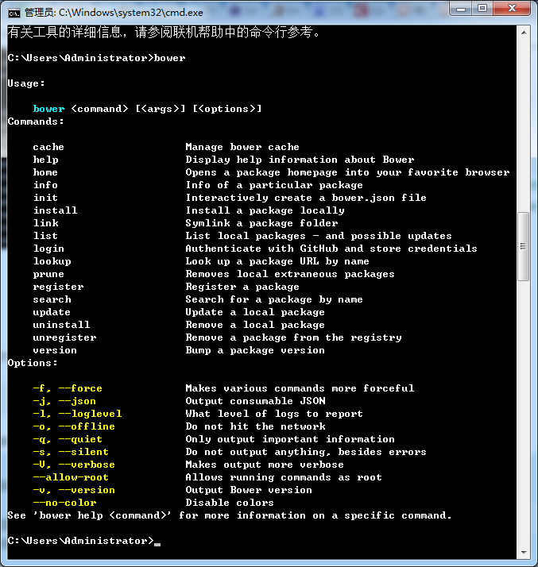
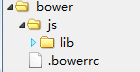

# bower入门指南

资源<https://segmentfault.com/a/1190000002971135>

## 1.什么是bower
Bower是一个客户端技术的软件包管理器。可用于搜索、安装和卸载如JavaScript、HTML、CSS之类的网络资源。 YeoMan和Grunt都是建立在Bower基础之上的开发工具。

## 2. 准备工作
1. 安装node.js环境和npm
2. 安装Git,以方便bower从远程git仓库获取代码包，git安装教程如下<http://www.bootcss.com/p/git-guide/>
注意：

- git 下载地址<https://git-for-windows.github.io/>
我的git安装包在E:/DOWNLOAD文件夹
- 我的git安装在D:/Program Files/Git
- 安装后要添加环境变量：计算机→系统属性→高级系统设置→高级→环境变量→系统变量(s)→Path→添加"D:\Program Files\Git\bin;D:\Program Files\Git\cmd"

## 3. 安装bower
打开cmd,直接输入：

	npm install -g bower

其中-g命令表示全局安装

## 4. 开始使用

直接再输入 bower

(我的界面就是直接是C:\Users\Administrator>bower)

可以查看一系列bower命令

## 5.定义包的安装目录

定义文件.bowerrc(可先新建一个txt文件，再用rename 1.txt .bowerrc修改文件名）

我的bower目录如下：

.bowerrc文件的内容是规定bower下载的代码包应该保存的目录，例如我想将下载的代码包保存在js/lib中，则.bowerrc文件内容如下：

	{
	    "directory":"js/lib"
	}

## 6. bower初始化

输入

	bower init

然后根据提示输入一些基本信息，并自动生成bower.json文件，用以保存该项目的配置。

## 7.包的安装
安装一个jquery包，输入

	bower install jquery --save

然后bower就会从远程下载jquery最新版本到你的js/lib目录下

其中--save参数是保存配置到你的bower.json，你会发现bower.json文件已经多了一行：
	
	 "dependencies": {
	    "jquery": "^3.0.0"
	  }

## 8.查看包的信息

输入：

	bower info jquery

## 9.包的更新
经已经查到兼容低版本浏览器的jquery版本为1.11.3，下面直接修改bower.json文件中的jquery版本号如下：

	"dependencies": {
	    "jquery": "^1.11.3"
	  }

然后输入命令

	bower update

这样就实现了jquery版本切换

## 10.包的查找
比如输入

	bower search bootstrap

bower就会列出包含字符串bootstrap的所有可用包了。

## 11.包的卸载

输入

	bower uninstall jquery

就可以卸载包了。