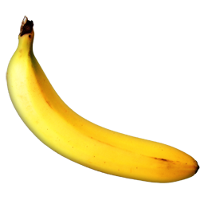

# 一. 好贴搜集
腾讯前端面试经历<http://my.oschina.net/june6502/blog/392914>

2015腾讯WEB前端开发面试题
<http://www.xzhichang.com/Strategy/Article_107017.html>

史上最全前端面试题（含答案）
<http://www.jobui.com/mianshiti/it/web/5066/>

腾讯的三轮面试（web前端）
<http://www.cnblogs.com/hustskyking/archive/2013/04/27/mianshi.html>

2015腾讯暑期实习生Web前端开发面试经历
<http://www.360doc.com/content/15/0414/22/7864192_463251422.shtml>

腾讯面试经历一
<http://www.cnblogs.com/bullub/archive/2013/03/13/2956897.html>

腾讯面试经历二 √
<http://www.cnblogs.com/bullub/archive/2013/03/14/2960458.html>

腾讯2013实习生面经
<http://www.cnblogs.com/tonylp/archive/2013/04/27/3048084.html>

# 二、 专题总结
## 1.关于HTTP协议


## 2.关于数据库表的设计查询


## 3、关于自己做的网站的介绍


## 4.响应式布局设计
http://www.educity.cn/jianzhan/403677.html

***在自己的网站上实现一下***

## 5.算法


***晚上把《程序员面试宝典》拿过来***


## 6.div拖动 √
看《JavaScript高级程序设计》Chapter16

<http://www.cnblogs.com/dolphinX/p/3290520.html>

## 7.Ajax自动补全
<http://blog.csdn.net/tounaobun/article/details/8062781>

## 8.自定义js右键菜单√(见三）
<http://www.cnblogs.com/snandy/archive/2011/03/09/1977789.html>

## 9.字符串、数组方法记住！

## 10.面向对象编程原理
***看《JavaScript高级程序设计》Chapter6***

## 11.复习事件相关知识 √
***看《JavaScript高级程序设计》Chapter13***

## 12.框架集、复习BOM


## 13.websocker（前端好贴整理里面有涉及）

## 14.看一下nodejs原理部分,看一下Ajax

## 15.解决自己的网站的浏览器兼容问题，并总结方法
使用EventUtil对象的方法。

## 16.解决自己的网站的性能问题，并总结提高性能的方法

### 1.将一些函数及该函数相关代码放进立即执行的匿名函数，形成私有作用域，避免感染全局作用域。
参见《JavaScript高级程序设计》P378

### 2.事件相关的内存和性能
参见《JavaScript高级程序设计》P402
#### （1）对鼠标和键盘事件采用事件委托
#### （2）移除事件处理程序
对onload事件处理程序添加的东西，最后都通过onunload删除

## 17.按照一些原则进一步优化网站
### 1.参见《JavaScript高级程序设计》P379

## 18.页面解析顺序问题***看已总结过的好贴***

## 19.提高首屏时间的方法，提高资源加载速度的方法


# 三、面经题目总结

## 腾讯面试经历二
<http://www.cnblogs.com/bullub/archive/2013/03/14/2960458.html>
## 1. 
两个非常大的整数相加，整数大到计算机的整型数据已经无法保存了，要求写一个函数来进行计算。

	  var a="123456789";
        var b="22334455";
        var len=Math.max(a.length,b.length);
        var relAdvance=0;
        var result=[];
        
        
        for (var i=0;i<len;i++) {
            if (i==0) {
                aData=Number(a.slice(-1));
                bData=Number(b.slice(-1));
            }
            else{
                if(a.slice(-1-i,-i)){
                    aData=Number(a.slice(-1-i,-i));
                }
                else{
                    aData=0
                }
                
                if(b.slice(-1-i,-i)){
                    bData=Number(b.slice(-1-i,-i));
                }
                else{
                    bData=0;
                }
                
            }
                
            
          
            console.log(aData);
            console.log(bData);
            var rel=aData+bData+Number(relAdvance);
            console.log(rel);
            var relCurrent=String(rel).slice(-1);
            console.log(relCurrent);
            if (relCurrent.length>1) {
                var relAdvance=String(rel).slice(0,1);
            }
            else{
                var relAdvance=0;
            }
            console.log(relAdvance);
            result.unshift(relCurrent);
        }
        console.log(result);
        var resultStr=result[0];
        for (var i=1,l=result.length;i<l;i++) {
            var resultStr=resultStr.concat(result[i]);
        }
        
        console.log(resultStr);

## 2.
div 拖动
**答案：**
代码如下，详情见《JavaScript高级程序设计》P481，《HTML5权威指南》P788

	<!DOCTYPE html>
	
	<html>
	<head>
	    <title>Page Title</title>
	    <style type="text/css">
	        #src>*{
	            float: left;
	        }
	        #target, #src>img{
	            border: thin solid black;
	            height: 81px;
	            width: 81px;
	            padding: 2px;
	            margin: 4px;
	        }
	        #target{
	            
	            text-align: center;
	            display: table;
	        }
	        #target>p{
	            display: table-cell;
	            vertical-align: middle;
	        }
	        #target>img{
	            
	            height: 81px;
	            width: 81px;
	            padding: 2px;
	            margin: 1px;
	        }
	       img.dragged{
	          background-color: gray;
	       }
	    </style>
	</head>
	
	<body>
	    <div id="src">
	        
	        
	        <div id="target">
	            <p id="msg">Drop Here</p>
	        </div>
	    </div>
	    
	    
	    <script>
	        var src=document.getElementById("src");
	        var target=document.getElementById("target");
	        var msg=document.getElementById("msg");
	        
	        
	        var draggedID;
	        
	        target.ondragenter=handleDrag;
	        target.ondragover=handleDrag;
	        function handleDrag(e) {
	            if (e.dataTransfer.getData("Text")=="banana") {
	                 if (e.preventDefault) {
	                    e.preventDefault();
	                }
	                else{
	                    e.returnValue=false;
	                }   
	            }
	           
	        }
	        
	        
	        
	        target.ondrop=function(e){
	            var droppedID=e.dataTransfer.getData("Text");
	            var newElem=document.getElementById(draggedID).cloneNode(false);
	            target.innerHTML="";
	            target.appendChild(newElem);
	            if (e.preventDefault) {
	                e.preventDefault();
	            }
	            else{
	                e.returnValue=false;
	            }
	        }
	        
	        
	        
	        src.ondragstart=function(e){
	            e.dataTransfer.setData("Text",e.target.id);
	            draggedID=e.target.id;
	            e.target.classList.add("dragged");
	        }
	        src.ondragend=function(e){
	            var elems=document.querySelectorAll(".dragged");
	           for (var i=0;i<elems.length;i++) {
	            elems[i].classList.remove("dragged");
	           }
	        }
	
	    </script>
	</body>
	</html>

## 3.
自定义右键菜单

方法一：使用oncontextmenu事件
：所有浏览器都支持 oncontextmenu 事件， contextmenu 元素只有 Firefox 浏览器支持。

	<!DOCTYPE html>

	<html>
	<head>
	    <title>Page Title</title>
	    <style type="text/css">
	        #rWindow{
	            position: absolute;
	            width: 150px;
	            height: 150px;
	            background-color: lightgray;
	            display: none;
	            border:thin solid blue;
	        }
	        ul{
	            position: absolute;
	            margin: 0px;
	            padding: 0px;
	            width: 100%;
	            height: 100%;
	            border: thin solid red;
	            list-style-type: none;/*去掉li前的点*/
	        }
	        li{
	            position: absolute;
	            margin: 0px;
	            padding: 0px;
	            left: 0px;
	            height: 50px;
	            width: 100%;
	            text-align: center;
	            vertical-align: middle;
	            border: thin solid black;
	        }
	        ul :nth-child(1){
	            top: 0px;
	        }
	        ul :nth-child(2){
	            top:50px;
	        }
	        ul :nth-child(3){
	            top: 100px;
	        }
	        
	        
	        
	        
	    </style>
	</head>
	
	<body>
	    <div id="myDiv">test here</div>
	    
	    <div id="rWindow">
	        <ul>
	            <li><p>love</p></li>
	            <li><p>like</p></li>
	            <li><p>else</p></li>
	        </ul>
	      
	    </div>
	    <script src="prepare.js"></script>
	</body>
	</html>

javascript:
	
	```//EventUtil对象
	var div=document.getElementById("myDiv");

	EventUtil.addHandler(div,"contextmenu",function(event){
	    event=EventUtil.getEvent(event);
	    EventUtil.preventDefault(event);
	    
	    var rWindowLeft=event.clientX+"px";
	    var rWindowTop=event.clientY+"px";
	    var rWindow=document.getElementById("rWindow");
	 
	    rWindow.style.setProperty("left",rWindowLeft);
	    rWindow.style.setProperty("top",rWindowTop);
	    rWindow.style.setProperty("display","block");
	        
	    
	});
	EventUtil.addHandler(document,"click",function(event){
	    event=EventUtil.getEvent(event);
	     var rWindow=document.getElementById("rWindow");
	        rWindow.style.setProperty("display","none");
	 
	})


方法二：检测mouseenter的event.button==2

不能屏蔽掉oncontextmenu事件带来的默认菜单，故该方法并不可取

	var div=document.getElementById("myDiv");
	
	EventUtil.addHandler(div,"mousedown",function(event){
	    event=EventUtil.getEvent(event);
	    var buttonNum=EventUtil.getButton(event);
	    if (buttonNum==2) {
	        EventUtil.preventDefault(event);//这样好像屏蔽不掉原右键菜单，只能求助oncontextmenu事件
	        var rWindowLeft=event.clientX+"px";
	        var rWindowTop=event.clientY+"px";
	        var rWindow=document.getElementById("rWindow");
	     
	        rWindow.style.setProperty("left",rWindowLeft);
	        rWindow.style.setProperty("top",rWindowTop);
	        rWindow.style.setProperty("display","block");
	        
	    }
	});
	EventUtil.addHandler(document,"click",function(event){
	    event=EventUtil.getEvent(event);
	     var rWindow=document.getElementById("rWindow");
	        rWindow.style.setProperty("display","none");
	 
	})

## 3.
Ajax自动补全功能

## 4.
ul里面加100个li，然后过一秒让所有li反转，要求不能用innerHTML.

## 腾讯三轮面试

## 1.首字母变成大写

text-transform：none； 默认。定义带有小写字母和大写字母的标准的文本。
text-transform：capitalize	；文本中的每个单词以大写字母开头。
text-transform：uppercase	；定义仅有大写字母。
text-transform：lowercase；	定义无大写字母，仅有小写字母。
text-transform：inherit	；规定应该从父元素继承 text-transform 属性的值。

而你需要就是这句：text-transform：uppercase	；
# 四、自己的一些模糊点、遗忘点总结
## 1. window对象和document对象区别

#### Window对象:
表示浏览器中打开的窗口。<br>
如果文档包含框架（frame 或 iframe 标签），浏览器会为 HTML 文档创建一个 window 对象，并为每个框架创建一个额外的 window 对象。

####  Document对象：
每个载入浏览器的 HTML 文档都会成为 Document 对象。
Document 对象使我们可以从脚本中对 HTML 页面中的所有元素进行访问。

## 2. 浏览器兼容性总结
### 1.事件冒泡方式
所有现代浏览器都支持冒泡，IE5.5之前事件冒泡跳过html(从body直接u跳到document)。其他IE9、Firefox、Chrome和Safari则将事件一直冒泡到windows.

### 2.事件捕获支持度
老版本的浏览器不支持捕获，故最好都用冒泡。

### 3.三种事件处理程序
- IE事件处理程序attachEvent()和detachEvenr()只有两个参数，因为IE8及之前版本只支持冒泡。且attachEvent()和detachEvenr()的第一个参数带on("onclick"),DOM2级不带on("click").
- IE事件处理程序在全局作用域运行，不像DOM2级的和DOM0级的方法是在所属元素的作用域运行。其中的this===window.
- 在同一个事件上添加多个addEventListener(),或多个attachEvent()。addEventListener()顺序执行，IE事件处理程序attachEvent()是反过来的顺序执行的。
- DOM0级对每个事件只支持一个事件处理程序，DOM2和IE事件处理程序都支持多个。
- 支持IE事件处理程序的浏览器有IE和Opera。
- 支持DOM2级的有IE9、FF、Safari、Chrome、Opera。
- 支持DOM0的是**所有**浏览器。（所以IE浏览器只有IE9支持DOM2)


### 4.IE的事件对象与DOM中的event对象及其属性的不同***P358***
- IE在使用DOM0级方法添加事件处理程序时，要通过window.event获得event。IE使用其他方法则与DOM中的event相同。
- IE的event.srcElement和DOM的event.target属性相同
- IE取消默认事件方法:
		
		event.returnValue =false;

  	其他取消默认事件方法:

		event.preventDefault();	


- IE的cancelBubble属性和DOM的stopPropagation()作用类似。event.cancelBuble=true只能停止事件冒泡；而event.stopPropagation()则能停止冒泡和捕获。
- 
- 
***认真反复看EventUtil对象的写法！！***


## 3.removeEventListener()的第二个参数必须是addEventListener的同名函数的名字，不能是相同匿名函数

这样是有效的：

	 var btn=document.getElementById("myBtn");
        var handler=function(){
            alert(this.id);
        }
        btn.addEventListener("click",handler,false);
        btn.removeEventListener("click",handler,false);

这样是不行的：

	var btn=document.getElementById("myBtn");
      
        btn.addEventListener("click",function(){
            alert(this.id);
        },false);
        btn.removeEventListener("click",function(){
            alert(this.id);
        },false);


## 4.Event对象的target、currentTarget和事件处理程序中this三者的区别

- currentTarget和this：指被绑定事件监听器的元素
- target指事件的真正目标（比如currentTarget所指元素的具体子元素）

## 5.检测浏览器是否支持DOM3级的事件方法
检测浏览器是否支持焦点事件的方法：

	var isSupported=document.implementation.hasFeature("FocusEvent","3.0)
	var isSupported=document.implementation.hasFeature("FocusEvent","2.0)

检测浏览器是否支持鼠标事件的方法：

	var isSupported=document.implementation.hasFeature("MouseEvents","2.0");//不包括dbclick、mouseenter、mouseleave
	var isSupported=document.implementation.hasFeature("MouseEvent","3.0");

检测浏览器是否支持变动事件：

	var isSupported=document.implementation.hasFeature("MutationEvents","2.0");
	

## 6.不冒泡的事件

焦点事件：blur、focus
(其他焦点事件focusin、focusout、DOMFocusIn、DOMFocusOut都冒泡)

鼠标事件：mouseenter、mouseleave
(其他鼠标事件click、dbclick、mousedown、mouseup、mousemove、mouseout、mouseover都会冒泡)

## 7.鼠标事件的坐标属性
- 获取鼠标指针在视口的坐标:event.clientX、 event.clientY
- 获取鼠标指针在页面中的坐标：event.pageX、 event.pageY

		说明：IE8及之前IE 不支持event.pageX、event.pageY
		代替方法
		var div=document.getElementById("myDiv");
		EventUtil.addHandler(div,"click",function(){
		        var pageX=event.pageX;
		        var pageY=event.pageY;
		        if(pageX==undefined){
		            pageX=event.clientX+
		            (document.body.scrollLeft)||//混杂模式：document.compatMode=="BackCompat"
		            (document.documentElement.scrollLeft);//标准模式：document.compatMode=="CSS1Compat"
		        }
		        if(pageY==undefined){
		            pageY=event.clientY+
		            (document.body.scrollTop)||//混杂模式：document.compatMode=="BackCompat"
		            (document.documentElement.scrollTop);//标准模式：document.compatMode=="CSS1Compat"
		        }
		        alert(pageX+" "+pageY );
		});	

- 获取鼠标指针在屏幕的坐标:event.screenX、 event.screenY
- 获取鼠标指针相对于目标元素边界的坐标（仅ie支持）:event.offsetX、 offsetY

## 8.DOMContent事件与load事件
window.load事件: 页面中的一切都加载完毕时触发
document.DOMContentloaded:形成完整的DOM树后就触发，不管其中资源是否加载完。

## 9.检测浏览器是否支持某一事件
例如

 var isSupported=("onhashchange" in window);//

即一般方法为：

 	'onclick' in document.documentElement;
当然并不完全有效，要结合浏览器具体标准