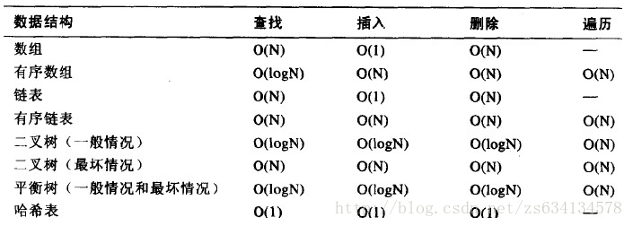

# 一）网络基础
### 1.各协议作用总结

1. ICMP:（Internet Control Message Protocol）Internet控制 报文 协议。用于控制数据报传送过程中的差错情况。可理解为带错误报告的IP协议。
2. NAT：将内部网络的私有IP地址转换为公有IP地址
3. ARP: 地址解析协议，即ARP（Address Resolution Protocol），是根据 IP地址 获取 物理地址 的一个 TCP/IP协议。
4. RARP:反向地址转换协议（RARP：Reverse Address Resolution Protocol） ,根据MAC地址查找对应的IP地址
	- （MAC（Media Access Control或者Medium Access Control）地址，意译为媒体访问控制，或称为物理地址、硬件地址，用来定义网络设备的位置。在OSI模型中，第三层网络层负责 IP地址，第二层数据链路层则负责 MAC地址。因此一个主机会有一个MAC地址，而每个网络位置会有一个专属于它的IP地址。）
5. DHNC协议：集中管理网络中的IP地址分配。给内部网络或 网络服务 供应商自动分配 IP地址。

### 2.ASCII码重点：
0--48，1--49.....9--57
A--65, a--97
'\0'(即空字符）--0

### 3.
32位机跟64位机的变量的差别主要在指针大小上，32位机指针长度为4，64位机指针长度为8

### 4.const
关键字const定义常量，语法

const 类型名 常量名=值

例如
	
	const float pi=3.1415926

其在程序执行过程中值不能被改变，否则会报错。

### 5.可能导致代码体积膨胀的是
1. 宏定义
2. 模板
3. 内联函数

另外：递归是可能爆栈，而不是代码体积膨胀

### 6.正态分布曲线性质中有
P（μ-σ<X≤μ+σ）=68.3%

P（μ-2σ<X≤μ+2σ）=95.4%

P（μ-3σ<X≤μ+3σ）=99.7%；

### 7.重复抽样比不重复抽样误差大

### 8.Z、t、u检验各自是什么及其适用条件***待弄懂***

### 9.视图包含下列结构是不可以更新的  
1：集合运算符 union，union all, intersect，minus  
2：distinct关键字  
3：group by,order by,connect by,或者start with  
4：子查询  
5：分组函数  
6：需要更新的列不是视图定义的  
7：具有连接查询(可以更新键值保存表的数据)  
8：违反基表的约束条件；连接视图是指基于多表连接查询创建的视图（一般不容易修改，但通用instead of触发器可以实现修改的功能）

### 10.汇总网后面的数字=汇总网的子网掩码1的个数=子网后面的数字-1

### 11.
HTTP是文本协议，不是二进制协议；
HTTP协议的ETAG响应头主要用于信息的过期验证；
cache-control是在HTTP1.1中才有的,HTTP1.0没有。

### 12.进程和线程的区别和联系

线程和进程的区别联系：

1. 进程：子进程是父进程的复制品。子进程获得父进程数据空间、堆和栈的复制品。
2. 线程：相对与进程而言，线程是一个更加接近与执行体的概念，它可以与同进程的其他线程共享数据，但拥有自己的栈空间，拥有独立的执行序列。   
3. 共同点：两者都可以提高程序的并发度，提高程序运行效率和响应时间。
   
线程和进程在使用上各有优缺点：

线程执行开销小，但不利于资源管理和保护；而进程正相反。同时，线程适合于在SMP机器上运行，而进程则可以跨机器迁移。
根本区别就一点：**用多进程每个进程有自己的地址空间(address space)，线程则共享地址空间。** 所有其它区别都是由此而来的： 

1. 速度：线程产生的速度快，线程间的通讯快、切换快等，因为他们在同一个地址空间内。 
2. 资源利用率：线程的资源利用率比较好也是因为他们在同一个地址空间内。 
3. 同步问题：线程使用公共变量/内存时需要使用同步机制还是因为他们在同一个地址空间内

### 13. 在数据库系统中，产生不一致的原因：

造成数据不一致的原因主要有：

#### （1）数据冗余
如果数据库中存在冗余数据，比如两张表中都存储了用户的地址，在用户的地址发生改变时，如果只更新了一张表中的数据，那么这两张表中就有了不一致的数据。

#### （2）并发控制不当
比如某个订票系统中，两个用户在同一时间订同一张票，如果并发控制不当，可能会导致一张票被两个用户预订的情况。当然这也与元数据的设计有关。

#### （3）故障和错误
如果软硬件发生故障造成数据丢失等情况，也可能引起数据不一致的情况。因此我们需要提供数据库维护和数据恢复的一些措施。

### 14.数据库选择操作个语句执行顺序

1. FROM 子句, 组装来自不同数据源的数据 
2. WHERE 子句, 基于指定的条件对记录进行筛选
3. GROUP BY 子句, 将数据划分为多个分组
4. 使用聚合函数进行计算 
5. 使用 HAVING 子句筛选分组
6. 计算Select所有的表达式 
7. 使用 ORDER BY 对结果集进行排序

### 15.UNIX系统目录结构采用 带链接树形目录结构
带链接树形目录结构又称非循环图目录结构,它是指访问一文件(或目录)可以有多条路径。一般常说UNIX的文件系统是树形结构，其实是指带链接的树形结构，而不是纯树形目录结构。

### 16.怎么理解分配延迟？
分配器停止一个进程到开启另一个进程的时间。

### 17.进程的三种基本状态

进程在运行中不断地改变其运行状态。通常，一个运行进程必须具有以下三种基本状态。

#### （1）就绪(Ready)状态

当进程已分配到除CPU以外的所有必要的资源，只要获得处理机便可立即执行，这时的进程状态称为就绪状态。

#### （2）执行（Running）状态 
当进程已获得处理机，其程序正在处理机上执行，此时的进程状态称为执行状态。

#### （3）阻塞(Blocked)状态 
正在执行的进程，由于等待某个事件发生而无法执行时，便放弃处理机而处于阻塞状态。引起进程阻塞的事件可有多种，例如，等待I/O完成、申请缓冲区不能满足、等待信件(信号)等。

### 18.在所有非抢占CPU调度算法中，系统平均响应时间最优的是**短任务优先算法**

1. 短任务优先系统平均响应时间最短，但是往往不能确定所有任务的运行时间
2. 先来先服务平均响应时间最长，不适用于分时系统
3. 时间片轮转，适用于分时系统，但是增加了抢占以切换进程，算法性能依赖于时间片大小

### 19. 内存抖动（Thrashing)是什么？
非常频繁的换页活动。

### 20.Belady异常或者Belady现象出现在内存换页算法
Belady’s Anomaly， 即 Belady异常或者Belady现象。  所谓Belady现象是指：管理中，发生缺页时的置换算法采用FIFO（先进先出）算法时，如果对—个进程未分配它所要求的全部页面，有时就会出现分配的页面数增多但缺页率反而提高的异常现象。  

### 21. 对于服务端和用户端一定安全的HTTP方法是TRACE

- GET:通过请求URI得到资源,
- POST:用于添加新的内容,
- OPTIONS:询问可以执行哪些方法 
- TRACE： 请求服务器回送收到的请求信息，主要用于测试或诊断。所以是安全的。 
- HEAD:类似于GET, 但是不返回body信息，用于检查对象是否存在，以及得到对象的元数据

HEAD,GET,OPTIONS和TRACE视为安全的方法，因为它们只是从服务器获得资源而不对服务器做任何修改，

但是HEAD,GET,OPTIONS在用户端不安全。

而POST则影响服务器上的资源。

### 22.关于指向 二维数组的指针
把二维数组a分解为一维数组a[0]、a[1]、a[2]之后，设p为指向二维数组的指针变量。可定义为：

    int (*p)[4]
它表示p是一个指针变量，它指向包含4个元素的一维数组。若指向第一个一维数组a[0]，其值等于a,a[0]，或&a[0][0]等。而p+i则指向一维数组a[i]。从前面的分析可得出*(p+i)+j是二维数组i行j 列的元素的地址，而*(*(p+i)+j)则是i行j列元素的值。

### 23.Cache的设计目标是在合理成本下提高命中率

　　系统开机或复位时，Cache 中无任何内容。当CPU送出一组地址去访问内存储器时，访问的存储器的内容才被同时“拷贝”到Cache中。此后，每当CPU访问存储器时，Cache 控制器要检查CPU送出的地址，判断CPU要访问的地址单元是否在Cache 中。若在，称为Cache 命中，CPU可用极快的速度对它进行读/写操作；若不在，则称为Cache未命中，这时就需要从内存中访问，并把与本次访问相邻近的存储区内容复制到Cache 中。未命中时对内存访问可能比访问无Cache 的内存要插入更多的等待周期，反而会降低系统的效率。而程序中的调用和跳转等指令，会造成非区域性操作，则会使命中率降低。因此，提高命中率是Cache 设计的主要目标。

### 24. Z、t、u检验各自是什么及其适用条件？
#### 显著性差异P值
当数据之间具有了显著性差异，就说明参与比对的数据不是来自于同一总体（Population），而是来自于具有差异的两个不同总体。

比如，我们说A、B两数据在0.05水平上具备显著性差异，这是说两组数据具备显著性差异的可能性为95%。两个数据所代表的样本还有5%的可能性是没有差异的。这5%的差异是由于随机误差造成的。

sig值通常用 P>0.05 表示差异性不显著；0.01<P<0.05 表示差异性显著；P<0.01表示差异性极显著。

### 方差齐
方差齐：不同样本的总体方差相同。

### 25.下推自动识别机的语言是2型语言（上下文无关语言）

	0型文法产生的语言称为0型语言。
	1型文法产生的语言称为1型语言，也称作上下文有关语言。
	2型文法产生的语言称为2型语言，也称作上下文无关语言。
	3型文法产生的语言称为3型语言，也称作正规语言。
	
	在编译原理中,图灵机(TM)识别0型语言 
	线性界限自动机(LBA)识别上下文有关语言 
	下推自动机(PDA)识别上下文无关语言 
	有穷自动机(FA)识别正规语言

### 26.对于派生类的构造函数，在定义对象时构造函数的执行顺序为啥？

#### 当派生类中不含对象成员时

- 在创建派生类对象时,构造函数的执行顺序是：基类的构造函数→派生类的构造函数；
- 在撤消派生类对象时,析构函数的执行顺序是：派生类的构造函数→基类的构造函数。

#### 当派生类中含有对象成员时

- 在定义派生类对象时，构造函数的执行顺序：基类的构造函数→对象成员的构造函数→派生类的构造函数；
- 在撤消派生类对象时，析构函数的执行顺序：派生类的构造函数→对象成员的构造函数→基类的构造函数。

### 27.编译过程中，语法分析器的任务是
1. 分析单词串是如何构成语言和说明的
2. 分析语句和说明是如何构成程序的
3. 分析程序的结构

### 28. 程序进入等待状态有哪种种方式？
	A.CPU调度给优先级更高的线程
	B.阻塞的线程获得资源或者信号
	C.在时间片轮转的情况下，如果时间片到了
	D.获得spinlock未果

进程分为基本的三个状态：运行、就绪、阻塞/等待。

A. 高优先级的抢占CPU，使得原来处于运行状态的进程转变为就绪状态。

B. 阻塞的进程等待某件事情的发生，一旦发生则它的运行条件已经满足，从阻塞进入就绪状态。

C. 时间片轮转使得每个进程都有一小片时间来获得CPU运行，当时间片到时从运行状态变为就绪状态。

D. 自旋锁（spinlock）是一种保护临界区最常见的技术。在同一时刻只能有一个进程获得自旋锁，其他企图获得自旋锁的任何进程将一直进行尝试（即自旋，不断地测试变量），除此以外不能做任何事情。因此没有获得自旋锁的进程在获取锁之前处于忙等（阻塞状态）。

### 29.几种常见数据结构操作性能对比：***important***

故具有较高的查找和删除性能的是AVL树和Hash表（即散列表）

### 30.各种排序算法时间空间复杂度比较 **important***

大类|排序方法|时间复杂度|空间复杂度|稳定性|备注
----|-------|---------|--------|------
交换法|冒泡法|最差、平均都是O(n^2),最好是O(n)|1|稳定|n较小时较好
交换法|鸡尾酒冒泡法|最差、平均都是O(n^2),最好是O(n)|1|稳定|n较小时较好
交换法|快速排序|平均O(nlogn),最坏是O(n^2)|O(logn)|不稳定|n大时较好
插入法|直接插入法|最差、平均都是O(n^2),最好是O(n)|1|稳定|大部分已排序时较好
插入法|希尔排序（分组的插入法）|平均是O(nlogn)|1|不稳定
选择法|普通选择|最差、平均都是O(n^2)|1|不稳定|n较小时较好
选择法|堆排序|最差、平均、最好都是O(nlogn)|1|不稳定|n大时较好
归并排序|归并排序|最差、平均、最好都是O(nlogn)|O(n)|稳定|n大时较好
基数排序|基数排序|O(dn)(d是常数）|O(n)|稳定

### 31.设计模式有哪些？ ***important***
设计模式分为三种类型，共23种。

- 创建型模式：单例模式、抽象工厂模式、建造者模式、工厂模式、原型模式。
- 结构型模式：适配器模式、桥接模式、装饰模式、组合模式、外观模式、享元模式、代理模式。
- 行为型模式：模版方法模式、命令模式、迭代器模式、观察者模式、中介者模式、备忘录模式、解释器模式、状态模式、策略模式、职责链模式、访问者模式。

主要几种设计模式介绍：

设计模式|GoF 的描述|我的理解
-------|---------|----------
Adapter 适配器模式|将一个类的接口转换成客户希望的另一个接口。 Adapter 模式使得原本由于接口不兼容而不能一起工作的类可以一起工作|转换接口，由于应用环境的变化，常常需要将“ 一些现存的对象 ” 放在新的环境中应用，但是，新环境要求的接口是现存对象所不满足的，此时我们可以通过添加一层 Adapter 对现有的对象加入一些接口，使其适应新的应用环境。
Bridge 桥接模式|将抽象部分与实现部分分离，使他们可以独立的变化|分离接口（抽象）与其实现，当某个类型具有两个或两个以上的纬度变化（或者说是变化点），通过以继承接口的方式隔离变化，以减少因变化带来的代码的修改量。
Composite 组合模式|将对象组合成树形结构以表示“ 部分 - 整体” 的层次结构。 Composite 模式使得客户对单个对象和组合对象的使用具有一致性|解决客户程序与复杂对象容器的解耦，一类具有“ 容器特征 ” 的对象 —— 即他们在充当对象的同时，又是其他对象的容器的情况，通过继承统一的接口，我们可以将容器对象及其子对象看成同一类对象使用，以减少对象使用中的复杂度。
Decorator 装饰模式|动态的给一个对象添加一些额外的职责。就增加功能而言， Decorator 模式比生成子类更为灵活|在稳定接口的前提下为对象扩展功能，主要是解决用继承的方式为对象扩展大量功能而造成的子对象数量膨胀的问题
Facade 外观模式|为子系统中的一组接口提供一个一致的界面， Facade 模式定义了一个高层接口，这个接口使得这一子系统更加容易使用|简化接口，对于复杂子系统或子对象调用的封装。从客户程序角度看，只能看见 Facade 提供的接口。换句话说是对子对象调用的封装，将客户程序对子对象的调用与子对象的变化分离。
Flyweight 享元模式|运用共享技术有效的支持大量细粒度的对象|主要是解决由于相同对象数量过大而造成系统内存开销过大的问题。实际上是相同的对象引用指向同一个对象空间。在使用 Flyweight 模式前要做一个评估，如果使用不当会适得其反
Proxy 代理模式|为其他对象提供一种代理以控制这个对象的访问|解决直接访问某些对象是出现的问题，如：访问远程的对象

### 31.Unix系统中，哪些可以用于进程间通信？
管道、命名管道、信号、信号量、消息队列、内存共享、内存映射、套接口

（1）管道（Pipe）：管道可用于具有亲缘关系进程间的通信，允许一个进程和另一个与它有共同祖先的进程之间进行通信。
（2）命名管道（named pipe）：命名管道克服了管道没有名字的限制，因此，除具有管道所具有的功能外，它还允许无亲缘关系进程间的通信。命名管道在文件系统中有对应的文件名。命名管道通过命令mkfifo或系统调用mkfifo来创建。
（3）信号（Signal）：信号是比较复杂的通信方式，用于通知接受进程有某种事件发生，除了用于进程间通信外，进程还可以发送信号给进程本身；linux除了支持Unix早期信号语义函数sigal外，还支持语义符合Posix.1标准的信号函数sigaction（实际上，该函数是基于BSD的，BSD为了实现可靠信号机制，又能够统一对外接口，用sigaction函数重新实现了signal函数）。
（4）消息（Message）队列：消息队列是消息的链接表，包括Posix消息队列system V消息队列。有足够权限的进程可以向队列中添加消息，被赋予读权限的进程则可以读走队列中的消息。消息队列克服了信号承载信息量少，管道只能承载无格式字节流以及缓冲区大小受限等缺
（5）共享内存：使得多个进程可以访问同一块内存空间，是最快的可用IPC形式。是针对其他通信机制运行效率较低而设计的。往往与其它通信机制，如信号量结合使用，来达到进程间的同步及互斥。
（6）内存映射（mapped memory）：内存映射允许任何多个进程间通信，每一个使用该机制的进程通过把一个共享的文件映射到自己的进程地址空间来实现它。
（7）信号量（semaphore）：主要作为进程间以及同一进程不同线程之间的同步手段。
（8）套接口（Socket）：更为一般的进程间通信机制，可用于不同机器之间的进程间通信。起初是由Unix系统的BSD分支开发出来的，但现在一般可以移植到其它类Unix系统上：Linux和System V的变种都支持套接字。

### 32.同一进程下的线程可以共享以下：

线程共享的内容包括：
1. 代码段（code segment）
2. 数据段（data section）
3. 进程打开的文件描述符（file fd)
4. 信号的处理器
5. 进程的当前目录
6. 进程用户ID与进程组ID

### 33.如何减少换页错误？
换页错误又称缺页错误，当一个程序试图访问没有映射到物理内存的地方时，就会出现缺页错误， 这时操作系统就要去虚拟内存中加载这块内存页。

减少换页错误的方法，即降低缺页中断率：
 
1. 内存页框数。增加作业分得的内存块数。 
2. 页面大小。页面划分越大，中断率越低。 
3. 替换算法的优劣影响缺页中断次数 
4. 程序局部性。程序局部性好可减少缺页中断。 

### 34.同步机制应该遵循的基本准则

· 空闲让进：当无进程处于临界区时，表明临界资源处于空闲状态，允许一个请求进入临界区的进程立即进入临界区，以有效利用临界资源

· 忙则等待：当已有进程处于临界区时，表明临界资源正在被访问，因而其他试图进入临界区的进程必须等待，以保证对临界资源的互斥访问

· 有限等待：对要求访问临界资源的进程，应保证在有限时间内能进入自己的临界区，以免陷入“死等”状态

· 让权等待：当进程不能进入自己的临界区时，应立即释放处理机，以免进程陷入“忙等”状态

### 35.关于ip地址
#### 每类ip地址
- A类：0开头
- B类：10开头
- C类：110开头
- D类：1110开头
- E类：11110开头

#### 私有地址
这些地址是不会被Internet分配的，它们在Internet上也不会被路由，虽然它们不能直接和Internet网连接，但通过技术手段仍旧可以和 Internet通讯（NAT技术）。我们可以根据需要来选择适当的地址类，在内部局域网中将这些地址像公用IP地址一样地使用。在Internet上，有些不需要与 Internet通讯的设备，如打印机、可管理集线器等也可以使用这些地址，以节省IP地址资源。

- A类私有ip地址范围： 10.0.0.0/8
	
		即 10.0.0.0~10.255.255.255
		    00001010.00000000.00000000.00000000~
			00001010.11111111.11111111.11111111

- B类私有ip地址范围：172.16.0.0/12

		即172.16.0.0~172.31.255.255
		即10101100.00010000.00000000.00000000~
		  10101100.00011111.11111111.11111111

- C类私有ip地址范围：192.168.0.0/16

		即192.168.0.0~192.168.255.255
		即11000000.10101000.00000000.00000000~
		  11000000.10101000.11111111.11111111

汇总网后面的数字=汇总网掩码的个数=子网后面的数字-1

网络号=主机地址|子网掩码（按位与）

### 待弄懂牛客题目
<http://www.nowcoder.com/profile/73
7314/test/2828612/25647?onlyWrong=0>

消除左递归：<http://www.nowcoder.com/profile/737314/test/2836972/7248#summary>

<http://www.nowcoder.com/profile/737314/test/2836972/7259#summary>

<http://www.nowcoder.com/profile/737314/test/2836972/14903#summary>

<http://www.nowcoder.com/profile/737314/test/2837627/25469#summary>

<http://www.nowcoder.com/profile/737314/test/2837627/25465#summary>
