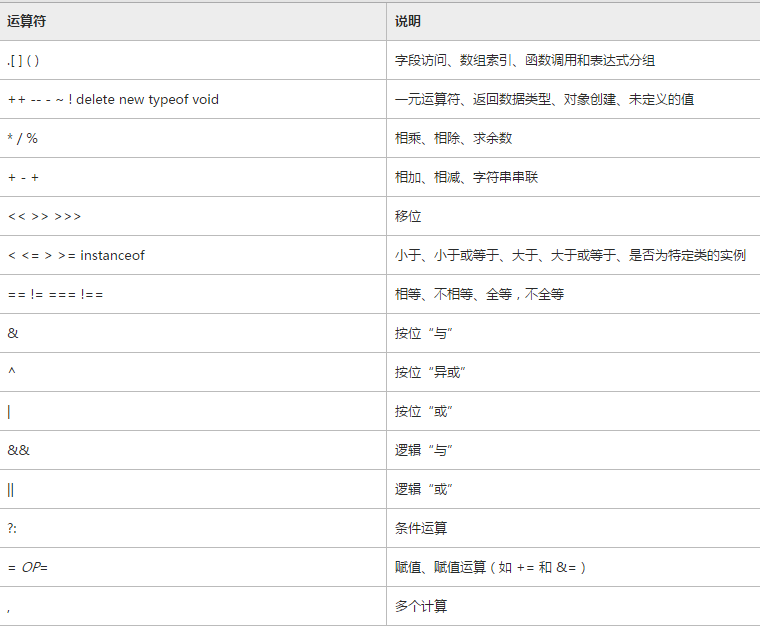

## 一、试卷搜集
### 1.腾讯web前端开发工程师笔试题及答案***√***
<http://wenku.baidu.com/link?url=BZHymcJp0IEOl_EDrDHXCZv7CNwBXAVjSUsZ19AbxqmmgImkRlGAsPPfjQEQVkXuzt7VIBiwh6zPCZVuCTJnw8dusl8Lp1o9UHoUge7NC-C>
已下载

### 2.2015腾讯web前端笔试题
<http://www.yjbys.com/qiuzhizhinan/show-466640.html>

### 3.腾讯web前端开发方向实习笔试需要准备什么？
<https://www.zhihu.com/question/20966351/answer/24401878>

### 4.腾讯2013笔试题
<http://www.cnblogs.com/wolm/p/3383474.html>

### 5.2012腾讯实习生web前端笔试题
<http://www.mianwww.com/html/2012/04/16214.html>

### 6.腾讯实习生网页重构组招聘公开试题（含答案）
<http://www.mianwww.com/html/2012/04/16216.html>

### 7.2015腾讯暑期实习生Web前端开发笔试面试经历
<http://www.360doc.com/content/15/0414/22/7864192_463251422.shtml>

## 二、题目解答研究
### 1.腾讯web前端开发工程师笔试题及答案
<http://wenku.baidu.com/link?url=BZHymcJp0IEOl_EDrDHXCZv7CNwBXAVjSUsZ19AbxqmmgImkRlGAsPPfjQEQVkXuzt7VIBiwh6zPCZVuCTJnw8dusl8Lp1o9UHoUge7NC-C>
已下载

#### 1.如何实现事件委托？并用事件委托修改下列代码。

	<!DOCTYPE HTML>
	<html>
	    <head>
		<meta charset="utf-8" />
		<title>js性能优化</title>
	    </head>
	    <body> 
		<ul id='list'>
	            <li>精通css</li>
	            <li>精通js</li>
	            <li>精通html</li>
		</ul>
		 
		
		
	   </body>
	</html>

**答案：** script部分改为

	  (function(){
            var a=document.getElementById('list');
            a.addEventListener(
                'click',
                function (e) {
                    alert(e.target.innerHTML);
                },
                false
            );
            
        })();

将每个具体元素对象上绑定的事件处理程序，绑定到其上层元素上，再通过e.target获取实际触发事件的目标元素即具体元素对象。这叫做事件委托。

**事件委托的好处**添加到页面上的事件处理程序的个数直接关系到页面的整体运行性能。因为（1）每个事件处理程序都是一个函数，函数都是对象，都会占用内存；内存中的对象越多，性能就越差。（2）必须事先指定所有事件处理程序会导致较多的DOM访问次数，会延迟整个页面的交互就绪时间。

#### 2.将10进制的数302转为二进制。
**答案：**

方法一：除2取余，倒序排列

	(function(){
	    var a=302,rel="";
	    while (1) {
	        var i=a%2;
	        rel=i+rel;
	        a=Math.floor(a/2);
	        if (a==0) {
	            break;
	        }
	        
	    }
	    console.log(rel);//"100101110"
	    
	})();

循环的另一种写法：

	(function(){
	    var a=302,rel="";
	    while (a>=1) {
	        var i=a%2;
	        rel=i+rel;
	        a=parseInt(a/2);
	    }
	    console.log(rel);
	    
	})();

***注意！！：***

与C不同，js两个整数相除会得到小数，要实现C一样的效果就需要把结果向下取整。向下取整方法有

	- Math.floor(a)
	- parseInt(a)

方法二:利用现成方法.toString(2)

	(function () {
	    var a=302;
	    var rel=a.toString(2);
	    console.log(a);//302
	    console.log(typeof a);//number
	    console.log(rel);//100101110
	    console.log(typeof rel);//string
	})();

#### 4.js运算符的优先级
参见<https://technet.microsoft.com/zh-cn/library/z3ks45k7>

大体是 一元运算符>算术运算符>关系运算符>逻辑运算符

圆括号用于改变由运算符优先级确定的计算顺序。这就是说，先计算完圆括号内的表达式，然后再将它的值用于表达式的其余部分。

#### 4.typeof(null)=_____
**答案：** object

说明：null是空对象指针

#### 5.	JS中给全部都是数字元素的数组排序的原生方法是___，其中使用的是___排序方法。

**答案：**sort  冒泡

**说明：**参见《javaScript高级程序设计》P92

sort（）对数组就地重排序。排序时，sort()会调用每个数组项的toString()转型方法，然后比较得到的**字符串**。默认Array.sort()按字符串升序排列。

	var arr1=[0,10,1,15,5];
	var arr2=arr1.sort();
	console.log(arr1);//[0,1,10,15,5]
	console.log(arr2);//[0,1,10,15,5]

其可接受一个比较函数作为参数。例如，从小到大排序如下：

	
	function compare(value1,value2) {
	    if (value1<value2) {
	        return -1;
	    }
	    else if (value1==value2) {
	        return 0;
	    }
	    else{
	        return 1;
	    }
	}
	var arr3=arr1.sort(compare);
	console.log(arr1);//[0,1,5,10,15]
	console.log(arr3);//[0,1,5,10,15]

对于数值类型或其valueOf()方法（返回Array对象的原始值，***待研究***）返回数值类型的对象类型，可以直接用相减的比较函数。

	function compare1(value1,value2) {
	    return value1-value2;
	}
	var arr4=arr1.sort(compare1);
	console.log(arr1);//[0,1,5,10,15]
	console.log(arr4);//[0,1,5,10,15]

#### 6.NaN*6=___
**答案：** NaN

	关于NaN
	1. 任何涉及NaN的操作都会返回NaN
	2. NaN与任何值都不相等，包括NaN本身
	3. typeof NaN结果为 number
	4. isNaN(x)函数可以确定x是否“不是数值”
	
			console.log(typeof(NaN));//number
			console.log(NaN==NaN);//false
			console.log(isNaN(NaN));//true
			console.log(isNaN(10));//false
			console.log(isNaN("10"));//false,"10"转换为10
			console.log(isNaN("abc"));//true,"abc"转换为NaN
			console.log(isNaN(true));//false,true转换为1
			console.log(isNaN(false));//false,false转换为0

#### 7.JS中调用某个函数之前，如何知道该函数最多可以传递多少个参数？该函数被调用时，如何知道传了多少个参数过来？
**答案：** 函数名.length就是它最多能接受的参数个数（***待研究求证***）

arguments.length就是已经传递过来的参数个数。

实践发现二者是相等的。

#### 8.软件HttpWatch的作用？
**答案：** 参见<http://baike.baidu.com/view/425789.htm>

HttpWatch是强大的网页数据分析工具.集成在Internet Explorer工具栏.包括网页摘要.Cookies管理.缓存管理.消息头发送/接受.字符查询.POST 数据和目录管理功能.报告输出.HttpWatch 是一款能够收集并显示深层信息的软件。它不用代理服务器或一些复杂的网络监控工具，就能够在显示网页同时显示网页请求和回应的日志信息。甚至可以显示浏览器缓存和IE之间的交换信息。集成在Internet Explorer工具栏。

HttpWatch也可以集成到火狐浏览器中。

#### 9.JS如何得到HTTP头信息？
**答案：** 利用Ajax的XMLHttpRequest对象的方法。
	
	- xhr.setRequestHeader() 可设置自定义请求头部信息
	- xhr.getResponseHeader(头部字段) 可取得相应相应头部的信息
	- xhr.getAllResponseHeader()可取得包含所有响应头部信息的长字符串
	

**答案补充：**

（***待研究***）
需要注意的是，通常，在IE下不能完整的获取header报头数据，只能取到如下header数据：

	X-Powered-By:
	X-UA-Compatible:
	Keep-Alive:
	Transfer-Encoding:
	Content-Type:
比如你要获取时间戳，在IE下必须做些特殊处理，需要在后端设置一下，关闭缓存：
  
	header( 'Cache-Control: no-store'); // 关闭缓存

### 2.2015腾讯web前端笔试题
<http://www.yjbys.com/qiuzhizhinan/show-466640.html>

#### 1.请实现，鼠标点击页面中的任意标签，alert该标签的名称。
**答案：**

方法一：直接考虑跨浏览器问题

	var dom=document.getElementsByTagName("body")[0];//可换成document.body
	
	dom.onclick=function(){
	    var event= event?event:window.event;
	    var getTarget=event.target?event.target:event.srcElement;
	    alert(getTarget.tagName);
	}

方法二：使用EventUtil对象

	var EventUtil={
	    addHandler:function(element,type,handler){
	        if (element.addEventListener) {
	            element.addEventListener(type,handler,false);
	        }
	        else if (event.attachEvent) {
	            element.attachEvent("on"+type,handler);
	        }
	        else{
	            element["on"+type]=handler;
	        }
	    },
	    removeHandler:function(element,type,handler){
	        if (element.removeEventListener) {
	            element.removeEventListener(type,handler,false);
	        }
	        else if (element.detachEvent) {
	            element.detachEvent("on"+type,handler);
	        }
	        else{
	            element["on"+type]=null;
	        }
	    },
	    getEvent:function(event){
	        return event?event:window.event;
	    },
	    getTarget:function(event){
	        return event.target||event.srcElement;
	    },
	    preventDefault:function(event){
	        if (event.preventDefault) {
	            event.preventDefault();
	        }
	        else{
	            event.returnValue=false;
	        }
	    },
	    stopPropagation:function(event){
	        if (event.stopPropagation) {
	            event.stopPropagation();
	        }
	        else{
	            event.cancelBubble=true;
	        }
	    },
	    getRelatedTarget:function(event){
	        if (event.relatedTarget) {
	            return event.relatedTarget;
	        }
	        else if (event.fromTarget) {
	            return event.fromTarget;
	        }
	        else if (event.toTarget) {
	            return event.toTarget;
	        }
	        else{
	            return null;
	        }
	    }
	    //省略其他   
	}
	
	var dom=document.getElementsByTagName("body")[0];//可换成document.body
	var event=EventUtil.getEvent(event);
	EventUtil.addHandler(dom,"click",function(){
	    var getTarget=EventUtil.getTarget(event);
	    alert(getTarget.tagName);
	})

**说明：**

考点（1）：事件委托

	click事件会一直冒泡到document层次，故只用给body元素绑定事件处理程序即可。

考点（2）：浏览器兼容性。
###### 1.事件冒泡方式
所有现代浏览器都支持冒泡，IE5.5之前事件冒泡跳过html(从body直接u跳到document)。其他IE9、Firefox、Chrome和Safari则将事件一直冒泡到windows.

###### 2.事件捕获支持度
老版本的浏览器不支持捕获，故最好都用冒泡。

###### 3.三种事件处理程序
- IE事件处理程序attachEvent()和detachEvenr()只有两个参数，因为IE8及之前版本只支持冒泡。且attachEvent()和detachEvent()的第一个参数带on("onclick"),DOM2级不带on("click").
- IE事件处理程序在全局作用域运行，不像DOM2级的和DOM0级的方法是在所属元素的作用域运行。其中的this===window.
- 在同一个事件上添加多个addEventListener(),或多个attachEvent()。addEventListener()顺序执行，IE事件处理程序attachEvent()是反过来的顺序执行的。
- DOM0级对每个事件只支持一个事件处理程序，DOM2和IE事件处理程序都支持多个。
- 支持IE事件处理程序的浏览器有IE和Opera。
- 支持DOM2级的有IE9、FF、Safari、Chrome、Opera。
- 支持DOM0的是**所有**浏览器。（所以IE浏览器只有IE9支持DOM2)

###### 4.IE的事件对象与DOM中的event对象及其属性的不同***P358***
- IE在使用DOM0级方法添加事件处理程序时，要通过window.event获得event。IE使用其他方法则与DOM中的event相同。
- IE的event.srcElement和DOM的event.target属性相同
- IE取消默认事件方法:
		
		event.returnValue =false;

  	其他取消默认事件方法:

		event.preventDefault();	

- IE的cancelBubble属性和DOM的stopPropagation()作用类似。
	event.cancelBuble=true只能停止事件冒泡；而event.stopPropagation()则能停止冒泡和捕获。

***认真反复看EventUtil对象的写法！！***

	var EventUtil={
	    addHandler:function(element,type,handler){
	        if (element.addEventListener) {
	            element.addEventListener(type,handler,false);//表示在冒泡阶段调用事件处理程序
	        }
	        else if (element.attachEvent) {//IE8及之前版本
	            element.attachEvent("on"+type,handler);
	        }
	        else{
	            element["on"+event]=handler;
	        }
	    },
	    removeHandler:function(element,type,handler){
	        if (element.removeEventListener) {
	            element.removeEventListener(type,handler,false);
	        }
	        else if (element.detachEvent) {
	            element.detachEvent("on"+type,handler);
	        }
	        else{
	            element["on"+type]=null;
	        }
	    },
	    getEvent:function(event){
	        return event? event:window.event;
	    },
	    getTarget:function(event){
	        return event.target||event.srcElement;
	    },
	    preventDefault:function(event){
	        if (event.preventDefault) {
	            event.preventDefault();
	        }
	        else if(event.returnValue){
	            event.returnValue =false;
	        }
	    },
	    getRelatedTarget:function(event){
	        if (event.relatedTarget) {
	            return event.relatedTarget;
	        }
	        else if (event.toElement) {//IE8之前只有下面两种，IE9三种都有
	            return event.toElement;
	        }
	        else if (event.fromElement) {
	            return event.fromElement;
	        }
	        else{
	            return null;
	        }
	    },
	   getButton: function(event){
	        if (document.implementation.hasFeature("MouseEvents","2.0")) {
	            return event.button;//DOM的event.button就三个值：0、1、2
	        }
	        else{
	            switch (event.button) {//IE8之前的很复杂，如下转换
	                case 0:
	                case 1:
	                case 3:
	                case 5:
	                case 7:
	                    return 0;
	                case 2:
	                case 6:
	                    return 2;
	                case 4:
	                    return 1;
	            }
	        }
	    },
	    getWheelDelta:function(event){
	        if (event.wheelDelta) {//大多数浏览器的mousewheel事件，及相应event.wheelDelta属性
	            return(client.engine.opera&&client.engine.opera<9.5? -event.wheelDelta:event.wheelDelta);
	        }
	        else{
	            return -event.detail*40;//Firefox是DOMMouseScroll事件，相应滚动信息在event.detail属性
	        }
	    },
	    getCharCode: function(event){
	        if (typeof event.charCode=="number") {
	            return event.charCode;
	        }
	        else{
	            return event.keyCode;
	        }
	    },
	    getClipboardText:function(event){
	        var clipboardData=(event.clipboardData||window.clipboardData);
	        return clipboardData.getData("text");
	    },
	    setClipboardText: function(event,value){
	        if (event.clipboardData) {
	            return event.clipboardData.setData("text/plain",value);
	        }
	        else if (window.clipboardData) {
	            return window.clipboardData.setData("text",value);
	        }
	    }
	};

#### 2.请指以下代码的性能问题，并进行优化。

	var info="腾讯拍拍网(www.paipai.com)是腾讯旗下知名电子商务网站,";
	　　info +="拍拍网于2005年9月12日上线发布,";
	　　info +="2006年3月13日宣布正式运营,";
	　　info +="是目前国内第二大电子商务平台。";
	　　info=info.split(",");
	　　for(var i=0; i<info.length;i++){
	        alert(info[i]);
	　　}

**答案：**
######（1）for循环优化，简化终止条件。
 因为每次循环都要重新计算终止条件，故改为

	for(var i=0,len=info.length;i<len;i++)

###### (2) 避免添加全局变量，使用立即执行的匿名函数形成块级作用域。
   
	(function(){
		var 
        ……
	})()    

###### （3）使用数组对象代替字符串连接
**在js中，字符串连接是性能最低的操作之一**。
###### 参见《JavaScript高级程序设计》P33:
	
	var lang="Java";
	lang=lang+"Script";

实现这个操作的过程为：

1. 首先创建一个可以容纳10个字符的新字符串；
2. 在这个新字符串中填充"Java"和"Script"；
3. 销毁原来的字符串"Java"和"Script"。

这个过程在后台发生，这也是某些旧版本浏览器拼接字符串速度很慢的原因。

###### 更多相关解释，参见<http://www.jb51.net/article/56074.htm>
     
由于字符串是不可变的，这意味着要创建中间字符串来存储连接的结果。频繁地在后台创建和销毁字符串导制性能异常低下。

可直接使用数组对象进行优化。

###### 最终答案为：
	
	(function(){
	    var info=[],i=0;
	    info[i++]="腾讯拍拍网(www.paipai.com)是腾讯旗下知名电子商务网站,";
	    info[i++]="拍拍网于2005年9月12日上线发布,";
	    info[i++]="2006年3月13日宣布正式运营,";
	    info[i++]="是目前国内第二大电子商务平台。";

	    for(var i=0,len=info.length; i<len;i++){
	        alert(info[i]);
	    }
	})();

***复习性能优化，复习字符串操作***

#### 3. 请给出异步加载js方案，不少于两种。
**答案：**
默认情况下javascript是同步加载的，就是加载时时阻塞的，后面的元素要等待javascript加载完后才能进行加载。对于一些意义不是很大的javascript，如果放在页头会导致加载很慢的话，是会严重影响用户体验的。

异步加载方案：
#####（1）defer
script标签的defer属性。表名脚步在执行时不会影响页面的构造。也就是说，脚本会被延迟到整个页面都解析完毕后再运行。故在script中设置defer属性，是告诉浏览器**立即下载，但延迟执行**。

注意：

- defer只适用于外部脚本文件。
- 延迟脚本不一定会按照顺序执行，也不一定会在DOMContentLoaded事件触发前执行，故最好只包含一个延迟脚本。

示例：

	<!DOCTYPE HTML>
	<html>
	    <head>
		<meta charset="utf-8" />
		<title>js性能优化</title>
	        
	        
	    </head>

	    <body>

		</body>
	</html>

##### (2)async属性
是HTML5新增属性，使用async属性的目的是不让页面等待脚本的下载和执行，从而异步加载页面其他内容。异步脚本并不保证按照它们的先后顺序执行。

注意：

- 如果 async="async"：脚本相对于页面的其余部分异步地执行（当页面继续行解析时，脚本将被执行）
- 如果不使用 async 且 defer="defer"：脚本将在页面完成解析时执行
- 如果既不使用 async 也不使用 defer：在浏览器继续解析页面之前，立即读取并执行脚本

示例：

	<!DOCTYPE HTML>
	<html>
	    <head>
		<meta charset="utf-8" />
		<title>js性能优化</title>
	        
			 
	        
	    </head>

	    <body>

		</body>
	</html>

##### (3)在script标签中用js创建一个script元素插入到document中。

	(function() {  
	     var s = document.createElement('script');  
	     s.type = 'text/javascript';  
	     s.async = true;  
	     s.src = 'http://yourdomain.com/script.js';  
	     var x = document.getElementsByTagName('script')[0];  
	     x.parentNode.insertBefore(s, x);  
	 })()

***疑问：*** async=true这句去掉还是不是异步呢？如果要这句，那不是跟（2）一个意思？？

##### （4）创建script，插入到DOM中，加载完毕后callBack

	function loadScript(url, callback){
	   var script = document.createElement("script")
	   script.type = "text/javascript";
	   if (script.readyState){ //IE
	      script.onreadystatechange = function(){
	         if (script.readyState == "loaded" ||
	            script.readyState == "complete"){
	            script.onreadystatechange = null;
	            callback();
	         }
	      };
	   } else { //Others: Firefox, Safari, Chrome, and Opera
	      script.onload = function(){
	          callback();
	      };
	   }
	   script.src = url;
	   document.body.appendChild(script);
	}
***没看懂***

**补充**：
关于JavaScript脚本放在哪里：
 
传统的做法，是把所有的script标签都放入页面的head标签中。这意味着必须等到全部JavaScript代码都被下载、解析和执行完成以后，才能开始呈现页面内容（浏览器遇到body标签时才开始呈现内容）。对于那些需要很多JavaScript代码的页面来说，这无疑会导致浏览器在呈现页面时出现明显的延迟，延迟期间浏览器窗口将一片空白。

为了避免这个问题，现代web应用程序一般都把全部JavaScript引用放在body元素中页面内容的后面。这样，在解析JavaScript代码之前，页面的内容将呈现在浏览器中。

**简言之，就是**
放入html的head,是页面加载前就运行；放入body中，则加载后才运行javascript的代码。
所以head里面的先执行。

####　4.请写出jQuery绑定事件的方法，不少于两种。

##### (1)bind()方法
    
	<body>
       

            click me
        

        
        
	    
	</body>

##### （2）简写绑定事件

	 <body>
	        

	            click me
	        

	        
	        
		
	   </body>

***快速翻一遍jQuery***

####  5.请设计一套方案，用于确保页面中JS加载完全。***看到这里***
**答案：** 详见《JavaScript高级程序设计》P365

	EventUtil={
	    addHandler:function(element,type,handler){
	        if (element.addEventListener) {
	            element.addEventListener(type,handler,false);
	        }
	        else if (element.attachEvent) {
	            element.attachEvent("on"+type,handler);
	        }
	        else{
	            element["on"+type]=handler;
	        }
	    }
	    //EventUtil其他方法略
	}
	EventUtil.addHandler(window,"load",function(){
	    var script=document.createElement("script");
	    EventUtil.addHandler(script,"load",function(){
	        alert("Script loaded");
	    })
	    script.src="example.js";
	    document.body.appendChild(script);
	    
	})

**说明：**

- 除IE8及更早版本外，其他浏览器基本都支持script元素的load事件，以便确认动态加载的JavaScript文件是否加载完毕。
- 向DOM添加新元素前，必须确定页面已经加载完毕。因为如果在页面加载前操作document.body会导致错误。
- **只有在设置了script元素的src并将该元素添加到文档后，才会开始下载JavaScript文件。**故对于script元素，指定src属性和事件处理程序的先后顺序并不重要。

**对比延伸：**

###### （1）图像img上触发load事件：

	EventUtil={
	    getEvent:function(event){
	        return event?event:window.event;   
	    },
	    getTarget:function(event){
	        return event.target||event.srcElement;
	    },
	    addHandler:function(element,type,handler){
	        if (element.addEventListener) {
	            element.addEventListener(type,handler,false);
	        }
	        else if (element.attachEvent) {
	            element.attachEvent("on"+type,handler);
	        }
	        else{
	            element["on"+type]=handler;
	        }
	    }
	    //其他方法略
	};
	
	EventUtil.addHandler(window,"load",function(){
	    var image=document.createElement("img");
	    EventUtil.addHandler(image,"load",function(){
	        event=EventUtil.getEvent(event);
	        alert(EventUtil.getTarget(event).src);
	    });
	    document.body.appendChild(image);
	    image.src="apple.png";
	});

- 因为新图像元素不一定要从添加到文档后才开始下载，只要设置了src属性就会下载。所有一定要在指定src属性前绑定事件。

###### （2）link上触发load事件：确保样式表是否加载完毕

	EventUtil.addHandler(window,"load",function(){
	    var style=document.createElement("link");
	    EventUtil.addHandler(style,"load",function(){
	        alert("CSS loaded");
	    });
	    style.rel="stylesheet";
	    style.type="text/css";
	    style.href="text1.css";
	    document.getElementsByTagName("head")[0].appendChild(style);
	})

与script类似，只有在指定href属性并将其添加到文档之后，才会开始下载样式表。故不用在意指定href属性和事件处理程序的顺序。

#### 6. 请优化某网页的加载速度。
<http://www.codeceo.com/article/14-ways-website-page-speed.html>
***待研究整理***
#### 7.对string对象经行扩展，使其具有删除前后空格的方法。
**答案：**

	String.prototype.myTrim=function(){
	    var a=" ";
	    var str=this;
	    var pos=str.indexOf(a);
	    while (pos>-1&&pos==0) {
	        str=str.slice(1);
	        pos=str.indexOf(a);
	    }
	    var pos2=str.lastIndexOf(a);
	    while (pos>-1&&pos2==(str.length-1)) {
	        str=str.slice(0,str.length-1);
	        pos2=str.lastIndexOf(a);
	    }
	    return str;
	}

	var myStr=" Hello World   ";
	console.log(myStr);//" Hello World   "
	console.log(myStr.myTrim());//"Hello World"
	console.log(myStr.length);//15
	console.log(myStr.myTrim().length);//11

**说明：**
其实，也可以直接利用String类型的trim()方法直接删除前后空格。

	var str=" hello world ";
	var newStr=str.trim();
	console.log(str);
	console.log(newStr);

#### 8. 完成一个正则表达式，验证用户输入是否身份证号码。

	var pattern=/^[0-9]{17}[0-9X]$/;
	console.log(pattern.test("420602199201231548"));

### 3. 腾讯web前端开发方向实习笔试需要准备什么？
<https://www.zhihu.com/question/20966351/answer/24401878>
#### 1)基础计算机知识和算法数据结构
看C和《程序员面试宝典》

#### 2）必考题目js部分：

##### (1)dom的操作，删除，移动，复制，插入，前插后插，指定插一类。
嚼透《JavaScript高级程序设计》Chapter10
###### a.删除节点
node.removeChild()

	var myNode=document.getElementsByTagName("ol")[0];
	var removedNode=myNode.removeChild(myNode.firstChild);

###### b.替换节点
node.replaceChild(,)

	var myNode=document.getElementsByTagName("ol")[0];
	
	var newNode=document.createElement("li");
	newNode.appendChild(document.createTextNode("newItem"));
	myNode.replaceChild(newNode,myNode.lastChild);

###### c.复制节点
node.cloneNode(true/false)

	var myNode=document.getElementsByTagName("ol")[0];
	
	var deepClone=myNode.cloneNode(true);
	console.log(deepClone);
	
	var shallowClone=myNode.cloneNode(false);
	console.log(shallowClone);

###### d.后插节点（最常用）
node.appendChild()

	var newNode=document.createElement("dl");
	var someNode=document.body;
	someNode.appendChild(newNode);

###### e.前插节点
node.insertBefore(,)

	var newNode=document.createElement("dl");
	var someNode=document.body;
	someNode.insertBefore(newNode,someNode.firstChild);
	
	someNode.insertBefore(newNode,null);//参照节点为null,则和appendChild执行相同的操作

	someNode.insertBefore(newNode,someNode.childNodes[1]);//通过childNodes属性，可实现指定插

###### f.移动节点

	var newNode=document.createElement("dl");
	var someNode=document.body;
	someNode.appendChild(someNode.childNodes[0]);//把第一个子节点移动到了最后一个

##### (2）事件的处理，兼容性写法，参数作用，捕获冒泡，委派代理。

###### a.EventUtil对象即兼容性写法
参数作用略

	var EventUtil={
	    addHandler:function(element,type,handler){
	        if (element.addEventListener) {
	            element.addEventListener(type,handler,false);
	        }
	        else if (element.attachEvent) {
	            element.attachEvent("on"+type,handler);
	        }
	        else{
	            element["on"+type]=handler;
	        }
	    },
	    removeHandler:function(element,type,handler){
	        if (element.removeEventListener) {
	            element.removeEventListener(type,handler,false);
	        }
	        else if (element.detachEvent) {
	            element.detachEvent("on"+type,handler);
	        }
	        else{
	            element["on"+type]=null;
	        }
	    },
	    getEvent:function(event){
	        return event?event:window.event;
	    },
	    getTarget:function(event){
	        return event.target?event.target:event.srcElement;
	    },
	    preventDefault:function(event){
	        if (event.preventDefault) {
	            event.preventDefault();
	        }
	        else{
	            event.returnValue=false;
	        }
	    } 
	}

###### b.捕获冒泡
事件冒泡：事件开始时由最具体的元素接受，然后逐级向上传播到较为不具体的节点。

事件捕获： 不同具体的节点更早接收到事件，最具体的节点最后接收到事件。用意在事件到达具体目标前捕获它。

###### c.委托代理
利用事件可以冒泡到不具体的节点上，在不具体的节点上绑定事件处理程序以替代在每个具体节点上绑定事件处理程序。

这样的好处是，减少事件处理函数。（1）每个函数都是对象，都会占用内存；内存越多，性能就越差。（2）必须事先指定所有事件处理程序而导致的DOM访问次数，会延迟整个页面的交互就绪时间。

	var bigElem=document.getElementsByTagName("ul")[0];
	
    //使用上述EventUtil对象
	EventUtil.addHandler(bigElem,"click",function(){
	    var event=EventUtil.getEvent(event);
	    var target=EventUtil.getTarget(event);
	    alert(target.innerHTML+target.nodeValue+target.nodeName);
	})

##### （3）ie下的一些兼容性问题，js的，举例。
如上述EventUtil。
###### a.ie事件处理程序
ie是attachEvent,detachEvent。
DOM2级事件处理程序是addEventListener,removeEventListener。

###### b.event对象
ie如果使用DOM0级方法绑定事件处理程序，其event需要通过window.event获取。

###### c.取消默认事件处理程序的方法
ie是

	event.returnValue=false。

其他事

	event.preventDefault()。

###### d.获取target的方法。
ie是

	event.srcElement

其他是

	event.target。

###### e.取消事件冒泡
其他是
	
	event.cancelBubble=true

DOM2是

	event.stopPropagation()

##### （4)动画方面，加速度，重力模拟实现。
***复习CSS动画***

##### （5）正则，基本的用法和相关函数作用考查。
***狂复习正则***

##### （6）闭包，原型链，作用域，变量引用，类继承方法。

##### （7）内存泄露的原因和场景。

##### （8）h5里一些新增api的了解。

##### （9）性能优化和重构知识。

#### 3）html、css部分
模型盒，haslayout，doctype，hack写法，常见经典布局写法刷一下

### 4.腾讯2013笔试题
<http://www.cnblogs.com/wolm/p/3383474.html>

编写一个javascript的函数把url解析为与页面的javascript.location对象相似的实体对象，如：url ：'http://www.qq.com/index.html?key1=1&key2=2'，最后输出的对象是：

	{
	    protocol: "http", 
	    hostname: "www.qq.com", 
	    pathname: "index.html", 
	    query: "key1=1&key2=2"
	}

**答案：**

	function parseUrl(url) {
	    var parsedUrl={
	        protocol:"",
	        hostname:"",
	        pathname:"",
	        query:""
	    };
	    var urlArray=url.split(/[(://)/?]+/m)//正则的/怎么写？？
	    console.log(urlArray);
	    parsedUrl.protocol=urlArray[0];
	    parsedUrl.hostname=urlArray[1];
	    parsedUrl.pathname=urlArray[2];
	    parsedUrl.query=urlArray[3];
	    return parsedUrl;
	}
	url="http://www.qq.com/index.html?key1=1&key2=2";
	console.log(parseUrl(url));

### 5.2012腾讯实习生web前端笔试题
<http://www.mianwww.com/html/2012/04/16214.html>

#### 1.为div设置类a和B,编写HTML代码。

	

#### 2.设置CSS属性clear为什么可清楚两边浮动

	clear:both

#### 3.什么标签必须直接嵌套于ul、ol中?

	li

#### 4.CSS属性(margin)可为元素设置外补丁。

#### 5.设置CSS属性float为(none）可取消元素的浮动。

#### 6.文字水平居中的代码是:

	text-align:center

#### 7. 下列哪个样式定义后,内联(非块状)元素可以定义宽度和高度

	A. display:inline 
	B. display:none
	C. display:block 
	D. display:inheric

**答案：** C 即便这样成为了一个独立的块。上下都换行了。

要想不换行，设为inline-block比较好。

#### 8.不换行必须设置

	A.word-break
	B.letter-spacint
	C.white-space
	D.word-spacing

**答案：** AC

**知识恶补：** 看《HTML权威指南》Chapter22

##### A.word-break:
在恰当的断字点进行换行。
属性值：

- normal:使用浏览器默认换行规则
- break-all:允许在单词内换行
- keep-all:只能在半角空格或连字符处换行。
- hyphenate:单词会在一个合适的时候换行。

		
	    </head>
	    <body>
	        
This is a veryveryveryveryveryveryveryveryveryveryveryvery long paragraph

	        
This is a veryveryveryveryveryveryveryveryveryveryveryvery long paragraph

	
	    </body>

##### B.letter-spacing属性
增加或减少字符间的空白（即字符间距）。
属性值：

- normal	默认。规定字符间没有额外的空间。
- length	定义字符间的固定空间（允许使用负值）。
- inherit	规定应该从父元素继承 letter-spacing 属性的值。
	
		<head>
	    	
	    </head>
	    <body>
	        
Hello World

	        
Hello World

	       
	       
	   </body>

##### C.white-space:
设置如何处理元素内的空白。
可能的值：

- normal	默认。空白会被浏览器忽略。
- pre	空白会被浏览器保留。其行为方式类似 HTML 中的pre标签。
- nowrap	文本不会换行，文本会在在同一行上继续，直到遇到br标签为止。
- pre-wrap	保留空白符序列，但是正常地进行换行。
- pre-line	合并空白符序列，但是保留换行符。
- inherit	规定应该从父元素继承 white-space 属性的值。

示例：（规定段落内文本不换行）

	   
	    </head>
	    <body>
	        

	            这是一些文本。
	            这是一些文本。
	            这是一些文本。
	            这是一些文本。
	            这是一些文本。
	            这是一些文本。
	            这是一些文本。
	            这是一些文本。
	            这是一些文本。
	            这是一些文本。
	        

	        
	    </body>

##### D.word-spacing
增加或减少单词间的空白（即字间隔）。

- normal	默认。定义单词间的标准空间。
- length	定义单词间的固定空间。（可为负）
- inherit	规定应该从父元素继承 word-spacing 属性的值。

#### 9.在使用table表现数据时，有时候表现出来的会比自己实际设置的宽度要宽，为此需要设置下面哪些属性值()

	A. cellpadding=”0″ 
	B. padding:0 
	C. margin:0 
	D. cellspacing=”0″

**知识恶补：**
table标签的属性。

参见<http://www.w3school.com.cn/tags/tag_table.asp>

- cellpadding: 规定单元边沿与其内容之间的空白。
- cellspacing: 规定单元格之间的空白。

示例：

    	<table border="8" cellpadding="0" cellspacing="0">
            <tr>
              <th>Month</th>
              <th>Savings</th>
            </tr>
            <tr>
              <td>January</td>
              <td>$100</td>
            </tr>
        </table>

#### 10. CSS属性font-style 用于设置字体的粗细。

**答案：** 错。

font-style用于设置字体风格。可有normal,italic(斜体），oblique(倾斜），inherit(继承父元素的字体样式）

#### 11. CSS属性overflow用于设置元素超过宽度时是否隐藏或显示滚动条。 

**答案：** 对

over-flow规定当内容溢出元素边框时发生的事情。

- visible	默认值。内容不会被修剪，会呈现在元素框之外。
- hidden	内容会被修剪，并且其余内容是不可见的。
- scroll	内容会被修剪，但是浏览器会显示滚动条以便查看其余的内容。
- auto	如果内容被修剪，则浏览器会显示滚动条以便查看其余的内容。
- inherit	规定应该从父元素继承 overflow 属性的值。

***复习CSS参考手册 定位属性***
#### 12. 在不涉及样式情况下,页面元素的优先显示与结构摆放顺序无关。 
 **答案：** 错

#### 13. 在不涉及样式情况下,页面元素的优先显示与标签选用无关。 
**答案：** 对

#### 14. display:inline兼容所有的浏览器。 
**答案：** 对

#### 15. input属于窗体元素,层级显示比flash、其它元素都高。 
**答案：** 错
页面元素的优先显示与元素标签选用无关。

#### 16.写出ul、ol、dl三种列表的html结构

		<ul>
            <li>item1</li>
            <li>item2</li>
            <li>item3</li>
        </ul>
        <ol>
            <li>item1</li>
            <li>item2</li>
            <li>item3</li>
        </ol>
        <dl>
            <dt>item1</dt>
            <dd>item1 is a …………………………………</dd>
            <dt>item2</dt>
            <dd>item2 is a ……………………………………</dd>
        </dl>

**说明：** 

dl dt dd比较生疏。dt用于定义列表中的项目。dd用于描述列表中的项目。

#### 17.2. 将以下CSS代码进行缩写，注意要符合缩写的规范。
##### a) 代码一：
	border-width:1px;
	border-color:#000;
	border-style:solid;

**答案：** 

	border:1px solid #000

**顺序是可以打乱的**

##### b) 代码二：

	background-position:0 0;
	background-repeat:no-repeat;
	background-attachment:fixed;
	background-color:#f00;
	background-image:url(background.gif);

**答案：** 

	background: #f00 0 0 url(background.gif) no-repeat fixed 

background简写属性属性参见<http://www.w3school.com.cn/cssref/pr_background.asp>

- background-color 颜色
- background-image 设置背景图像，可设置一个以上图像，则后面的图像在前面的下面——none或url(图像地址） 
- background-position  设置背景图像的位置——top/left/right/bottom/center/x% y%/xpx ypx
- background-size 规定背景图片的尺寸——contain/cover/auto/xpx [ypx]/x% [y%]
- background-repeat 设置图像的重复样式——repeat-x/repeat-y/repeat/no-repeat
- background-origin 设置背景定位区域——padding-box/border-box/content-box
- background-clip 设置背景裁剪方式——值同background-origin
- background-attachment 设置背景附着方式——scroll/fixed/local/inherit

**顺序是可以打乱的**

##### c)代码三：
font-style:italic;
font-family:”Lucida Grande”,sans-serif;
font-size:1em;
font-weight:bold;
font-variant:small-caps;
line-height:140%;

**答案：** 

	font:italic small-caps bold 1em/140% ”Lucida Grande”,sans-serif

font简写属性参见<http://www.w3school.com.cn/cssref/pr_font_font.asp>

- font-style 指定字体样式——normal/italic/oblique/inherit
- font-variant 指定字体是否以小型大写字母显示——normal/small-caps/inherit
- font-weight 设置字体粗细——normal/bold/bolder/lighter/100~900的数字/inherit
- font-size 设置文本块字体大小——xx-small/x-small/small/medium/large/x-large/xx-large/smaller/larger/length(长度值)/%、inherit
- line-height 设置文本行间距——narmal/number(与当前的字体尺寸相乘来设置行间距)/length(固定长度值）/%/inherit
- font-family 指定文本块采用的字体名称——serif/sans-serif/

**注意:**
1. font-size和line-height**必须**要以 font-size/line-height的形式书写
2. 顺序不能打乱，一定是 fontstyle font-variant font-weight font-size/line-height font-family
3. 至少要指定font-size和font-family，其他可以不设其中某值。

##### d) 代码四：
	list-style-position:inside;
	list-style-type:square;
	list-style-image:url(image.gif);

**答案：** 

	list-style:square inside url(image.gif)

list简写属性参见<http://www.w3school.com.cn/cssref/pr_list-style.asp>

- list-style-type 指定列表中使用的标记的类型——none/disc(默认实心圆）/circle/square……（很多）
- list-style-position 指定标记相对于列表项目盒子的位置——outside(默认）/inside
- list-style-image 指定图像作为列表标记——url(图像路径)

**可以不设某个值，亲测也可打乱顺序**

##### e)代码五：
	margin-left:20px;
	margin-right:20px;
	margin-bottom:5px;
	margin-top:20px;

**答案：**

	margin:20px 20px 5px 20px;
	//或margin: 20px 20px 5px;

margin简写参见http://www.w3school.com.cn/cssref/pr_margin.asp

- 当有四个值  margin:上 右 下 左
- 当有三个值  margin:上  左/右  下 
- 当有两个值  margin:上/下  左/右
- 当有一个值  margin:上/下/左/右

##### f)代码六：
	color:#336699;
	color:#ffcc00;
**答案：**

	color:#369;
	color:#fc0;

#### 17. 简述border:none以及border:0的区别，并给出使用建议。
border:none表示边框样式无。border:0表示边框宽度为0。

当定义了border:none,即隐藏了边框的显示，实际就是边框宽度为0。

定义边框时，必须定义边框的显示样式。因为边框默认样式为不显示none,所以如果仅设置边框宽度，由于样式不存在，边框的宽度也会被自动设置为0。

#### 18.使用重构的方式制作出一个如下图的水平、垂直都居中短边为50px，长边为150px的红色十字架。