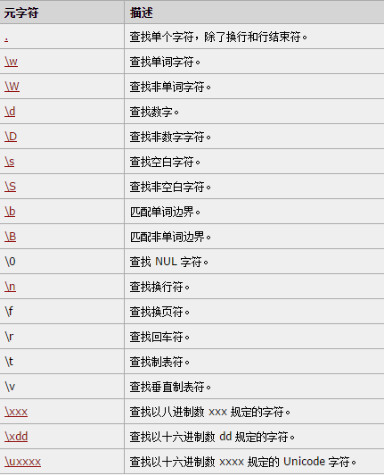

## 一、todo
### 1.做牛客上的题
### 2.整理牛客上的错题
### 3.看《JavaScript高级程序设计》Chapter5,10，11，12
### 4.整理FF,IE等浏览器的区别
### 5.快速看一遍《锋利的jQuery》
### 6.快速翻一番bootstrap中文文档<http://v3.bootcss.com/>
### 7.看《HTML5权威指南》某几张漏掉的
### 8.看w3school上css手册
### 9.看网上的笔试贴
### 10.复习数组方法 √
### 11.复习字符串方法
### 12.复习正则，猛刷正则和字符串方法
### 13.复习算法和数据结构

## 二、专题整理
### 1.数组方法复习
#### 1. concat()
连接两个或多个数组。不会改变现有数组，返回的是被连接数组的副本。

	Array1.concat(Array2,Array3,……，Arrayn)

**参数:** 可以是具体的值，也可以是素组对象。可以是1个或任意多个。

**返回：** 被连接数组的副本。原数组不变。

**示例：**
	
	var arr1=[1,2,3];
	console.log(arr1.concat(4,5,6,7));//[1,2,3,4,5,6,7]
	
	var arr2=[7,8];
	console.log(arr1.concat(arr2));//[1,2,3,7,8]
	
	var arr3=["Tom","Eve"];
	console.log(arr1.concat(arr2,arr3));//[1, 2, 3, 7, 8, "Tom", "Eve"]

#### 2.join()
把数组中所有元素放入一个字符串。元素通过指定的分隔符分隔。

	Array.join(separator)

**参数：**可选。指定要使用的分隔符。如果省略该参数或传入undefined(ie及早期版本会使用字符串"undefined"做为分隔符)，则使用逗号作为分隔符。

**返回：**连接成的字符串。

**示例：**

	var arr1=[1,2,3,"Tom","Eve"];
	console.log(arr1.join());
	console.log(arr1.join("\t"));

#### 3.pop()
删除并返回数组的最后一个元素。
	
	Array.pop()

**返回：** 素组的最后一个元素。原数组改变。

**示例：**

	var arr1=[1,2,3,"Tom","Eve"];
	var arr2=arr1.pop();
	console.log(arr2);//"Eve"
	console.log(typeof arr2);//string
	console.log(arr1);//[1,2,3,"Tom"]

#### 4.push()
向素组末尾顺序添加一个或多个元素，并返回新的长度。

	Array.push(newValue1,newValue2,……，newValueN)

**参数：**至少有一个参数

**返回：**添加后数组的新长度。原数组改变。

**示例：**

	var arr1=[1,2,3,"Tom","Eve"];
	console.log(arr1.push("Lulu"));//6
	console.log(arr1);//[1, 2, 3, "Tom", "Eve", "Lulu"]
	console.log(arr1.push(4,5,"Ben"));//9
	console.log(arr1);//[1, 2, 3, "Tom", "Eve", "Lulu", 4, 5, "Ben"]

#### 5.reverse()
就地颠倒素组中元素的顺序。
	
	Array.reverse()

**返回：** 顺序颠倒后的数组。这就是原数组，原数组改变。

**示例：**

	var arr1=[1,2,3,"Tom","Eve"];
	console.log(arr1.reverse());//["Eve", "Tom", 3, 2, 1]
	console.log(arr1);//["Eve", "Tom", 3, 2, 1]

#### 6.shift()
删除素组的第一个元素，返回第一个元素的值。

	Array.shift()

**返回：**
删除的值，即数组用来第一个元素的值。

**示例：**

	var arr1=[1,2,3,"Tom","Eve"];
	console.log(arr1.shift());//1
	console.log(arr1);//[2, 3, "Tom", "Eve"]

#### 7.unshift()
向数组的开头添加一个或多个元素。返回新的长度。

	Array.unshift(newValue1,newValue2,……，newValueN)

**参数：**至少一个。

**返回：**数组的新长度。原数组改变。

**注意：**该方法的第一个参数将成为数组的新元素 0，如果还有第二个参数，它将成为新的元素 1，以此类推。

**示例：**

	var arr1=[1,2,3,"Tom","Eve"];
	console.log(arr1.unshift(4,"Lily"));//7
	console.log(arr1);//[4, "Lily", 1, 2, 3, "Tom", "Eve"]

#### 8.slice()
从已有数组中返回选定的元素。

	Array.slice(startIndex,endIndex)

**参数：**  
至少有startIndex,规定从何处开始选取。0为第一个元素。也可以是负数，-1指最后一个元素，-2 指倒数第二个元素。

endIndex可选。规定从何处结束选取。该参数是选取的数组片断结束后下一个元素的数组下标。如果没有指定该参数，那么切分的数组包含从 startIndex 到数组结束的所有元素。如果这个参数是负数，那么它规定的是从数组尾部开始算起的元素。

**返回：**选取的新数组。原数组不变。

**示例：**

	var arr1=[1,2,3,"Tom","Eve"];
	console.log(arr1.slice(2,4));//[3, "Tom"]
	console.log(arr1);//[1, 2, 3, "Tom", "Eve"]
	console.log(arr1.slice(1));//[2, 3, "Tom", "Eve"]
	console.log(arr1.slice(-1));//["Eve"]
	console.log(arr1.slice(-3,-1));//[3, "Tom"]

#### 9.sort()
对数组就地重排序。
	
	Array.sort(function)

**参数：** 可要可不要，规定排序方法，必须是函数。

**返回：** 排序后的数组。原数组就地改变，不生成副本。

**示例：**

排序时，sort()会调用每个数组项的toString()转型方法，然后比较得到的**字符串**。默认Array.sort()按字符串升序排列。

	var arr1=[0,10,1,15,5];
	var arr2=arr1.sort();
	console.log(arr1);//[0,1,10,15,5]
	console.log(arr2);//[0,1,10,15,5]

其可接受一个比较函数作为参数。例如，从小到大排序如下：

	
	function compare(value1,value2) {
	    if (value1<value2) {
	        return -1;
	    }
	    else if (value1==value2) {
	        return 0;
	    }
	    else{
	        return 1;
	    }
	}
	var arr3=arr1.sort(compare);
	console.log(arr1);//[0,1,5,10,15]
	console.log(arr3);//[0,1,5,10,15]

对于数值类型或其valueOf()方法（返回Array对象的原始值，***待研究***）返回数值类型的对象类型，可以直接用相减的比较函数。

	function compare1(value1,value2) {
	    return value1-value2;
	}
	var arr4=arr1.sort(compare1);
	console.log(arr1);//[0,1,5,10,15]
	console.log(arr4);//[0,1,5,10,15]

#### 10.splice()
向数组中添加或删除元素。

	Array.splice(startIndex,number,newValue1,newValue2,……）

**参数：** 
startIndex:必须。规定添加/删除项目的位置，使用负数可从数组结尾处规定位置。

number：必须。要删的项目数量。可为0，这时不删除项目。

newValue1,newValue2,……：可选。向数组添加的新项目。

**返回：** 被删除项目组成的数组。原数组改变。

**示例：**

	var arr1=[1,2,3,"Tom","Eve"];
	console.log(arr1.splice(1,2,"Greg",3,4));//[2,3]
	console.log(arr1);//[1, "Greg", 3, 4, "Tom", "Eve"]

#### 11.toSource() *
显示对象的源代码。只有Gecko 核心的浏览器（比如 Firefox）支持该方法

	Object.toSource()

#### 12.toString()
把数组转换为字符串。并返回结果。

	Array.toString()

**返回：** arrayObject 的字符串表示。返回值与没有参数的 join() 方法返回的字符串相同。原数组不变。

**注意：** 当数组用于字符串环境时，JavaScript 会调用这一方法将数组自动转换成字符串。

**示例：**

	var arr1=[1,2,3,"Tom","Eve"];
	console.log(arr1.toString());//1,2,3,Tom,Eve
	console.log(arr1);//[1, 2, 3, "Tom", "Eve"]

#### 13.toLocaleString()
把数组转换为本地字符串。

	Array.toLocaleString()

**返回：** 本地字符串。原数组不变。

**注意：** 首先调用每个数组元素的 toLocaleString() 方法，然后使用地区特定的分隔符把生成的字符串连接起来，形成一个字符串。

**示例：**

	var arr1=[1,2,3,"Tom","Eve"];
	console.log(arr1.toLocaleString());//1,2,3,Tom,Eve
	console.log(arr1);//[1, 2, 3, "Tom", "Eve"]

#### 14.valueOf()*
得到数组对象的原始值。

#### 15.位置方法indexOf()和lastIndexOf()
ECMA5新添方法。indexOf()从数组头向后查找，lastIndexOf()从数组末尾向前查找。

**参数：** 两个方法都接收两个参数：要查找的项（必须），查找起点位置的索引（可选）

**返回：** 两个方法都返回要查找的项在数组中的位置，在没有找到的情况下都返回-1。

**说明：** 在比较第一个参数和数组中的每一项时，会使用全等操作符。

**示例：**

	var arr1=[1,2,3,4,5,4,3,2,1];
	
	console.log(arr1.indexOf(4));//3
	console.log(arr1.lastIndexOf(4));//5
	
	console.log(arr1.indexOf(4,4))//5
	console.log(arr1.lastIndexOf(4,4))//3
	
	var person={
	    name:"Nicholas"
	}
	var people=[
	    {
	        name:"Nicholas"
	    }
	]
	
	var morepeople=[person];
	
	console.log(people.indexOf(person));//-1
	console.log(morepeople.indexOf(person));//0

#### 16.迭代方法
五个迭代方法every()、some()、filter()、map()、forEach()。

**参数：** 每个方法都包含两个参数：要在数组每一项上运行的函数，运行该函数的作用域（可选）。传入的函数都接收三个参数：数组项的值、该项在数组中的位置和数组对象本身。

**说明：**

- every():对数组中的每一项运行给定函数，若函数对每一项都返回true,则返回true。
- some()：对数组的每一项运行给定函数，若函数对任一项返回true,则返回true。
- filter():对数组的每一项运行给定函数，返回该函数返回true的项组成的数组。
- map():对数组的每一项运行给定函数，返回每次函数调用的结果组成的数组。
- forEach():对数组的每一项运行给定函数。该方法无返回值。

		var numbers=[1,2,3,4,5,4,3,2,1];
		
		var everyResult=numbers.every(
		    function (item,index,array) {
		        return (item>2);
		    }
		);
		console.log(everyResult);//false
		console.log(numbers);//[1, 2, 3, 4, 5, 4, 3, 2, 1]
		
		var someResult=numbers.some(
		    function (item,index,array) {
		        return (item>2);
		    }
		);
		console.log(someResult);//true
		console.log(numbers);//[1, 2, 3, 4, 5, 4, 3, 2, 1]
		
		var filterResult=numbers.filter(
		    function (item,index,array) {
		        return (item>2);
		    }
		);
		console.log(filterResult);//[3,4,5,4,3]
		console.log(numbers);//[1, 2, 3, 4, 5, 4, 3, 2, 1]
		
		var mapResult=numbers.map(
		    function (item,index,array) {
		        return (item*2);
		    }
		);
		console.log(mapResult);//[2, 4, 6, 8, 10, 8, 6, 4, 2]
		console.log(numbers);//[1, 2, 3, 4, 5, 4, 3, 2, 1]
		
		numbers.forEach(
		    function (item,index,array) {
		        item*2;
		    }
		);
		console.log(numbers);//[1, 2, 3, 4, 5, 4, 3, 2, 1]

#### 17.归并方法reduce()和reduceRight()
两个方法都会迭代数组的所有项，然后构建一个最终返回的值。reduce()从第一项开始，逐个遍历到最后。reduceRight()从最后一个开始，向前遍历到第一项。

**参数：**
两个方法都接收两个参数：在每一项上调用的函数，作为归并基础的初始值（可选）。函数接收四个值：前一个值、当前值、项的索引、数组对象。第一次迭代发生在数组的第二项上。

**返回：**
迭代最终值。原数组不变。

**示例：**

	var values=[1,2,3,4,5];
	var sum=values.reduce(function(prev,cur,index,array){
	    return prev+cur;
	});
	console.log(sum);//15
	console.log(values);//[1,2,3,4,5]
	
	var sumRight=values.reduceRight(function(prev,cur,index,array){
	    return prev+cur;
	})
	console.log(sumRight);//15
	console.log(values);//[1,2,3,4,5]

#### 18.Array对象属性

属性|	描述
----|----
constructor	|返回对创建此对象的数组函数的引用。
length	|设置或返回数组中元素的数目。
prototype	|使您有能力向对象添加属性和方法。

### 2.正则复习
参见<http://www.w3school.com.cn/jsref/jsref_obj_regexp.asp>
#### 1.三种标志

#### 2.范围查询

方括号用于查找某个范围内的字符：

#### 3.元字符
元字符（Metacharacter）是拥有特殊含义的字符。

#### 4.量词

#### 5.RegExp对象属性

#### 6.方法

#### 7.Exp构造函数属性

	var text="this has been a short summer";
	var pattern=/(.)short/g;
	
	if (pattern.test(text)) {
	    console.log(RegExp.$_);//即RegExp.input：this has been a short summer
	    console.log(RegExp["$&"]);//即RegExp.lastMatch： short
	    console.log(RegExp["$+"]);//即RegExp.lastParen：s(实操未显示)
	    console.log(RegExp["$`"]);//即RegExp.leftContext：this has been a
	    console.log(RegExp["$'"]);//即RegExp.rightContext： summer
	    console.log(RegExp["$*"]);//即RegExp.multiline：false(实操undefined)
	}

### 3.字符串方法复习

#### 1字符方法：charAt()、charCodeAt()、stringValue[]
charAt()以单字符字符串形式返回给定位置的字符。

charCodeAt()以字符编码形式返回给定位置的字符。

stringValue[]使用方括号加数字索引来访问指定位置字符。

示例：略

#### 2字符串操作方法：
##### (1)concat()
用于将一个或多个字符串拼接起来。

**参数：** 一个或多个。

**返回：** 新字符串。原字符串不变。

	var stringValue="hello ";
	var rel=stringValue.concat("world");
	console.log(stringValue);//hello 
	console.log(rel);//hello world
	
	var rel2=stringValue.concat("world","!");
	console.log(rel2);//hello world!

##### (2)slice(startIndex,endIndex)
返回被操作字符的一个子字符串。

**参数：** 第一个参数指定子字符串的开始位置，第二个参数指定子字符串结束位置的后面的位置。可为负值，负值会与字符串长度相加。
	
	var rel2="hello world";
	console.log(rel2.slice(3));//lo world
	console.log(rel2.slice(3,7));//lo w
	console.log(rel2.slice(-3));//rld
	console.log(rel2.slice(3,-3));//lo wo

##### （3）substring( ,　）
返回被操作字符的一个子字符串。

**参数：** 第一个参数指定子字符串的开始位置，第二个参数指定子字符串结束位置的后面的位置。负值会全部转化为0。

	console.log(rel2.substring(3));//lo world
	console.log(rel2.substring(3,7));//lo w
	console.log(rel2.substring(-3));//hello world
	console.log(rel2.substring(3,-3));//hel

##### （4）substr( ，)
返回被操作字符的一个子字符串。

**参数：** 第一个参数指定子字符串的开始位置，第二个参数指返回的字符个数。第一个参数为负，则加上字符串长度；第二个参数为负，则转换为0。

	console.log(rel2.substr(3));//lo world!
	console.log(rel2.substr(3,7));//lo worl
	console.log(rel2.substr(-3));//rld
	console.log(rel2.substr(3,-3));//""（即空字符串）

#### 3字符串位置方法 indexOf()和lastIndexOf()
从一个字符串中搜索给定的子字符串位置。indexOf()从头向后搜索，lastIndexOf()从后向前搜索。

**参数：** 都可以接受两个参数。第一个参数为子字符串。第二个为搜索的起始位置,indexOf()从该位置向后搜索，lastIndexOf()从该位置向前搜索。

**返回：** 子字符串的位置。原字符串不变。

**示例：**

	var str="hello world";
	console.log(str.indexOf("o"));//4
	console.log(str.lastIndexOf("o"));//7
	
	console.log(str.indexOf("o",6));//7
	console.log(str.lastIndexOf("o",6));//4
	
	var longStr="Lorem ipsum dolor sit amet,consectetur adipisicing elit";
	var positions=new Array();
	var pos=longStr.indexOf("e");
	
	//利用第二个参数，可以循环找到所有匹配的字符串
	while (pos>-1) {
	    positions.push(pos);
	    pos=longStr.indexOf("e",pos+1);
	}
	console.log(positions);//[3, 24, 31, 34, 51]

#### 4 trim()方法
创建一个字符串副本，删除前置及后缀的所有空格。

**返回：** 去除空格后的字符串副本。原字符串不变。

**示例：**

	var str=" hello world ";
	var trimmedStr=str.trim();
	console.log(str);//" hello world "
	console.log(trimmedStr);//"hello world"

#### 5字符串大小写转换方法：toLowerCase()、toLocaleLowerCase()、toUpperCase()、toLocaleUpperCase()
toLowerCase()和toLocaleLowerCase()将字符串转换为小写。toUpperCase()和toLocaleUpperCase()将字符串转换为大写。

在不知道代码将在哪种语言环境中运行时，使用针对地区的toLocaleLowerCase()、toLocaleUpperCase()方法更稳妥。

**示例：：**

	var str="Hello World ";
	console.log(str.toLowerCase());//hello world 
	console.log(str.toLocaleLowerCase());//hello world 
	console.log(str.toUpperCase());//HELLO WORLD
	console.log(str.toLocaleUpperCase());//HELLO WORLD
	console.log(str)//Hello World

#### 6 字符串模式匹配方法
##### （1）match()
返回一个数组。同(RegExp.)exec()方法。

**参数：** 要匹配的正则表达式。

**示例：**
	var text="cat,bat,sat,fat";
	var pattern=/.at/;
	
	var matches=text.match(pattern);
	console.log(matches);
	console.log(matches.index);//0
	console.log(matches[0])//cat
	
	var matches2=pattern.exec(text);
	console.log(matches2);
	console.log(matches2.index);//0
	console.log(matches2[0]);//cat

##### （2）search()
返回字符串中第一个匹配项的索引。无匹配项，则返回-1。

**示例：**

	var text="cat,bat,sat,fat";
	var pos=text.search(/at/);
	console.log(pos);//1

##### (3)replace()
替换子字符串。

**参数：** 两个参数。第一个是一个字符串（字符串不会被转换成RegExp对象）或RegExp对象，第二个参数可以是一个字符串或一个函数。

若第一个参数是字符串，则只会替换第一个子字符串；若第一个参数是正则表达式且指定g标志，才会替换所有子字符串（这是唯一的替换所有子字符串的方法）

**返回：** 替换后的字符串。原字符串不变。

**示例：**

	var text="cat,bat,sat,fat";
	var result=text.replace("at","ond");
	console.log(result);//cond,bat,sat,fat
	console.log(text);//cat,bat,sat,fat
	
	var result2=text.replace(/at/g,"ond");
	console.log(result2);//cond,bond,sond,fond
	console.log(text);////cat,bat,sat,fat

**补充：**

第二个参数如果是字符串，那么还可以用一些特殊的字符序列，将正则表达式得到的值插入到结果字符串中。详见《JavaScript高级程序设计》P127

如匹配第1个捕获组的子字符串：

	var text="cat,bat,sat,fat";
	var result=text.replace(/(.at)/g,"word ($1)");
	console.log(result);//word (cat),word (bat),word (sat),word (fat)

第二个参数也可以是函数。在只有一个匹配项的情况下，会传递三个参数：模式的匹配项、模式匹配项在字符串中的位置和原始字符串。该函数应该返回一个字符串，表示用作替换的字符串。

如下例：

	function htmlEscape(text) {
	    return text.replace(
	        /[<>"&]/g,
	        function(match,pos,originalText){
	            switch (match) {
	                case "<":
	                    return "&lt;";
	                case ">":
	                    return "&gt;";
	                case "&":
	                    return "&amp;";
	                case "\"":
	                    return "&quot;";
	            }
	        }
	    );
	}

	console.log(htmlEscape("
Hello world!
"));
	//&lt;p class=&quot;greeting&quot;&gt;Hello world!&lt;/p&gt;

##### （4）split()
基于给定的分隔符将字符串分割成多个子字符串，并将结果放在一个数组中。

**参数：** 第一个参数是分隔符。第二个（可选）是指定返回的数组大小。

**示例：**

	var colorText="red,blue,green,yellow";
	var colors1=colorText.split(",");
	var colors2=colorText.split(",",2);
	var colors3=colorText.split(/[^\,]+/);
	console.log(colors1);//["red", "blue", "green", "yellow"]
	console.log(colors2);//["red", "blue"]
	console.log(colors3);//["", ",", ",", ",", ""]

#### 7 localeCompare()方法
比较两个字符串。

**返回：** 在子母表中，如果参数字符串在原字符串之前，返回一个正数（大多数情况下是1）；如果参数字符串在原字符串之后，返回一个负数（大多数情况下是-1);如果参数字符串等于原字符串，返回0。

**示例：**

	var str="yellow";
	console.log(str.localeCompare("brick"));//1
	console.log(str.localeCompare("yellow"));//0
	console.log(str.localeCompare("zoo"));//-1

#### 8 fromCharCode()方法
Sring构造函数本身的方法。接受多个字符编码，然后将它们转换成一个字符串。与实例方法charCodeAt()执行的是相反的操作。

**示例：**

	console.log(String.fromCharCode(104,101,108,108,111));//hello

### 4.字符串、数组、正则操作练习题

#### 1.某元素一共有多个类名，删除其中"disabled"类名。

	var mydiv=document.getElementById("mydiv");
	
	var classNames=mydiv.className.split(/\s+/);
	
	var pos,i,len;
	for (i=0,len=classNames.length;i<len;i++) {
	    if (classNames[i]=="user") {
	        pos=i;
	        break;
	    }
	}
	classNames.splice(pos,1);
	
	mydiv.className=classNames.join(" ");

其实可以直接：
	mydiv.classList.remove("user");

### 5.Dom节点流操作练习

#### 1.以浏览器兼容方式确定一个节点是不是另一个节点后代

参见《JavaScript高级程序设计》P300

	function contains(refNode,otherNode) {
	    if (typeof refNode.contains=="function"&&(!client.engine.webkit||client.engine.webkit>=522)) {
	        return refNode.contains(otherNode);
	    }
	    else if (typeof refNode.compareDocumentPosition=="function") {
	        return !!(refNode.compareDocumentPosition(otherNode)&16);
	    }
	    
	    else{
	        var node=otherNode.parentNode;
	        do{
	            if (node==refNode) {
	                return true;
	            }
	            else{
	                node=node.parentNode;
	            }
	        }
	        while (node!=null);
	        return false;
	    }
	}

### 6.特别容易忘记弄错的偏知识点复习
#### 1.关于基本包装类型和转型函数的区别

	var value="25";
	var num1=Number(value);
	console.log(typeof num1);//number
	
	var num2=new Number(value);
	console.log(typeof num2);//object
	console.log(num2 instanceof Number);//true

#### 2.Boolean类型的基本类型和基本包装类型的区别

	var falseObj=new Boolean(false);
	var rel=falseObj&&true;（1）
	console.log(rel);//true 
	
	var falseValue=false;
	var rel2=falseValue&&true;
	console.log(rel2);//false

上面（1)代码是对falseObj求值而不是对它的值（false)求值。而**布尔表达式中的所有对象都会被转换为true**（见《JavaScript高级程序设计》P27）,故falseObj在此布尔表达式中代表true。

	var numObj=new Number(10);
	var numValue=10;
	console.log(typeof numObj);//object
	console.log(typeof numValue);//number
	console.log(numObj instanceof Object);//true
	console.log(numObj instanceof Number);//true
	console.log(numValue instanceof Object);//false
	console.log(numValue instanceof Number);//false
用typeof测试基本类型值，会返回number;测试Number基本包装类型，会返回object。Number基本包装类型是object类型实例，也是Number类型实例；基本类型则不是它们的实例。

#### 3.需要转义的字符。

