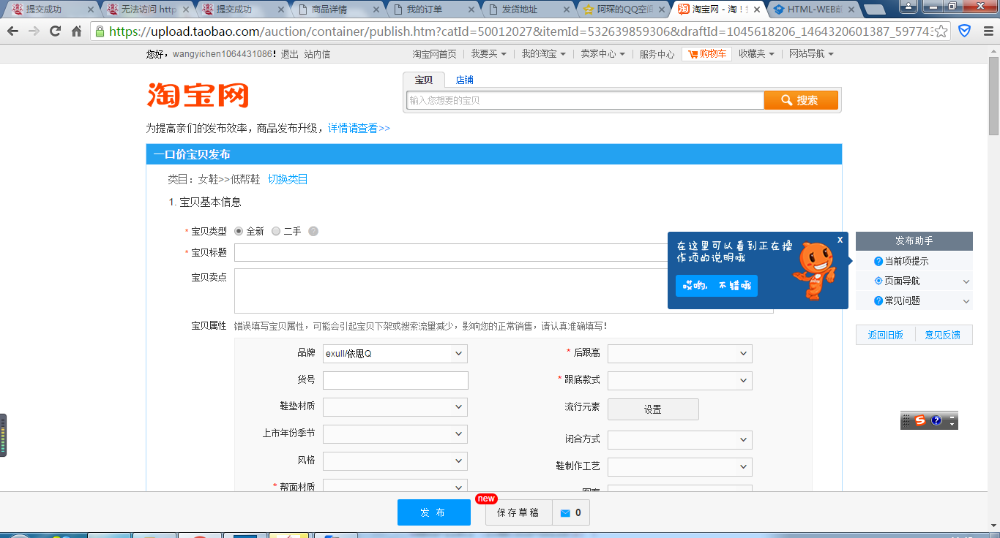

# 第一周

## 1.完成404html
#### (1)当页面缩小时，breadcrumb会跑到header404.php的header之上：

##### 解决办法:为breadcrumb添加样式

		#breadcrumb{
				position: absolute;
				top: 40px;
			}
#### （2）Chrome不能从总的规定处继承字体，其他浏览器都可以继承字体

##### 解决办法：新加的字还是要加上font-family属性

## 2.完成我要开店注册页面

### （1）上传文件（身份证、经营执照照片）进度条
<http://my.oschina.net/u/1377774/blog/284703>

### 　(2) 上传完成后预览图片
<http://www.jb51.net/article/56634.htm>
<http://www.cnblogs.com/cloudgamer/archive/2009/12/22/ImagePreview.html>
<http://www.jb51.net/article/25541.htm>

目前的写法

 	

                    <b class="ftx04">*</b>店主身份证：
                    

                        <input type="file" id="idcard" name="idcard" required onchange="javascript: setImagePreview()">
                    

                

                
                    
                

### (3)表单验证
jquery直接一个each函数就ok了。

检测手机号是不是手机号，邮箱是不是合法邮箱，身份证是不是身份证号。

没填的框框后面加个提示。

### 成果：
- storeRegister.php：var/www/chineworld/ <http://localhost/store/storeRegister.php>
- storeRegister.html:放在var/www/chineworld/templates/
- storeRegister文件夹：放在var/www/chineworld/

# Week2
## 1.文件夹树结构修改
全部按照

-  task.php放在根目录
-  对应的task.html放在templates文件夹
-  相应的资源（img,css,js)一起放到一个名为task的文件夹中，该文件夹放在根目录。

将store文件夹也并入该结构树中。

## 2.首页 √
chineworld/index.php
### 任务描述：
#### （1）顶部添加“商家进驻”连接√
具体位置导航栏右侧“我的订单”的左边

#### （2）去掉首页左侧的“品类荟萃”图片及效果√
去掉后更换为一张普通的商品图片，类似该页面其他图片那样。

### 已改动文件：（已同步）
- chineworld/templates/index.html
- chineworld/templates/nav.php

### 待研究：
#### （1）后台php如何从数据库中取出图片

## 3*.登录逻辑说明
1. 首页→
2. “商家进驻”→
3. 弹出买家登录页面<http://166.111.143.234/chineworld/login.php>→
4. 输入用户名密码后登录→
5. 点击左上角“您好”下拉菜单“管理账号”
6. 进入 个人中心 页面<http://166.111.143.234/chineworld/personalCenter.php> →

## 4.个人中心页面
<http://166.111.143.234/chineworld/personalCenter.php>
### 任务描述
####（1） 左侧栏增加“我的店铺”目录
“我的店铺”为一级目录，其下包含“我要开店”、“申请状态”、“店铺链接”三个二级目录。√

##### “我要开店”√
- 该链接是链接到我自己写的register页面。√
- register页面信息包含：申请人信息（姓名、手机、身份证、权限）和店铺信息（名称、描述、域名），即要在我自己的页面的基础上增加“店铺描述”、“店铺域名”两个input√

***待求证解决：“店铺描述”和“店铺域名”是必填的吗？验证规则是怎样的？***

##### “申请状态” √
仿照 实名认证页面<http://166.111.143.234/chineworld/realnameAuthentication1.php> 写一个新页面，该页面包含类似实名认证也的进度条
##### 新增文件（已同步）
- chineworld/storeApplystatus.php
- chineworld/templates/storeApplystatus.html
- chineworld/storeApplystatus文件夹

#### “店铺链接”√
该链接链接到我写的 storeCenter.php,具体细节待求证。
##### 新增文件(已同步，还是有问题）
- chineworld/storeCenter.php
- chineworld/templates/storeCenter.html
- chineworld/templates/storeCenterleftList.php
- chineworld/storeCenter文件夹

#### （2）左侧栏增加“系统消息”目录
“系统消息”为一级目录，其下包含“事务通知”、“促销活动”两个二级目录。√

这两个二级目录链接到的页面就是文字描述的广告。

#### （3）导航栏修改√
- 把“首页”转移到导航栏前部，顺序变成“首页”-“我的采遗”。该“首页”是链接到网站首页<http://166.111.143.234/chineworld/index.php>的。√
- 去掉“账户设置”，“消息”栏目。右侧两个搜索框保留。√

### 待研究问题
- chineworld的leftList.php第68行clstag自定义属性的作用？

### 已改动文件(已同步）
- chineworld/templates/personalCenter.html
- chineworld/templates/leftList.php
- chineworld/templates/top.php
- chineworld/templates/storeRegister.html
- personalCenter/css/personalCenter_wycnew.css

## 5. 品类频道页面 √
<http://166.111.143.234/chineworld/categoryHome.php>
### 任务描述
#### (1)去掉右边的“采遗资讯”、“生活服务”等，把广告位拉长
#### （2）“商品”“闪购”的导航栏离顶部导航栏距离稍长一点

### 已改动页面（已同步）
chineworld/templates/categoryHome.html

## 6. 典籍频道页面√
<http://166.111.143.234/chineworld/ancientBooks.php>
### 任务描述
#### (1)“古籍”“著名诗人”导航栏离顶部导航栏距离稍长一点
（和2.（2）类似）
#### （2）“古籍”“著名诗人”导航栏背景颜色调成白色。

### 已改动页面（已同步）
chineworld/templates/ancientBookis.html

## 7. 重构“联系客服页面”
一对一的卖家买家轮流留言回复页面，底部的文本框二者都可以输入。

### 问题：
服务器缓存如何清理

已解决：templates_c里面的文件是服务器缓存，全部删除

# Week3

## 1.shoppingCart.php √
###  (1)调整间距

### （2）默认红色的改为品类

### 已修改页
chineworld/templates/shoppingCart.html

## 2. 个人中心页面 √
保持左侧所有链接进入的页面nav样式一致

### 修改页面(已同步）
- personalInfo1.html
- personalInfo2.html
- realnameAuthentication1.html
- realnameAuthentication2.html
- realnameAuthentication3.html
- realnameAuthentication4.html
- emailAuthentication1.html
- emailAuthentication2.html
- emailAuthentication3.html
- receivingAddress.html
- myOrder.html
- auctionRecord.html
- myEvaluate.html
- cancelRecord.html
- coupon.html
- balance.html
- concernGoods.html
- concernShop.html
- concernActivity.html
- browseHistory.html

- chineworld/personalCenter/css/personalCenter_wycnew.css

## 3.找回密码页面 √

新增：（已同步）
- templates/findPassword.html
- findPassword文件夹
- findPassword.php

## 4.首页搜索页面
- searchResults.php
- templates/searchResults.html
- searchResults文件夹

## 5.调bug√
### 1）templates/succeedToCart.html
#### 任务描述
- 加入购物车页面 chineworld/succeedToCart.php标红的为城市改为品类
- 间隙去掉
- 搜索框太乱调回来
#### 改动页面（已同步）
templates/succeedToCart.html√
templates/nav.php√

### 2）templates/shoppingChat.html
#### 任务描述
修改乱掉的搜索框
#### 改动页面（已同步）
templates/shoppingChat.html√

### 3）templates/checkOrder.html
核对订单页面 chineworld/checkOrder.php标红的为城市改为品类√
#### 改动页面（已同步）
templates/checkOrder.html√

### 4）templates/OrderPay.html
提交完订单后 chineworld/submitorder.php标红的为城市改为品类

#### 改动页面（已同步）
templates/OrderPay.html√

## 6.品类首页公告栏细节修改√

#### 任务描述
- 品类首页的广告栏跟左边导航对齐一下
- 品类首页的广告栏跟左边导航对齐一下

#### 改动页面
templates/categoryHome.html

# Week4
## 1.chineworld/yunwei/orderOverview.php √
### 任务描述
该页面的订单管理→订单总览→加个物流状态

- 数据说明
http://baidu.kuaidi100.com/query?type=物流类型&postid=运单号&id=4&valicode=&temp=小于1的随机正数&sessionid=
- 快递类型写法： type = 
ems  ems快递
shentong  申通
yuantong 圆通
zhongtong 中通
huitongkuaidi 汇通
shunfeng 顺丰
yunda 韵达
tiantian 天天快递
youzhengguonei 邮政国内
- 接收后台发来的数据expressnum,expresstype,要先判断是否为空

### 已修改页面（已同步）
- chineworld/yunwei/templates/orderOverview.html
- chineworld/yunwei/templates/orderOverviewpart.tpl
- chineworld/yunwei/orderOverview文件夹

买物流账号

## 2.succeedToCart.php √
### 任务描述
该页面的 为你推荐 图片调大、底色条白、数量减少
### 改动页面（已同步）
chineworld/templates/succeedToCart.html
统一用成上面的样式，对齐，背景

## 3.忘记密码页面 √
### 任务描述
- 倒计时时间改为90s
- 邮箱的可输入长度加长
### 改动页面（已同步）
- chineworld/templates/findPassword.html
- chineworld/findPassword/js/findPassword.js

## 4.搜索页面（接上周任务）√
### 任务描述
仿照chineworld/sonPage.php制作一个搜索页面

4*4，图片大一点，稍微开一点，然后两侧留出来

### 新制作页面（已同步）
- searchResults.php
- templates/searchResults.html
- searchResults文件夹

### 修改页面（已同步）
- templates/nav.php

## 5.商家中心页面
### 任务描述与问题

- 左侧栏“店铺信息”链接到的是storeInfo1.php，直接把storeRegister中除了两个图片上传外其他的字段对应过来，直接显示出来？
- “店铺信息”>“修改店铺信息”链接到的是storeInfo2.php，那么哪些字段是可以修改的？暂时把所有字段都弄过来了。。
- “店铺认证”、“邮箱认证”是多余的吧？“店铺认证”应该就是“个人中心”页面（personalCenter.php)的“我的店铺”的“申请状态”√（已删）
- percenalCenter.php左侧栏的“收货地址”，和右侧的“我的收货地址”不是重复了么？同理，storeCenter.php左侧栏的“发货地址”和右侧“我的发货地址”也重复了。。。。。应该保留一个就好吧？√（已删）
- 之前的添加收货地址页面为什么要有两个“新增收货地址”按钮？
- top中的“我的购物车”也应该删了吧？不用
- “优惠券”属于“本店活动”吧？之前是“财务管理”。。需要再弄个“财务管理”吗？
- 最上面一行“我的订单”“我的采遗”“采遗会员”还有没有必要要？
- 左上角“送至：北京”时而出现时而消失。。。包括个人中心和店铺中心。。。这块的逻辑到底是什么？什么时候要什么时候不要？
- “店铺编辑”里面关于发布商品，可以参考淘宝的“宝贝发布”
<https://upload.taobao.com/auction/sell.jhtml?spm=a313o.7914902.a1zvx.d48.Fwza5I&mytmenu=wym>
<https://upload.taobao.com/auction/container/publish.htm?catId=50012042&itemId=532682953558&draftId=1045618206_1464249567154_59607482122399662>

- personalCenter和storeCenter的左侧栏哪些是点击了用新窗口打开？哪些是直接在本窗口打开？
- 是否再加个回到店铺首页的链接？加在哪里？头部or左侧栏？

### 525新需求点
- top改成“采遗首页” “个人中心”
- 右侧中间条，改成 待发货 待收货 换货 退款 
- 去掉右侧的“我的收货地址”“优惠券”，下面的“浏览历史”“新品推荐”  
### 527新需求

- 判断一下店铺链接
- 除了身份证和经营执照不能改，店主姓名也不能改
- 发货地址两个
### 新增页面
- chineworld/storeInfo1.php
- chineworld/templates/storeInfo1.html
- chineworld/storeInfo1文件夹
- chineworld/storeInfo2.php
- chineworld/templates/storeInfo2.html
- chineworld/storeInfo2文件夹
- chineworld/sendingAddress.php
- chineworld/templates/sendingAddress.html
- chineworld/sendingAddress文件夹
- chineworld/storeOrder.php
- chineworld/templates/storeOrder.html
- storeOrder文件夹
- chineworld/storeEvaluate.php
- chineworld/templates/storeEvaluate.html
- storeEvaluate文件夹
- chineworld/storeCoupon.php
- chineworld/templates/storeCoupon.html
- storeCoupon文件夹

### 修改页面
- chineworld/templates/storeCenter.php
- chineworld/templates/storeCenterLeftList.php
- chineworld/templates/storeRegister.html
- chineworld/templates/top.php

## 6.核对订单页面
核对订单页面，如果没有默认收货地址会出现一个bug就是返回购物车页面。应该改为：在改页面判断如果没有收货地址，弹出一个小窗口提示输入收货地址。

## 7.解决问题my_order.php（吴高雄）

相关文件
templates/myOrder.html

templates/myorder_detail.php

# Week5
## 1.个人中心我的订单页面

### 任务描述
以订单号为单位，每个表格后面补上结算和操作

### 修改页面
- chineworld/templates/myOrder.html
- chineworld/templates/myorder_detail.php

## 2.运维的物流重新写

# week6

## 1.购物车页面bug重新改回去
上传文件
- shoppingCart.html

## 2.店铺中心

### 任务描述
1. 发货信息填写弹窗
	- templates/storeOrder.html

2. 订单字段

	- 包括 下单的用户名  价格 数量 物流 付款状态等，还需要看到收货地址；
	- 全部都是两重循环： 第一重是“订单号” （这里的订单号与用户中心的交易号是不同的），第二重则是商品信息

### 修改/新增页面
- templates/storeCenter.html
- templates/storetop.php
- templates/storeCenterLeftList.php
- templates/storeInfo1.html
- templates/storeInfo2.html
- templates/sendingAddress.html
- templates/storeOrder.html

